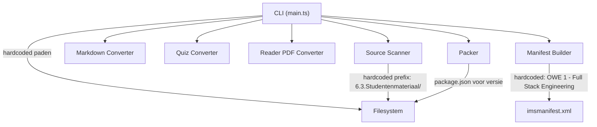
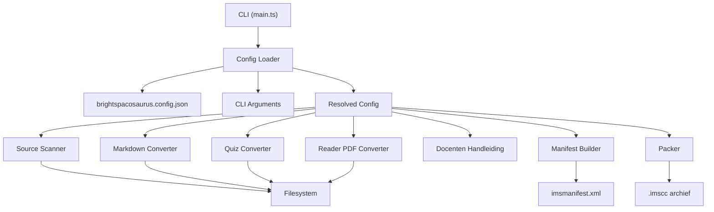

# Design Document: Brightspacosaurus Generiek

## Overview

Dit document beschrijft het technisch ontwerp voor het generiek maken van Brightspacosaurus (BSS). De kern van de wijziging is het introduceren van een configuratiebestand (`brightspacosaurus.config.json`) dat alle projectspecifieke instellingen bevat, zodat de tool herbruikbaar wordt voor andere OWE's en uiteindelijk als zelfstandig CLI-tool kan worden gepubliceerd via JSR.

De refactoring volgt het principe "convention over configuration": zonder configuratiebestand werkt BSS nog steeds met sensibele standaardwaarden, maar alle hardcoded OWE-1-paden en -namen worden vervangen door configureerbare waarden.

### Ontwerpprincipes

1. **Configuratie boven hardcoding** — Alle projectspecifieke paden, namen en opties komen uit het Config_File of CLI-argumenten
2. **CLI wint van config** — Expliciete CLI-argumenten prevaleren altijd boven configuratiebestandwaarden
3. **Graceful degradation** — Ontbrekende optionele configuratie (readers, docentenhandleiding) wordt stilzwijgend overgeslagen
4. **Backwards-compatibel** — OWE-1 kan blijven werken door een `brightspacosaurus.config.json` aan te maken met de huidige standaardwaarden
5. **Locatie-onafhankelijk** — BSS gebruikt `Deno.cwd()` als werkdirectory; de tool kan overal geïnstalleerd staan

## Architecture

### Huidige architectuur (vóór refactoring)



### Nieuwe architectuur (na refactoring)



### Kernwijziging

Een nieuw `config-loader.ts`-module wordt het centrale configuratiepunt. Dit module:
1. Laadt het JSON-configuratiebestand
2. Merget CLI-argumenten (die prevaleren)
3. Retourneert een volledig opgelost `ResolvedConfig`-object
4. Wordt door alle andere modules als enige bron van waarheid gebruikt

## Components and Interfaces

### Config Loader (`src/config-loader.ts`)

Nieuw module dat verantwoordelijk is voor het laden, valideren en mergen van configuratie.

```typescript
/** Schema van het brightspacosaurus.config.json configuratiebestand. */
export interface BssConfig {
  /** Bronmap voor lespagina's en quizzen (relatief aan Repo_Root). */
  sourcesDir: string;
  /** Bronmap voor readers (relatief aan Repo_Root). Optioneel. */
  readersDir?: string;
  /** Map met statische assets (relatief aan Repo_Root). Optioneel. */
  assetsDir?: string;
  /** Build-uitvoermap (relatief aan Repo_Root). Standaard: "build/brightspace". */
  outputDir?: string;
  /** Cursusnaam voor het manifest. */
  courseName: string;
  /** Versienummer (gebruikt in .imscc-bestandsnaam en HTML-badge). */
  version: string;
  /** Pad naar een custom CSS-bestand (relatief aan Repo_Root). Optioneel. */
  customCss?: string;
  /** Projectnaam voor het .imscc-bestand (standaard: afgeleid van courseName). */
  name?: string;
  /** Configuratie voor docentenhandleiding-generatie. Optioneel. */
  docentenHandleiding?: DocentenHandleidingConfig;
}

/** Configuratie voor de docentenhandleiding-PDF-generatie. */
export interface DocentenHandleidingConfig {
  /** Lijst van Markdown-bronbestanden (relatief aan Repo_Root). */
  inputFiles: string[];
  /** Bestandsnaam voor de output-PDF (zonder pad). */
  outputName?: string;
  /** Output-directory (relatief aan Repo_Root). Standaard: <outputDir>/docenten/. */
  outputDir?: string;
}

/** Volledig opgelost configuratieobject met absolute paden. */
export interface ResolvedConfig {
  /** Absoluut pad naar de bronmap voor les- en quizbestanden. */
  sourcesDir: string;
  /** Absoluut pad naar de bronmap voor readers. null = overslaan. */
  readersDir: string | null;
  /** Absoluut pad naar de assets-map. null = geen extra assets. */
  assetsDir: string | null;
  /** Absoluut pad naar de build-uitvoermap. */
  outputDir: string;
  /** Cursusnaam voor het manifest. */
  courseName: string;
  /** Versienummer. */
  version: string;
  /** Absoluut pad naar custom CSS. null = alleen standaard-CSS. */
  customCss: string | null;
  /** Projectnaam voor het .imscc-bestand. */
  name: string;
  /** Docentenhandleiding-configuratie met absolute paden. null = overslaan. */
  docentenHandleiding: ResolvedDocentenConfig | null;
  /** Absoluut pad naar Repo_Root. */
  repoRoot: string;
}

export interface ResolvedDocentenConfig {
  inputFiles: string[];
  outputName: string;
  outputDir: string;
}

/** CLI-argumenten die als override kunnen dienen. */
export interface CliOverrides {
  sources?: string;
  output?: string;
  readersOnly?: boolean;
  config?: string;
}
```

#### Belangrijke functies

```typescript
/**
 * Laadt en valideert het configuratiebestand.
 * @throws Error met exitCode 2 als het bestand niet gevonden wordt en geen --sources is meegegeven
 */
export async function loadConfig(configPath: string): Promise<BssConfig>;

/**
 * Valideert het configuratieobject tegen het verwachte schema.
 * @throws Error als verplichte velden ontbreken
 */
export function validateConfig(config: unknown): config is BssConfig;

/**
 * Merget CLI-overrides met het configuratiebestand.
 * CLI-argumenten prevaleren boven Config_File-waarden.
 * Resolvet alle relatieve paden naar absolute paden op basis van repoRoot.
 */
export function resolveConfig(
  config: BssConfig,
  cliOverrides: CliOverrides,
  repoRoot: string,
): ResolvedConfig;

/**
 * Zoekt het configuratiebestand in de standaardlocatie of het opgegeven pad.
 * Retourneert het absolute pad of null als niet gevonden.
 */
export async function findConfigFile(
  repoRoot: string,
  explicitPath?: string,
): Promise<string | null>;
```

#### Merge-strategie

De configuratieresolutie volgt een strikte precedentie-volgorde:

```
CLI-argument > Config_File > Standaardwaarde
```

| Veld | CLI-argument | Config_File | Standaard |
|------|-------------|-------------|-----------|
| sourcesDir | `--sources` | `sourcesDir` | (verplicht) |
| outputDir | `--output` | `outputDir` | `"build/brightspace"` |
| readersDir | — | `readersDir` | `null` (overslaan) |
| courseName | — | `courseName` | (verplicht) |
| version | — | `version` | (verplicht) |
| name | — | `name` | afgeleid van `courseName` |

### Aangepaste Source Scanner (`src/source-scanner.ts`)

De Source Scanner wordt minimaal gewijzigd: de interface blijft gelijk (`ScanOptions`), maar wordt nu gevoed vanuit `ResolvedConfig.sourcesDir` in plaats van een hardcoded pad.

Geen structurele wijziging nodig — de huidige `scanSources(options: ScanOptions)` accepteert al een configureerbare `sourcesDir`. De wijziging zit puur in de aanroeper (`main.ts`).

### Aangepaste Manifest Builder (`src/manifest-builder.ts`)

De huidige `buildManifest(courseTitle: string, entries: ManifestEntry[])` handtekening is al generiek — de `courseTitle` parameter vervangt de hardcoded waarde. De wijziging is dat `main.ts` nu `config.courseName` doorgeeft in plaats van de string `"OWE 1 - Full Stack Engineering"`.

De `getNiveau()`- en `getWeekLabel()`-functies bevatten OWE-1-specifieke logica (week → niveau mapping). Deze worden:
- Verplaatst naar een optioneel `organizationStrategy`-veld in de config, of
- Vervangen door een generieke groepering op basis van mapnamen (zonder week/niveau-mapping)

**Beslissing:** De week/niveau-mapping wordt verwijderd uit de kern. In plaats daarvan groepeert de Manifest Builder op de eerste submap-naam (bijv. `week-1/`, `module-a/`). OWE-1 behoudt dezelfde structuur door de mappenconventie aan te houden.

### Aangepaste Packer (`src/packer.ts`)

De Packer is al generiek (accepteert `PackOptions` met `sourceDir` en `outputPath`). De wijziging zit in hoe `main.ts` het `outputPath` bepaalt:

**Huidig:** Leest `package.json` voor versienummer en naam.
**Nieuw:** Leest `config.version` en `config.name` uit het ResolvedConfig-object.

Dit elimineert de afhankelijkheid van `package.json` — cruciaal voor projecten die geen npm gebruiken.

### Aangepaste Main (`src/main.ts`)

De `main.ts` wordt significant vereenvoudigd:

```typescript
async function main(): Promise<void> {
  const parsed = parseArgs(Deno.args);
  if (!parsed) { printUsage(); Deno.exit(1); }

  const repoRoot = Deno.cwd();
  
  // Nieuw: configuratie laden
  const configPath = await findConfigFile(repoRoot, parsed.config);
  
  let resolvedConfig: ResolvedConfig;
  if (configPath) {
    const config = await loadConfig(configPath);
    resolvedConfig = resolveConfig(config, parsed, repoRoot);
  } else if (parsed.sources) {
    // Fallback: zonder config, maar met --sources (backwards compat)
    resolvedConfig = resolveFromCliOnly(parsed, repoRoot);
  } else {
    console.error("Fout: geen brightspacosaurus.config.json gevonden en geen --sources argument.");
    console.error("Maak een configuratiebestand aan. Voorbeeld:\n");
    console.error(EXAMPLE_CONFIG);
    Deno.exit(1);
  }

  if (parsed.command === "prepare") {
    await runPrepare(resolvedConfig, parsed.readersOnly);
  } else if (parsed.command === "pack") {
    await runPack(resolvedConfig);
  }
}
```

De `runPrepare`- en `runPack`-functies accepteren nu een `ResolvedConfig` in plaats van losse parameters. Alle hardcoded paden verdwijnen.

### Aangepaste Markdown Converter (`src/markdown-converter.ts`)

Wijzigingen:
1. Versienummer komt uit `ResolvedConfig.version` (niet meer uit `package.json`)
2. CSS-pad wordt bepaald door: standaard-CSS + optioneel `config.customCss`
3. De `ConvertOptions`-interface wordt uitgebreid:

```typescript
export interface ConvertOptions {
  sourcePath: string;
  outputDir: string;
  repoRoot: string;
  /** Versienummer voor de badge. Nieuw: komt uit config. */
  version?: string;
  /** Pad naar custom CSS. Optioneel. */
  customCssPath?: string;
}
```

### Nieuwe CLI-argumenten

Het `--config`-argument wordt toegevoegd aan de bestaande argumentenparser:

```
Gebruik: brightspacosaurus <commando> [opties]

Commando's:
  prepare   Zet Markdown-bronbestanden om naar HTML en quiz-Markdown naar QTI
  pack      Verpak build-map tot een .imscc-archief

Opties:
  --config <pad>     Pad naar configuratiebestand (standaard: brightspacosaurus.config.json in cwd)
  --sources <map>    Bronmap voor les- en quiz-Markdown (override van config.sourcesDir)
  --output <pad>     Uitvoerpad voor .imscc (override van config.outputDir/name)
  --readers-only     Genereer alleen reader- en docenten-PDF's
```

## Data Models

### Config File Schema

Het `brightspacosaurus.config.json`-bestand volgt dit schema:

```json
{
  "courseName": "OWE 1 - Full Stack Engineering",
  "version": "2.1.0",
  "name": "FUSTEN",
  "sourcesDir": "6.3.Studentenmateriaal/6.3.1.Studentenhandleiding/Lesbeschrijvingen/",
  "readersDir": "6.3.Studentenmateriaal/6.3.2.Readers/",
  "assetsDir": "images/",
  "outputDir": "build/brightspace",
  "customCss": "assets/custom.css",
  "docentenHandleiding": {
    "inputFiles": [
      "6.1.Docentenhandleiding/docentenhandleiding.md",
      "6.1.Docentenhandleiding/6.1.1.OWE beschrijving voor in OS-OER/owebeschrijving.md"
    ],
    "outputName": "docentenhandleiding-fusten.pdf",
    "outputDir": "build/brightspace/docenten"
  }
}
```

#### Verplichte velden

| Veld | Type | Beschrijving |
|------|------|-------------|
| `courseName` | `string` | Cursusnaam in het manifest |
| `version` | `string` | Versienummer (semver) |
| `sourcesDir` | `string` | Relatief pad naar bronmap |

#### Optionele velden

| Veld | Type | Standaard | Beschrijving |
|------|------|-----------|-------------|
| `name` | `string` | afgeleid van courseName | Projectnaam voor .imscc |
| `readersDir` | `string` | `null` | Readers-bronmap |
| `assetsDir` | `string` | `null` | Extra assets-map |
| `outputDir` | `string` | `"build/brightspace"` | Build-uitvoermap |
| `customCss` | `string` | `null` | Custom stylesheet |
| `docentenHandleiding` | `object` | `null` | PDF-generatie config |

### Voorbeeldconfiguratie voor OWE-1 (backwards-compatibiliteit)

```json
{
  "courseName": "OWE 1 - Full Stack Engineering",
  "version": "2.1.0",
  "name": "FUSTEN",
  "sourcesDir": "6.3.Studentenmateriaal/6.3.1.Studentenhandleiding/Lesbeschrijvingen/",
  "readersDir": "6.3.Studentenmateriaal/6.3.2.Readers/",
  "outputDir": "build/brightspace",
  "docentenHandleiding": {
    "inputFiles": [
      "6.1.Docentenhandleiding/docentenhandleiding.md",
      "6.1.Docentenhandleiding/6.1.1.OWE beschrijving voor in OS-OER/owebeschrijving.md",
      "6.1.Docentenhandleiding/6.1.2.Overzicht van de OWE/beroepstaak.md",
      "6.1.Docentenhandleiding/6.1.3.Cursusopbouw/cursusopbouw.md",
      "6.1.Docentenhandleiding/6.1.3.Cursusopbouw/componenten-overzicht.md",
      "6.1.Docentenhandleiding/adr014-onderhoud-branches-opdrachtrepos.md"
    ],
    "outputName": "docentenhandleiding-fusten.pdf"
  }
}
```

### Mappenstructuur na refactoring

```
brightspacosaurus/
├── src/
│   ├── main.ts                    # CLI entry point (refactored)
│   ├── config-loader.ts           # NIEUW: config laden, valideren, mergen
│   ├── source-scanner.ts          # ongewijzigd interface
│   ├── markdown-converter.ts      # uitgebreid met version/customCss params
│   ├── quiz-converter.ts          # ongewijzigd
│   ├── reader-pdf-converter.ts    # ongewijzigd
│   ├── manifest-builder.ts        # week/niveau-logica verwijderd
│   ├── packer.ts                  # ongewijzigd interface
│   └── types.ts                   # uitgebreid met config-types
├── assets/
│   ├── brightspacosaurus.css      # generieke standaard-CSS (OWE-1 visuals verwijderd)
│   ├── reader-header.tex          # pandoc LaTeX-header
│   ├── include-filter.lua         # pandoc Lua-filter
│   └── logos/                     # BSS-logo's
├── adr/                           # NIEUW: BSS-relevante ADR's
│   ├── adr-008-deno-runtime.md
│   ├── adr-010-brightspace-packaging.md
│   ├── adr-011-property-based-testing.md
│   └── adr-014-onderhoud-branches.md
├── utils/                         # NIEUW: optionele utilities
│   └── verwijder-brightspace-paginas.js
├── docs/
│   └── brightspacosaurus-handleiding.md  # generieke handleiding
├── tests/
│   ├── config-loader.test.ts      # NIEUW
│   ├── config-loader.property.test.ts  # NIEUW: property-based tests
│   ├── ...bestaande tests...
├── deno.json                      # aangepast voor JSR-publicatie
└── README.md                      # installatie, quickstart, configuratievoorbeeld
```

### JSR-publicatie setup (`deno.json`)

```json
{
  "name": "@han-ict/brightspacosaurus",
  "version": "1.0.0",
  "exports": {
    ".": "./src/main.ts",
    "./config": "./src/config-loader.ts",
    "./scanner": "./src/source-scanner.ts",
    "./markdown": "./src/markdown-converter.ts",
    "./quiz": "./src/quiz-converter.ts",
    "./reader": "./src/reader-pdf-converter.ts",
    "./manifest": "./src/manifest-builder.ts",
    "./packer": "./src/packer.ts"
  },
  "tasks": {
    "prepare": "deno run --allow-read --allow-write --allow-run=pandoc --allow-env src/main.ts prepare",
    "pack": "deno run --allow-read --allow-write --allow-env src/main.ts pack",
    "test": "deno test --allow-read --allow-write --allow-run --allow-env tests/"
  },
  "imports": {
    "fast-check": "npm:fast-check@^4.7.0",
    "jszip": "npm:jszip@^3.10.0",
    "unified": "npm:unified@^11.0.0",
    "remark-parse": "npm:remark-parse@^11.0.0",
    "remark-frontmatter": "npm:remark-frontmatter@^5.0.0",
    "remark-gfm": "npm:remark-gfm@^4.0.0",
    "remark-rehype": "npm:remark-rehype@^11.0.0",
    "rehype-stringify": "npm:rehype-stringify@^10.0.0",
    "@std/path": "jsr:@std/path@^1.0.0",
    "@std/assert": "jsr:@std/assert@^1.0.0"
  },
  "publish": {
    "include": ["src/", "assets/brightspacosaurus.css", "assets/reader-header.tex", "assets/include-filter.lua", "README.md", "deno.json"]
  }
}
```

**Belangrijke wijzigingen:**
- `--allow-write` is niet meer beperkt tot `../../build/` maar generiek (bepaald door config)
- `name` en `version` in `deno.json` voor JSR-publicatie
- `exports`-veld zodat individuele modules importeerbaar zijn
- `publish.include` om alleen relevante bestanden te publiceren

## Correctness Properties

*Een property is een eigenschap of gedrag dat waar moet zijn voor alle geldige uitvoeringen van een systeem — in wezen een formele uitspraak over wat het systeem hoort te doen. Properties vormen de brug tussen menselijk leesbare specificaties en machinaal verifieerbare correctheidsgaranties.*

### Property 1: Config parse round-trip

*Voor elk* geldig `BssConfig`-object, als het wordt geserialiseerd naar JSON en vervolgens weer wordt geparseerd en gevalideerd door `validateConfig`, dan is het resultaat structureel equivalent aan het oorspronkelijke object. Alle verplichte velden (`courseName`, `version`, `sourcesDir`) en alle optionele velden die aanwezig waren, behouden hun waarde.

**Validates: Requirements 1.3, 1.7**

### Property 2: CLI-argumenten prevaleren boven config

*Voor elke* combinatie van een geldig `BssConfig`-object en een set `CliOverrides` waarbij minimaal één override is ingevuld, zal `resolveConfig(config, overrides, repoRoot)` voor elk overriden veld de CLI-waarde retourneren in plaats van de config-waarde. Specifiek: als `overrides.sources` is ingevuld, dan eindigt `resolvedConfig.sourcesDir` met de waarde uit de override (na pad-resolutie).

**Validates: Requirements 1.6**

### Property 3: Config-resolutie produceert absolute paden

*Voor elk* geldig `BssConfig`-object en elke geldige `repoRoot` (absoluut pad), zal `resolveConfig(config, {}, repoRoot)` een `ResolvedConfig` retourneren waarin alle pad-velden (`sourcesDir`, `readersDir`, `assetsDir`, `outputDir`, `customCss`) absolute paden zijn die beginnen met de `repoRoot`-prefix. Geen enkel pad in het resultaat is relatief.

**Validates: Requirements 5.1, 5.5, 5.6**

### Property 4: Manifest bevat geconfigureerde cursusnaam

*Voor elke* niet-lege string `courseName`, als `buildManifest(courseName, entries)` wordt aangeroepen, dan bevat de gegenereerde XML exact die `courseName` als `<lomimscc:string>` waarde in het manifest (na XML-escaping). De manifest-output is onafhankelijk van hardcoded OWE-1-namen.

**Validates: Requirements 5.5**

### Property 5: Optionele configuratie resulteert in null bij afwezigheid

*Voor elk* geldig `BssConfig`-object waarin `readersDir`, `docentenHandleiding`, of `customCss` ontbreekt (undefined), zal het corresponderende veld in het `ResolvedConfig`-resultaat `null` zijn. Dit garandeert dat de afwezigheid van optionele configuratie leidt tot graceful skipping in downstream modules.

**Validates: Requirements 5.3, 5.4, 11.2**

## Error Handling

### Config-gerelateerde fouten

| Situatie | Gedrag | Exitcode |
|----------|--------|----------|
| Config niet gevonden, geen `--sources` | Foutmelding + voorbeeldconfig | 1 |
| Config bevat ongeldige JSON | Parsefout met regelnummer | 1 |
| Config mist verplicht veld | Validatiefout met veldnaam | 1 |
| Config pad buiten repo root | Beveiligingsfout | 3 |
| `--config` verwijst naar niet-bestaand bestand | Foutmelding met opgegeven pad | 1 |

### Bestaande foutafhandeling (ongewijzigd)

| Situatie | Gedrag | Exitcode |
|----------|--------|----------|
| Bronmap niet gevonden | Foutmelding | 2 |
| Pad buiten repository-root | Beveiligingsfout | 3 |
| Packer: lege bronmap | Foutmelding | 2 |
| Packer: archiveringsfout | Foutmelding + cleanup | 4 |
| Reader-PDF mislukt | Waarschuwing per bestand, exitcode na afloop | 3 |
| Docentenhandleiding mislukt | Waarschuwing (niet-blokkerend) | — |
| Pandoc niet beschikbaar | Waarschuwing (niet-blokkerend) | — |

### Graceful degradation

Modules die afhankelijk zijn van optionele configuratie controleren of het relevante veld `null` is in `ResolvedConfig` en slaan dan hun volledige verwerking over:

```typescript
// In main.ts runPrepare():
if (config.readersDir) {
  // Reader-scan en -conversie
} 
// Geen else, geen waarschuwing — gewoon overslaan

if (config.docentenHandleiding) {
  // Docentenhandleiding-generatie
}
// Geen else — stilzwijgend overslaan
```

## Testing Strategy

### Overzicht

De teststrategie combineert drie niveaus:

1. **Property-based tests** (fast-check) — universele eigenschappen van pure functies
2. **Unit tests** — specifieke scenarios, edge cases, foutpaden
3. **Integratietests** — end-to-end CLI-aanroepen met fixture-data

### Property-based tests (`tests/config-loader.property.test.ts`)

Property-based tests gebruiken `fast-check` (npm:fast-check@^4.7.0) voor het genereren van willekeurige invoer. Elke property test draait minimaal 100 iteraties.

**Te testen properties:**

| Property | Beschrijving | Referentie |
|----------|--------------|------------|
| 1 | Config parse round-trip | Design Property 1 |
| 2 | CLI-argumenten prevaleren boven config | Design Property 2 |
| 3 | Config-resolutie produceert absolute paden | Design Property 3 |
| 4 | Manifest bevat geconfigureerde cursusnaam | Design Property 4 |
| 5 | Optionele velden resulteren in null bij afwezigheid | Design Property 5 |

**Tagging formaat:**
```typescript
// Feature: brightspacosaurus-generiek, Property 1: Config parse round-trip
```

### Unit tests

**Config Loader (`tests/config-loader.test.ts`):**
- Laden van geldig configuratiebestand
- Foutmelding bij ontbrekend verplicht veld
- Foutmelding bij ongeldige JSON
- Laden vanaf expliciet `--config`-pad
- Standaardzoekpad (`brightspacosaurus.config.json` in cwd)
- DocentenHandleiding-object correct geparseerd

**Manifest Builder (aanvulling `tests/manifest-builder.test.ts`):**
- Generieke groepering op basis van mapnamen (zonder week/niveau)
- courseName correct in XML-output

**CLI (aanvulling `tests/cli.test.ts`):**
- `--config` argument wordt geparseerd
- Foutmelding zonder config en zonder --sources

### Integratietests

- End-to-end `prepare` met een minimaal configuratiebestand en fixture-Markdown
- End-to-end `pack` met een minimale build-map
- Backwards-compatibiliteitstest: OWE-1-configuratie produceert verwachte output

### Testcommando

```bash
deno task test
# equivalent aan: deno test --allow-read --allow-write --allow-run --allow-env tests/
```

Property-based tests worden met minimaal 100 iteraties uitgevoerd:
```typescript
fc.assert(fc.property(...), { numRuns: 100 });
```
