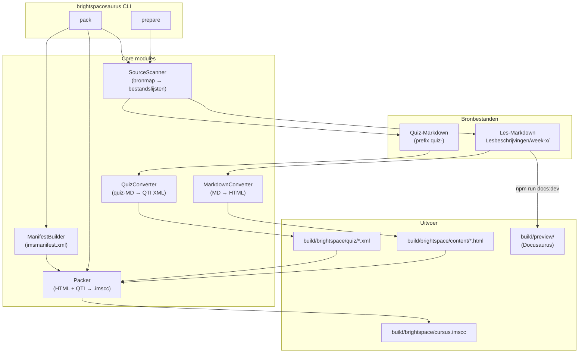

# Ontwerpdocument: Brightspacosaurus

## Overzicht

Brightspacosaurus is een Deno/TypeScript CLI-tool die Markdown-cursusmateriaal uit de OWE-1-monorepo omzet naar twee distributiepaden:

1. **Brightspace Common Cartridge** (`.imscc`): een zip-archief dat voldoet aan IMS Common Cartridge 1.3, importeerbaar in Brightspace als één pakket voor de hele cursus.
2. **Docusaurus-studentensite**: een lokale statische website op `localhost` die hetzelfde Markdown-materiaal toont voor studenten.

De tool vervangt het handmatige POC-script `scripts/build-week-1-brightspace-imscc.sh` door een herhaalbare pipeline met twee CLI-commando's: `prepare` en `pack`.

## Ontwerpprincipes

### Convention over configuration

De tool werkt zonder configuratiebestand. Brightspacosaurus scant automatisch de bekende bronmap:

- `6.3.Studentenmateriaal/6.3.1.Studentenhandleiding/Lesbeschrijvingen/` — alle Markdown-bestanden in de `week-x/`-mappen
  - Reguliere les-Markdown → HTML-conversie
  - Quiz-Markdown (prefix `quiz-`) → QTI XML-conversie

De bronmap is overschrijfbaar via CLI-vlag (`--sources`). Er is geen apart quizmap-argument nodig: quizzen worden herkend aan hun bestandsnaamprefix binnen dezelfde bronmap.

### Build-output gescheiden van bronbestanden

Alle gegenereerde bestanden (HTML, QTI XML, `.imscc`) worden geplaatst in `build/`, nooit naast de bronbestanden. De bestaande gegenereerde bestanden in de repository (zoals QTI XML naast quiz-Markdown) gelden als specificatie en voorbeeld van de gewenste uitvoer; ze worden op termijn vervangen door de gegenereerde versies in `build/`.

### Referentie-exports als specificatie

De bestaande Brightspace-exports in `scripts/brightspace/week-1/` en `6.1.Docentenhandleiding/meta/brightspace-poc/` dienen als de facto specificatie voor het Common Cartridge-formaat. De officiële IMS CC 1.3-spec is van 1EdTech maar zit achter een login. De referentie-exports zijn eerder succesvol geïmporteerd in Brightspace en vormen daarmee de primaire bron voor de verwachte XML-structuur, namespaces en resourcetypes. De kwaliteit van deze referentie-exports moet nog worden gevalideerd (zie taak 15).

## Architectuur



De CI-pipeline roept `prepare` en `pack` sequentieel aan en publiceert het `.imscc`-bestand als GitLab CI-artefact.

## Componenten en interfaces

### SourceScanner

Scant de bronmap en classificeert bestanden op basis van bestandsnaam. Geen apart quizmap-argument nodig.

```typescript
interface ScanOptions {
  sourcesDir: string;  // standaard: "6.3.Studentenmateriaal/6.3.1.Studentenhandleiding/Lesbeschrijvingen/"
  repoRoot: string;    // repository-root voor padvalidatie
}

interface ScanResult {
  markdownFiles: string[];  // reguliere les-Markdown, gesorteerd
  quizFiles: string[];      // quiz-Markdown (prefix "quiz-"), gesorteerd
}

function scanSources(options: ScanOptions): Promise<ScanResult>;
```

Quiz-bestanden worden herkend aan het prefix `quiz-` in de bestandsnaam. De scanner doorloopt de `week-x/`-mappen op het verwachte niveau — geen willekeurige nestdiepte.

### MarkdownConverter

Zet een Markdown-bestand om naar een zelfstandig HTML-bestand in `build/brightspace/content/`.

```typescript
interface ConvertOptions {
  sourcePath: string;  // absoluut pad naar bronbestand
  outputDir: string;   // absoluut pad naar build/brightspace/content/
  repoRoot: string;    // repository-root voor padvalidatie
}

interface ConvertResult {
  outputPath: string;
  copiedImages: string[];
}

function convertMarkdown(options: ConvertOptions): Promise<ConvertResult>;
```

Implementatie gebruikt [unified](https://unifiedjs.com/) via Deno JSR (zie [ADR 010](../../adr/adr010-unified-pipeline-voor-markdown-conversie.md)). Afbeeldingen met relatieve paden worden gekopieerd naar `build/brightspace/content/img/` en de paden in de HTML worden aangepast. QTI-gemarkeerde secties worden overgeslagen. De gegenereerde HTML bevat inline CSS-styling passend bij de Brightspace-weergave.

### ManifestBuilder

Genereert een geldig `imsmanifest.xml` op basis van de gescande bestanden.

```typescript
interface ManifestEntry {
  id: string;
  title: string;
  href: string;
  type: "webcontent" | "imsqti_xmlv1p2/imscc_xmlv1p3/assessment";
}

function buildManifest(
  courseTitle: string,
  entries: ManifestEntry[]
): string; // XML-string
```

Deterministische volgorde: HTML-bestanden gesorteerd op pad, QTI-bestanden daarna.

### Packer

Verpakt de `build/brightspace/`-map tot een `.imscc`-archief.

```typescript
interface PackOptions {
  sourceDir: string;   // build/brightspace/
  outputPath: string;  // build/brightspace/owe-1.imscc
}

function pack(options: PackOptions): Promise<void>;
```

Gebruikt een Deno-compatibele zip-bibliotheek (bijv. `jsr:@zip-js/zip-js`). Deterministische bestandsvolgorde (gesorteerd op pad). Bij mislukking wordt een gedeeltelijk aangemaakt bestand verwijderd.

### QuizConverter

Zet quiz-Markdown bestanden (prefix `quiz-`) om naar QTI 1.2 XML in `build/brightspace/quiz/`.

```typescript
interface QuizConvertOptions {
  sourcePath: string;   // absoluut pad naar quiz-Markdown
  outputDir: string;    // build/brightspace/quiz/
  repoRoot: string;
  sourcesDir: string;   // bronmap voor relatieve padberekening
}

function convertQuiz(options: QuizConvertOptions): Promise<QuizConvertResult>;
```

Quiz-Markdown bestanden worden herkend aan het prefix `quiz-` en worden niet als webcontent-pagina opgenomen in het manifest. Ze verschijnen uitsluitend als QTI-assessment (Brightspace "Tests").

### DiagramRenderer (gepland)

Rendert fenced code blocks met taal `mermaid` of `plantuml` naar SVG. Dezelfde renderlogica wordt gebruikt in zowel de Brightspace-export (MarkdownConverter) als de Docusaurus-preview, zodat diagrammen er identiek uitzien in beide omgevingen (dev/prod parity).

Overweging: Kroki als server-side rendering-backend (ondersteunt Mermaid, PlantUML en tientallen andere formaten via één API).

### CLI-entry points

```
deno run --allow-read --allow-write=../../build/ scripts/brightspacosaurus/src/main.ts prepare [--sources <map>]
deno run --allow-read --allow-write=../../build/ scripts/brightspacosaurus/src/main.ts pack
```

Of via `deno.json`-taken:

```
deno task prepare
deno task pack
```

Beide commando's schrijven voortgang naar `stdout` en fouten naar `stderr`. Exitcodes:

| Code | Betekenis |
|------|-----------|
| 0 | Succes |
| 1 | Ongeldige argumenten / gebruik |
| 2 | Bronmap niet gevonden of leeg |
| 3 | Bestandssysteemfout |
| 4 | Archiveringsfout |

## Uitvoerstructuur

```
build/brightspace/
├── imsmanifest.xml
├── content/
│   ├── week-1/
│   │   ├── lesoverzicht-1.1.html
│   │   └── lesoverzicht-1.2.html
│   └── img/
│       └── <gekopieerde afbeeldingen>
├── quiz/
│   └── week-1/
│       └── qti-quiz-1-1-oo-basics.xml
└── owe-1.imscc
```

De mappenstructuur onder `content/` weerspiegelt de structuur van `6.3.Studentenmateriaal/`.

### Docusaurus-configuratie

Docusaurus wordt geconfigureerd in `docusaurus.config.ts` in de repository-root. De `docs`-map wijst naar `6.3.Studentenmateriaal/`. De `build/preview/`-map is de statische uitvoer (niet gecommit).

## Correctheidseigenschappen

*Een eigenschap is een kenmerk of gedrag dat voor alle geldige uitvoeringen van een systeem moet gelden — een formele uitspraak over wat het systeem behoort te doen.*

### Eigenschap 1: HTML-uitvoer voldoet aan structuureisen

*Voor alle* geldige Markdown-bronbestanden geldt: na conversie bevat het HTML-uitvoerbestand een `<html lang="nl">`-attribuut, een `<meta charset="utf-8">`-element, en zijn alle relatieve afbeeldingspaden aangepast naar de gekopieerde locatie in `build/brightspace/content/img/`.

**Valideert: Requirements 1.1, 1.2**

---

### Eigenschap 2: Idempotentie van de volledige pipeline

*Voor alle* geldige bronmappen geldt: het twee keer achtereen uitvoeren van `prepare` gevolgd door `pack` op dezelfde invoer produceert byte-voor-byte identieke `.imscc`-archieven.

**Valideert: Requirements 1.4, 2.2**

---

### Eigenschap 3: Pakketinhoud is correct en compleet

*Voor alle* geldige bronmappen geldt: het gegenereerde `.imscc`-archief bevat een geldig `imsmanifest.xml` met een resource-entry voor elk gevonden Markdown-bestand (type `webcontent`) en voor elk gevonden QTI-bestand (type `imsqti_xmlv1p2/imscc_xmlv1p3/assessment`).

**Valideert: Requirements 2.1, 2.3**

---

### Eigenschap 4: Uitvoerstructuur weerspiegelt bronstructuur

*Voor alle* geldige bronmappen geldt: de mappenstructuur onder `build/brightspace/content/` is een exacte weerspiegeling van de mappenstructuur van de bronmap.

**Valideert: Requirements 3.5**

---

### Eigenschap 5: Ongeldige invoerpaden worden geweigerd

*Voor alle* invoerpaden die buiten de repository-root vallen of verwijzen naar niet-bestaande mappen, geldt: de tool weigert de bewerking, schrijft een foutmelding naar `stderr` met het ongeldige pad, en geeft een exitcode ongelijk aan nul terug.

**Valideert: Requirements 1.3, 2.4, 6.1**

---

### Eigenschap 6: Foutuitvoer volgt het juiste kanaal en exitcode

*Voor alle* foutscenario's geldt: foutmeldingen worden naar `stderr` geschreven, voortgang naar `stdout`, en de exitcode is ongelijk aan nul en overeenkomstig de foutcategorie.

**Valideert: Requirements 6.2, 6.5**

---

### Eigenschap 7: Geen corrupt artefact bij archiveringsfout

*Voor alle* scenario's waarbij de archiveringsstap mislukt, geldt: er bestaat geen gedeeltelijk aangemaakt `.imscc`-bestand in de uitvoermap na afloop van de mislukte run.

**Valideert: Requirements 6.3**

---

### Eigenschap 8: QTI-secties worden niet opgenomen in HTML-uitvoer

*Voor alle* Markdown-bestanden die een of meer QTI-gemarkeerde secties bevatten, geldt: de HTML-uitvoer bevat geen inhoud uit die secties.

**Valideert: Requirements 1.5**

---

### Eigenschap 9: Quiz-bestanden verschijnen niet als webcontent

*Voor alle* bestanden met het prefix `quiz-` in de bronmap geldt: deze worden niet opgenomen als webcontent-pagina in het IMSCC-pakket. Ze worden uitsluitend verwerkt als QTI-assessment.

**Valideert: Requirements 1.6**

---

## Foutafhandeling

| Situatie | Foutcategorie | Exitcode | Bericht naar |
|---|---|---|---|
| Ontbrekend verplicht argument | Gebruik | 1 | stderr + usage |
| Bronmap niet gevonden of leeg | Bronmap | 2 | stderr |
| Bronbestand niet leesbaar | Bestandssysteem | 3 | stderr |
| Schrijffout in uitvoermap | Bestandssysteem | 3 | stderr |
| Archiveringsfout | Archivering | 4 | stderr |
| Pad buiten repository-root | Bestandssysteem | 3 | stderr |

Bij een archiveringsfout verwijdert de Packer het gedeeltelijke uitvoerbestand voordat hij de fout doorgooit (zie Eigenschap 7).

## Teststrategie

### Aanpak

De teststrategie combineert twee complementaire benaderingen:

- **Unit-tests**: verifiëren specifieke voorbeelden, randgevallen en foutcondities.
- **Property-based tests**: verifiëren universele eigenschappen over willekeurig gegenereerde invoer.

### Testframework

- **Testrunner**: Deno's ingebouwde testrunner (`deno test`)
- **Property-based testing**: [fast-check](https://jsr.io/@fast-check/fast-check) via JSR (geen npm vereist)
- Minimaal **100 iteraties** per property-test

### Property-tests (fast-check)

| Eigenschap | Beschrijving |
|---|---|
| 1 | HTML-uitvoer structuureisen |
| 2 | Idempotentie pipeline |
| 3 | Pakketinhoud correct en compleet |
| 4 | Uitvoerstructuur weerspiegelt bronstructuur |
| 5 | Ongeldige paden geweigerd |
| 6 | Foutkanaal en exitcode |
| 7 | Geen corrupt artefact |
| 8 | QTI-secties uitgesloten van HTML |

### Unit-tests

- Specifieke voorbeelden van correcte HTML-uitvoer (snapshot-tests)
- Randgevallen: leeg Markdown-bestand, bestand zonder afbeeldingen, lege bronmap
- Foutcondities: ontbrekende bronmap, pad buiten root
- CLI-aanroep zonder argumenten (exitcode 1 + usage-tekst)
- Docusaurus-configuratie: verwijzing naar juiste bronmap, `build/preview/` in `.gitignore`

### CI-integratie

De GitLab CI-pipeline voert `deno test` uit als onderdeel van de `test`-stage. De CI-image gebruikt de officiële `denoland/deno`-Docker-image; geen npm-installatiestap nodig.
