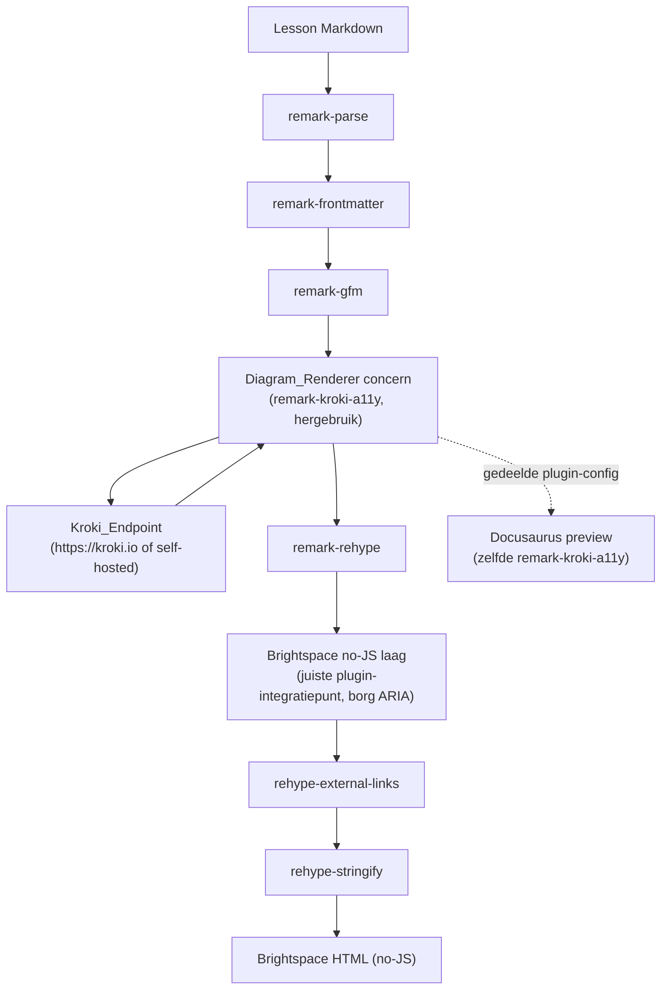

# Design Document: Diagram Rendering & Accessibility (a11y)

## Overview

Deze feature voegt diagramrendering en toegankelijkheid toe aan de HTML/Brightspace-route van Brightspacosaurus (BSO). PlantUML- en Mermaid-codeblokken in lespagina's worden tijdens `bso prepare` gerenderd tot een SVG-diagram in de HTML, met een toegankelijke wrapper (toegankelijke naam, broncode-disclosure en natuurlijketaal-beschrijving) die werkt zonder client-side JavaScript. Zie GitHub-issue [#14](https://github.com/bartvanderwal/brightspacosaurus/issues/14).

De kern van de wijziging is een nieuw concern — de **Diagram_Renderer** — dat wordt geïntegreerd in de bestaande unified/remark/rehype-pipeline van `src/markdown-converter.ts`. Die pipeline heeft op dit moment GEEN diagramplugin: ` ```plantuml `- en ` ```mermaid `-blokken blijven staan als ruwe codeblokken. De Diagram_Renderer verandert dat.

Het overkoepelende principe is **single source of truth**: de plugin `remark-kroki-a11y` (door @bartvanderwal) is de enige bron voor (a) de diagramrendering (via Kroki), (b) de broncode-disclosure, (c) de natuurlijketaal-beschrijving én (d) de toegankelijke titel-/labelteksten (via de parametriseerbare opties `summaryText`/`a11ySummaryText` met `{type}`/`{title}`-placeholders). BSO **hergebruikt** deze plugin en dupliceert de logica NIET (Requirement 11). Waar Brightspace afwijkt (no-JS iframe), past BSO een dunne **adaptatielaag** toe op de plugin-output, zonder de beschrijvings- of labellogica te herbouwen.

> **Bron van de ontwerpbeslissingen:** de backend-spike [remark-kroki-a11y#26](https://github.com/bartvanderwal/remark-kroki-a11y/issues/26) is afgerond en geresolved. De uitkomsten daarvan — backend nu `show-docs/remark-kroki` (ESM), in-process + async pipeline, geen apart proces puur voor Kroki, en `img-html-base64` als standaard outputmodus — zijn de grondwaarheid voor dit ontwerp. Zie **Key Design Decisions → Beslissing 1**.

### Ontwerpprincipes

1. **Hergebruik boven duplicatie** — Rendering, beschrijving, disclosure en labelteksten komen uit `remark-kroki-a11y`; BSO herimplementeert die niet (Requirement 11)
2. **No-JS in Brightspace** — De Brightspace-output biedt dezelfde toegankelijke inhoud zonder client-side JavaScript, via native `<details>`/`<summary>` en ARIA (Requirement 1.3, 4.3)
3. **Dev/prod-pariteit** — De Docusaurus-preview en de Brightspace-HTML delen dezelfde plugin-configuratie, zodat de inhoud identiek is (Requirement 6/7)
4. **Fail-fast met onderscheid** — Auteurfouten (ongeldige bron/parameter) worden onderscheiden van transiente fouten (Kroki onbereikbaar); standaard faalt de build (Requirement 12)
5. **Deterministische output** — Dezelfde broninhoud produceert identieke HTML, ook wat betreft ARIA-id's (Requirement 1.6, 9.6)
6. **Scope-afbakening** — Alleen de HTML/Brightspace-route; de PDF/reader-route (`diagram-filter.lua`) blijft ongewijzigd (Requirement 10)

## Architecture

### Positie binnen de bestaande pipeline

De Diagram_Renderer is geen losstaand CLI-commando maar een concern binnen de Markdown→HTML-conversie. De bestaande `processor` in `markdown-converter.ts` is een gedeelde `unified()`-instantie. Diagramrendering wordt in die pipeline geplaatst als een remark-stap (vóór `remark-rehype`), plus een dunne rehype/HTML-adaptatiestap voor de Brightspace no-JS-variant.



### Componentgrenzen

Om `markdown-converter.ts` cohesief te houden, worden de nieuwe verantwoordelijkheden in aparte modules geplaatst en door de converter aangeroepen:

- `src/diagram-renderer.ts` — bouwt en configureert de diagram-pipeline-stappen (plugin-wiring + adaptatielaag) en biedt de integratiepunten voor `markdown-converter.ts`.
- `src/diagram-config.ts` — vertaalt BSO-configuratie (`diagrams`-object) naar plugin-opties en gedeelde constanten (localized `summaryText`/`a11ySummaryText`, labels), zodat Docusaurus en BSO dezelfde bron gebruiken.
- `src/diagram-validation.ts` — de validatie-/detectielogica als los aanroepbaar concern, zodat een toekomstige `bso lint` deze kan hergebruiken (Requirement 13).
- `src/diagram-adapter.ts` — de dunne no-JS-adaptatielaag (rehype/hast-transformatie of HTML-nabewerking) die de JS-tab-wiring weglaat en de ARIA-relaties borgt.

De PDF/reader-route (`reader-pdf-converter.ts` + `assets/diagram-filter.lua`) wordt NIET aangeraakt (Requirement 10). Die route wordt hier alleen benoemd om de grens te tonen.

### Kernuitdaging: Deno-tool, Node/CJS-plugin

`remark-kroki-a11y` is een Node/CommonJS remark-plugin (`require('remark-kroki-a11y')`) die intern `unist-util-visit` gebruikt, afhankelijk is van `remark-kroki-plugin` voor de Kroki-rendering, en `fs` gebruikt voor lokale `src=`-verwijzingen. BSO draait op Deno. Hóe BSO deze plugin hergebruikt zonder de logica te dupliceren, is de centrale ontwerpbeslissing en wordt uitgewerkt in de sectie **Key Design Decisions**. De architectuur hierboven is bewust neutraal beschreven ("Diagram_Renderer concern") zodat de gekozen integratiewijze (in-process npm-compat versus Node-subproces) daar kan worden ingevuld.

## Components and Interfaces

### Diagram_Renderer (`src/diagram-renderer.ts`)

Verantwoordelijk voor het samenstellen van de diagram-pipeline en het aanbieden van integratiepunten aan `markdown-converter.ts`. De renderer voegt de plugin toe aan de unified-pipeline en past daarna de no-JS-adaptatie toe.

```typescript
import type { Plugin } from "unified";

/** Definitieve diagram-instellingen (afgeleid van ResolvedConfig.diagrams). */
export interface ResolvedDiagramConfig {
  /** Kroki_Endpoint. Standaard: "https://kroki.io". */
  krokiUrl: string;
  /** Bij ongeldige bron/parameter of onbereikbaar endpoint: build laten falen. Standaard: true. */
  failOnError: boolean;
  /** Taal voor labels/beschrijving-templates ('nl' | 'en'). Standaard: 'nl'. */
  locale: "nl" | "en";
}

/**
 * Bouwt de remark-plugin-configuratie voor remark-kroki-a11y op basis van
 * de BSO-diagramconfiguratie. Gedeeld tussen BSO en de Docusaurus-preview
 * (dev/prod-pariteit, Requirement 6/7).
 */
export function buildKrokiA11yOptions(cfg: ResolvedDiagramConfig): KrokiA11yOptions;

/**
 * Registreert de diagramrendering (plugin + adaptatie) op een bestaande
 * unified processor. Retourneert de uitgebreide processor.
 * Wordt aangeroepen vanuit markdown-converter.ts.
 */
export function withDiagramRendering(
  processor: Processor,
  cfg: ResolvedDiagramConfig,
): Processor;
```

De optie-set `KrokiA11yOptions` weerspiegelt de bestaande plugin-opties (niet door BSO uitgebreid): `showSource`, `showA11yDescription`, `defaultExpanded`, `summaryText`, `a11ySummaryText`, `tabSourceLabel`, `tabA11yLabel`, `cssClass`, `languages`, `locale`, `showDiagramModeToggle`, `showDiagramLegend`. De onderliggende Kroki-render-opties worden nu doorgegeven aan de `show-docs/remark-kroki`-backend: `server`, `output`, `target`, `headers` en `alias` (valt terug op `languages`). BSO configureert deze; het herimplementeert ze niet (Requirement 11.1, 11.2).

### Mapping BSO-config → plugin-/remark-kroki-opties

De onderstaande tabel gebruikt de echte `show-docs/remark-kroki`-optienamen (na de backend-refactor, [remark-kroki-a11y#26](https://github.com/bartvanderwal/remark-kroki-a11y/issues/26)).

| BSO `diagrams`-veld | remark-kroki-optie | Status | Opmerking |
|---|---|---|---|
| `krokiUrl` | `server` | actief | Kroki_Endpoint; ook honoreerbaar via env `KROKI_BASE_URL` |
| `output` | `output` | actief | `img-html-base64` (standaard) \| `inline-svg` \| `img-base64` \| `object-base64` |
| (afgeleid) | `target` | actief | Doel-flavour (bijv. `mdx3`) |
| (afgeleid) | `headers` | actief | Optionele HTTP-headers naar het Kroki_Endpoint |
| `languages` | `alias` | actief | Taal-aliassen; `alias` valt terug op `languages` |
| `failOnError` | (BSO-adaptatielaag) | actief | Bepaalt throw vs. warning+fallback rond de plugin |
| `locale` (afgeleid) | `locale`, `summaryText`, `a11ySummaryText` | actief | Gelokaliseerde templates met `{type}`/`{title}` |
| — | `showDiagramModeToggle: false` | actief | Voor Brightspace: geen JS-toggle (no-JS) |
| `lang` | — | legacy/ongebruikt | Rendering gebruikt codeblok-taal + meta-type; legacy geaccepteerd |
| `imgRefDir` / `imgDir` | — | legacy/ongebruikt | Waren voor het naar schijf schrijven van SVG's; niet gebruikt bij base64-embedding |

De toegankelijke labelteksten komen dus uit de plugin-opties (`summaryText`/`a11ySummaryText`), niet uit door BSO zelf samengestelde labellogica (Requirement 3.1, 5.5, 11.2). BSO levert alleen de gelokaliseerde template-strings aan.

### Diagram_Adapter (`src/diagram-adapter.ts`)

De dunne no-JS-laag. Het doel is NIET om de React/JS-tab-HTML te strippen, maar om het juiste `remark-kroki-a11y`-integratiepunt te vinden dat de gewenste output rechtstreeks levert. In de standaard outputmodus (`img-html-base64`) is het diagram een base64 ``; de toegankelijke inhoud leeft dan in de OMRINGENDE HTML (de ``, de `aria-describedby`-koppeling naar de beschrijving, en de `<details>`/`<summary>`-blokken), niet binnen de SVG. De plugin genereert al een native `<details>`/`<summary>`-blok met de broncode en (via de a11y-kern) de natuurlijketaal-beschrijving; die HTML is direct herbruikbaar. Voorkeursroute: configureer de plugin naar de non-tab/native `<details>`-variant (bijv. `showDiagramModeToggle: false`), zodat de output al no-JS is. Alleen als geen plugin-punt de no-JS-vorm rechtstreeks geeft, past deze laag een MINIMALE naverwerking toe die de JS-tab-bekabeling weglaat en het bestaande `<details>`/`<summary>`-blok hergebruikt. In beide gevallen borgt de laag de ARIA-relaties. De pipeline is async (Kroki is een netwerkaanroep); de adaptatie draait dus op de geawaite plugin-output.

```typescript
/**
 * Past de plugin-output aan voor Brightspace (no-JS):
 * - hergebruikt het native <details>/<summary>-blok van de plugin; verwijst niet naar client scripts;
 * - standaardmodus (img-html-base64): borgt een niet-lege alt op de base64  en
 *   een aria-describedby naar het beschrijvingselement (a11y in de omringende HTML);
 * - inline-svg-modus: borgt role="img" op de SVG en legt aria-labelledby (naar <title>);
 * - legt aria-describedby (naar de beschrijving) in beide modi;
 * - kent deterministische, stabiele id's toe voor de ARIA-relaties.
 * De pipeline is async; deze adaptatie draait op de geawaite plugin-output.
 * Dit is een adaptatie van de plugin-output, GEEN herimplementatie van de
 * beschrijvings- of labellogica (Requirement 11.4).
 */
export function adaptForBrightspace(
  tree: HastRoot,
  ctx: DiagramAdaptContext,
): HastRoot;

/** Context met o.a. bronbestandsnaam en een deterministische id-generator. */
export interface DiagramAdaptContext {
  sourceFile: string;
  /** Deterministische id-strategie (content-hash of index-gebaseerd). */
  makeId: (diagramIndex: number, kind: "title" | "desc" | "src") => string;
}
```

### Diagram_Validation (`src/diagram-validation.ts`)

De validatie-/detectielogica, zo opgezet dat een toekomstige `bso lint` deze kan aanroepen zónder te renderen (Requirement 13). `bso lint` zelf valt buiten scope ([#11](https://github.com/bartvanderwal/brightspacosaurus/issues/11)).

```typescript
/** Soort diagramprobleem dat los van rendering detecteerbaar is. */
export type DiagramIssueKind =
  | "unsupported-language"     // taalaanduiding is geen ondersteund diagramtype
  | "unknown-fence-option"     // onbekende fence-meta-optie
  | "invalid-src"              // ongeldige/niet-lokale src=
  | "empty-diagram"            // leeg diagramblok
  | "invalid-option-value";    // door de plugin afgewezen optiewaarde

/** Eén gedetecteerd probleem, met genoeg context voor een actiegerichte melding. */
export interface DiagramIssue {
  kind: DiagramIssueKind;
  sourceFile: string;
  /** Regel/positie in het bronbestand, indien bekend. */
  position?: { line: number; column: number };
  /** Diagramtitel indien aanwezig (title=/imgTitle=). */
  diagramTitle?: string;
  /** Actiegerichte, mensleesbare reden. */
  message: string;
}

/**
 * Detecteert statisch (zonder Kroki-aanroep) problemen in diagram-codeblokken:
 * niet-ondersteunde talen, onbekende fence-opties, ongeldige src.
 * Herbruikbaar door zowel de render-stap als een toekomstige `bso lint`.
 */
export function detectDiagramIssues(
  markdown: string,
  sourceFile: string,
): DiagramIssue[];
```

Merk op: fouten in de diagram-*bron* zelf (ongeldige PlantUML/Mermaid) worden pas door Kroki gedetecteerd; die worden tijdens rendering afgevangen (zie Error Handling). De statische detectie dekt talen, fence-opties en `src`.

### Config-uitbreiding (`src/config-loader.ts`, `src/types.ts`)

Een optioneel `diagrams`-object wordt toegevoegd aan `BsoConfig` en gevalideerd door `validateConfig`.

```typescript
// types.ts — toevoeging aan BsoConfig
export interface BsoConfig {
  // ...bestaande velden...
  /** Diagramrendering-configuratie. Optioneel. */
  diagrams?: DiagramsConfig;
}

/** Configuratie voor diagramrendering (Requirement 2). */
export interface DiagramsConfig {
  /** Kroki_Endpoint (gemapt naar remark-kroki `server`). Standaard: "https://kroki.io". */
  krokiUrl?: string;
  /** Outputmodus (gemapt naar remark-kroki `output`). Standaard: "img-html-base64". */
  output?: "img-html-base64" | "inline-svg" | "img-base64" | "object-base64";
  /** Build laten falen bij fout. Standaard: true. */
  failOnError?: boolean;
}

// ResolvedConfig — toevoeging
export interface ResolvedConfig {
  // ...bestaande velden...
  /** Definitieve diagram-instellingen (altijd ingevuld met defaults). */
  diagrams: ResolvedDiagramConfig;
}
```

`validateConfig` krijgt een blok dat het optionele `diagrams`-object controleert: als het aanwezig is, moet het een object zijn; `krokiUrl` (indien aanwezig) een string die als URL parseerbaar is; `output` (indien aanwezig) een van `img-html-base64` | `inline-svg` | `img-base64` | `object-base64`; `failOnError` (indien aanwezig) een boolean. `resolveConfig` vult defaults in: `krokiUrl` → `"https://kroki.io"`, `output` → `"img-html-base64"`, `failOnError` → `true`, `locale` → `"nl"`.

> Naamgeving: dit ontwerp gebruikt de doelnaam `BsoConfig`. In de huidige code heet het type nog `BssConfig` (in `src/types.ts`); de rename `BssConfig` → `BsoConfig` (inclusief regressietests) wordt apart uitgevoerd, na deze feature.


### Assets (`src/assets.ts`, `deno.json`)

Voor de no-JS-styling van de `<details>`-disclosure kan Brightspace-specifieke CSS nodig zijn. Nieuwe assets worden geladen via `src/assets.ts` (`loadAssetText`) — nooit via `import.meta.url` + `Deno.readTextFile()` — en MOETEN in `deno.json` onder `publish.include` worden opgenomen, anders zijn ze niet beschikbaar vanuit de JSR-cache.

- Als extra CSS nodig blijkt: `assets/diagram-a11y.css`, geladen via `loadAssetText("diagram-a11y.css")` en toegevoegd aan het bestaande `<style>`-blok in `wrapHtml()`. Toevoegen aan `publish.include`.
- De Docusaurus-preview gebruikt de client module + CSS van de plugin zelf; die worden NIET in de Brightspace-output opgenomen.

## Key Design Decisions

### Beslissing 1: Hoe hergebruikt een Deno-tool de (nu ESM-backed) remark-plugin?

Dit is de centrale beslissing. De backend-spike ([remark-kroki-a11y#26](https://github.com/bartvanderwal/remark-kroki-a11y/issues/26)) is inmiddels **afgerond** en is de bron van de onderstaande conclusies.

**Uitkomst van de spike (grondwaarheid):**
- De backend-swap is geslaagd: `remark-kroki-a11y` gebruikt intern nu `show-docs/remark-kroki` (ESM-first) in plaats van het gearchiveerde `remark-kroki-plugin`. PlantUML werkt en de tests daarvoor zijn groen.
- De pipeline is **in-process en async**: er is GEEN apart Node-proces nodig puur voor de Kroki-rendering. De Kroki-render is een asynchrone netwerkaanroep naar de Kroki-server; de adapter geeft die Promise door aan unified/remark, dus consumers MOETEN de remark-pipeline asynchroon aanroepen/awaiten.
- De standaard outputmodus is `img-html-base64` (base64 ``), niet `inline-svg`. `inline-svg` blijft een configureerbaar alternatief.
- De a11y-kernfunctie (natuurlijketaal-beschrijving) is ongewijzigd; alleen de rendering-backend is gewisseld.
- Resterende Deno-nuance: de a11y-wrapper zelf is nog CommonJS (`require`, `module.exports`, gebruikt Node `fs`/`path`) en importeert `remark-kroki` dynamisch via `import('remark-kroki')`. Puur voor Kroki is dus geen apart proces nodig, maar Deno-compatibiliteit hangt nog af van hoe BSO Node/CJS/npm-compat afhandelt — dat blijft de kern van spike-taak 1.

Op basis hiervan blijft de opzet **Optie A (in-process onder Deno's npm-compat) als primaire route**, met **Optie C (adaptatielaag) als verplichte aanvulling** en **Optie B (Node-subproces) als pure terugvaloptie**.

**Optie A — Plugin direct in de BSO unified-pipeline via Deno's Node-compat (`npm:`-specifier).**
BSO importeert `npm:remark-kroki-a11y` en `.use()`t de plugin in de bestaande `processor`; de pipeline wordt asynchroon geawait.

- Voordeel: maximale hergebruik, één pipeline, geen extra proces; sluit naadloos aan op de huidige `unified()`-opzet. De backend is nu ESM-first, wat de kans op werkende npm-compat vergroot.
- Resterend risico: de a11y-wrapper is nog CJS (`require`, `fs`/`path`, dynamische `import('remark-kroki')`); of Deno's npm-compat dit volledig afhandelt, wordt door spike-taak 1 specifiek voor BSO geverifieerd.

**Optie B — Plugin in een klein Node-subproces tijdens `bso prepare`.**
BSO orkestreert een Node-stapje (bijv. via `Deno.Command("node", ...)`) dat dezelfde plugin draait en HTML/markdown teruggeeft.

- Dit is nu een **pure terugvaloptie**, alleen relevant als Deno's npm-compat op de CJS-wrapper faalt. Nadeel: introduceert een Node-afhankelijkheid naast Deno (installatie + CI-kost) en botst met de "Deno-only"-eenvoud uit ADR-008.

**Optie C — Alleen de plugin-OUTPUT hergebruiken via een dunne adaptatielaag.**
De plugin (via A of B) produceert de rendering + beschrijving + disclosure; BSO hergebruikt die output (bij voorkeur via het juiste plugin-integratiepunt) voor de Brightspace no-JS-vorm.

- Dit is geen alternatief voor A/B maar een noodzakelijke aanvulling: ongeacht hóe de plugin draait, is een adaptatielaag nodig om de JS-tab-wiring weg te nemen en ARIA te borgen (Requirement 11.4). Optie C staat expliciet toe dat BSO géén render-/beschrijvingslogica dupliceert.

**Aanbeveling: Optie A als primaire route (bevestigd door de spike), met Optie C als verplichte adaptatielaag, en Optie B als pure terugvaloptie.**

Rationale:
- Optie A maximaliseert hergebruik in één pipeline en respecteert de Deno-only-conventie (ADR-008), wat Requirement 11 het beste dient. De backend is nu ESM en async, waardoor A de voorkeursroute is.
- Optie C (de adapter) is hoe dan ook nodig voor de no-JS-transformatie; die scheidt "adaptatie" netjes van "herimplementatie" (Requirement 11.3/11.4).
- Optie B blijft achter de hand als de CJS-wrapper onder Deno's npm-compat niet betrouwbaar blijkt.

**Resterende verificatie (spike-taak 1).** De backend-spike is afgerond, maar de Deno-compatibiliteit van de CJS-wrapper (`require`/`fs`/`import()`) specifiek in BSO's npm-compat blijft te verifiëren. Spike-taak 1 haalt daarom een minimale fixture (één PlantUML + één Mermaid) door `npm:remark-kroki-a11y` in een Deno-pipeline, awaiten de async pipeline, en verifieert dat de base64 ``-output verschijnt. Slaagt dit → Optie A blijft de route; faalt de npm-compat op de CJS-wrapper → Optie B (Node-subproces). De adaptatielaag (C) is in beide gevallen gelijk.

> **De backend-refactor is inmiddels geland.** `remark-kroki-a11y` gebruikte eerder het *gearchiveerde* `remark-kroki-plugin` (oud `remark@13`, CJS, `node-fetch`). De refactor ([remark-kroki-a11y#26](https://github.com/bartvanderwal/remark-kroki-a11y/issues/26); vervolg op [#17](https://github.com/bartvanderwal/remark-kroki-a11y/issues/17)) heeft dit vervangen door het actief onderhouden, ESM-first [`show-docs/remark-kroki`](https://github.com/show-docs/remark-kroki) (o.a. `unist-util-visit@5`, `target: "mdx3"`, en `output`-modi waaronder `img-html-base64` en `inline-svg`). De hele keten is nu ESM + modern; de a11y-kernfunctie (natuurlijketaal-beschrijving) is ongewijzigd. Zie taak 0 in de tasks.

### Beslissing 2: Deterministische ARIA-id's

De plugin genereert unieke id's voor ARIA-relaties; als die niet-deterministisch zijn (random/volgnummer per proces), breekt dat de idempotentie-eis (Requirement 1.6, 9.6). De adapter kent daarom eigen, deterministische id's toe, afgeleid van (bronbestand + diagramindex) of een content-hash van de diagrambron. Zo produceren twee runs op dezelfde invoer identieke `id`/`aria-*`-attributen.

### Beslissing 3: Onderscheid transiente fout vs. auteurfout

Requirement 2 (Kroki onbereikbaar) en Requirement 12 (ongeldige bron/parameter) vragen om verschillende behandeling. Het foutmodel (zie Data Models) codeert dit onderscheid expliciet via een `category`-veld, zodat de melding en het build-gedrag correct kunnen verschillen, onafhankelijk van de bereikbaarheid van Kroki (Requirement 12.5).

## Data Models

### `diagrams`-configuratie

```json
{
  "courseName": "OWE 1 - Full Stack Engineering",
  "version": "2.1.0",
  "sourcesDir": "bronmateriaal/lessen/",
  "diagrams": {
    "krokiUrl": "https://kroki.io",
    "output": "img-html-base64",
    "failOnError": true
  }
}
```

| Veld | Type | Standaard | Beschrijving |
|---|---|---|---|
| `diagrams` | `object` | afwezig → defaults | Diagramrendering-configuratie |
| `diagrams.krokiUrl` | `string` (URL) | `"https://kroki.io"` | Kroki_Endpoint (gemapt naar remark-kroki `server`) |
| `diagrams.output` | `"img-html-base64"` \| `"inline-svg"` \| `"img-base64"` \| `"object-base64"` | `"img-html-base64"` | Outputmodus (gemapt naar remark-kroki `output`) |
| `diagrams.failOnError` | `boolean` | `true` | Build laten falen bij fout |

`krokiUrl` blijft het gebruikersgerichte veld en mapt naar de `server`-optie van `show-docs/remark-kroki`. Zelf-gehoste Kroki (CI/offline): draai Kroki via Docker en zet `krokiUrl` op de lokale instantie, of gebruik env `KROKI_BASE_URL`. Voor Mermaid op een lokale Docker-Kroki is de companion-container `yuzutech/kroki-mermaid` vereist; met de publieke `https://kroki.io` werkt Mermaid zonder companion. De documentatie beschrijft dit en waarom het CI-vriendelijk is (Requirement 2.8, 2.9).

### Foutmodel

```typescript
/** Categorie bepaalt melding en build-gedrag (transient vs. auteurfout). */
export type DiagramErrorCategory =
  | "kroki-unreachable"   // transiente conditie (Requirement 2.6)
  | "invalid-source"      // auteurfout: Kroki wijst de diagrambron af (Requirement 12.1)
  | "invalid-parameter";  // auteurfout: ongeldige/onbekende parameter/optie (Requirement 12.2)

export interface DiagramError {
  category: DiagramErrorCategory;
  /** Bronbestand waarin het diagram staat. */
  sourceFile: string;
  /** Diagram-identificatie: regel/positie en/of titel. */
  diagram: { position?: { line: number; column: number }; title?: string };
  /** Onderliggende, actiegerichte reden. */
  reason: string;
}
```

Het gedrag is een functie van `category` en `failOnError`:

| `category` | `failOnError: true` (default) | `failOnError: false` |
|---|---|---|
| `kroki-unreachable` | Build faalt, melding naar `stderr` (bron + diagram) | Waarschuwing, origineel codeblok als fallback, build gaat door |
| `invalid-source` | Build faalt (fail-fast), actiegerichte melding | Waarschuwing + fallback, build gaat door |
| `invalid-parameter` | Build faalt (fail-fast), actiegerichte melding | Waarschuwing + fallback, build gaat door |

### Target-HTML-structuur (Brightspace, no-JS)

Concreet voorbeeld van wat BSO per diagram emit (na adaptatie) in de **standaard outputmodus (`img-html-base64`)**. De a11y leeft in de omringende HTML: een base64 `` met een betekenisvolle `alt` en een `aria-describedby` naar de beschrijving. Geen `<script>` vereist:

```html
<figure class="bso-diagram">
  
  <details class="bso-diagram-desc">
    <summary>Beschrijving</summary>
    <div id="diag-1-desc">
      <!-- natuurlijketaal-beschrijving uit remark-kroki-a11y -->
    </div>
  </details>
  <details class="bso-diagram-src">
    <summary>Broncode</summary>
    <pre><code class="language-plantuml"><!-- originele diagram-broncode --></code></pre>
  </details>
</figure>
```

Als alternatief levert de **`inline-svg`-modus** (configureerbaar via `diagrams.output`) de a11y binnen de SVG zelf, via `role="img"` + `<title>` + `aria-labelledby`:

```html
<figure class="bso-diagram">
  <svg role="img" aria-labelledby="diag-1-title" aria-describedby="diag-1-desc" viewBox="...">
    <title id="diag-1-title">Klassediagram: Bestellingdomein</title>
    <!-- door Kroki gerenderde SVG-inhoud -->
  </svg>
  <details class="bso-diagram-desc">
    <summary>Beschrijving</summary>
    <div id="diag-1-desc"><!-- natuurlijketaal-beschrijving --></div>
  </details>
  <details class="bso-diagram-src">
    <summary>Broncode</summary>
    <pre><code class="language-plantuml"><!-- originele diagram-broncode --></code></pre>
  </details>
</figure>
```

- De `alt`-/`<title>`-tekst en de `<summary>`-labels komen uit de plugin-opties (`summaryText`/`a11ySummaryText`), niet uit BSO-eigen labellogica (Requirement 3.1, 4.4, 5.5).
- Standaardmodus: de `` levert de toegankelijke naam, `aria-describedby` koppelt naar de beschrijving (Requirement 3.1, 3.2). Inline-svg-modus: `role="img"` + `aria-labelledby` + `aria-describedby` leggen de ARIA-relaties binnen de SVG (Requirement 3.3, 8.3).
- De pipeline is async (Kroki is een netwerkaanroep) en wordt geawait voordat de HTML wordt gestringificeerd.
- De id's (`diag-1-*`) zijn deterministisch (Beslissing 2).

## Correctness Properties

*Een property is een eigenschap of gedrag dat waar moet zijn voor alle geldige uitvoeringen van een systeem — in wezen een formele uitspraak over wat het systeem hoort te doen. Properties vormen de brug tussen menselijk leesbare specificaties en machinaal verifieerbare correctheidsgaranties.*

De eigenlijke Kroki-rendering (netwerk/externe service) wordt NIET met property-tests gedekt; die valt onder integratietests met enkele representatieve voorbeelden. De onderstaande properties gelden de pure, input-gevarieerde onderdelen van BSO: de no-JS-adaptatielaag, de ARIA-/disclosure-structuur, de config-resolutie, de statische validatie en de foutbeslissing. Waar de plugin nodig is, wordt Kroki gemockt zodat de properties goedkoop en offline draaien.

### Property 1: No-JS output

*Voor elk* gerenderd diagram in de Brightspace-adaptatie-output geldt dat de gegenereerde HTML geen `<script>`-element bevat dat nodig is om het diagram of de disclosure-widgets te laten werken; de disclosures zijn native `<details>`-elementen.

**Validates: Requirements 1.3, 4.3, 5.4, 9.5**

### Property 2: Deterministische output (double-run)

*Voor elke* diagram-broninhoud geldt dat tweemaal verwerken door de volledige transformatie (inclusief ARIA-id-toekenning) byte-identieke HTML oplevert.

**Validates: Requirements 1.6, 9.6**

### Property 3: ARIA-relaties (outputmodus-afhankelijk)

*Voor elk* gerenderd diagram geldt, afhankelijk van de geconfigureerde outputmodus: in de standaardmodus (`img-html-base64`) heeft het ``-element een niet-lege `alt`-attribuutwaarde en — wanneer een beschrijving beschikbaar is — een `aria-describedby` dat verwijst naar het `id` van het beschrijvingselement; in de `inline-svg`-modus heeft het `<svg>`-element `role="img"`, een `aria-labelledby` dat verwijst naar een `<title>`-element met dezelfde `id`, en — wanneer een beschrijving beschikbaar is — een `aria-describedby` naar het `id` van het beschrijvingselement.

**Validates: Requirements 3.1, 3.2, 3.3, 3.4, 8.3**

### Property 4: Disclosure-structuur

*Voor elk* gerenderd diagram geldt dat de output een broncode-`<details>` bevat waarvan de inhoud gelijk is aan de originele diagram-broncode, dat — wanneer een beschrijving beschikbaar is — een beschrijving-`<details>` aanwezig is waarvan de inhoud tekstueel is (geen ``), en dat elke `<details>` een niet-lege `<summary>`-label heeft.

**Validates: Requirements 4.1, 4.2, 4.4, 5.2**

### Property 5: Pass-through van niet-diagram-codeblokken

*Voor elk* codeblok waarvan de taalaanduiding geen ondersteund diagramtype is, geldt dat het blok ongewijzigd in de HTML-output wordt opgenomen.

**Validates: Requirements 1.4**

### Property 6: Config-resolutie en mapping

*Voor elk* geldig `BsoConfig`-object geldt dat `resolveConfig` bij een ontbrekend `diagrams.krokiUrl` de standaardwaarde `"https://kroki.io"` invult en bij een ontbrekend `diagrams.output` de standaardwaarde `"img-html-base64"`, en bij een aanwezige geldige URL exact die URL vastlegt in `diagrams.krokiUrl`; de omzetting naar remark-kroki-opties zet `server` gelijk aan die definitieve `krokiUrl` en `output` gelijk aan de opgeloste `output`.

**Validates: Requirements 2.2, 2.3, 2.5**

### Property 7: Statische parameterdetectie

*Voor elk* diagram-codeblok met een onbekende fence-optie of een ongeldige `src=` geldt dat `detectDiagramIssues` een `invalid-parameter`- (of `invalid-src`-)issue retourneert dat het bronbestand en de betreffende parameter identificeert; voor blokken met uitsluitend geldige opties retourneert de functie geen parameterissue.

**Validates: Requirements 12.2**

### Property 8: Foutbeslissing (fail vs. fallback)

*Voor elke* combinatie van een `DiagramError`-categorie en de `failOnError`-vlag geldt: bij `failOnError: true` signaleert de foutafhandeling een echte buildfout (throw / niet-nul exitcode), en bij `failOnError: false` schaalt zij af naar een waarschuwing met fallback (origineel codeblok behouden) zonder de build te stoppen.

**Validates: Requirements 12.3, 12.4, 12.6**

### Property 9: Auteurfout-categorisatie onafhankelijk van bereikbaarheid

*Voor elke* auteurfout-invoer (ongeldige diagrambron of ongeldige parameter) geldt dat de categorisatie `invalid-source` of `invalid-parameter` is en nooit `kroki-unreachable`, ongeacht of het Kroki_Endpoint bereikbaar is.

**Validates: Requirements 12.5**

## Error Handling

Mapping op Requirement 12 (en 2/5):

| Situatie | Categorie | Standaard (`failOnError: true`) | `failOnError: false` | Req |
|---|---|---|---|---|
| Kroki onbereikbaar | `kroki-unreachable` | Build faalt, melding met bron + diagram | Waarschuwing + fallback | 2.6, 2.7 |
| Ongeldige PlantUML/Mermaid (Kroki wijst af) | `invalid-source` | Build faalt, actiegerichte melding (bestand + diagram + reden) | Waarschuwing + fallback | 12.1, 12.3, 12.4 |
| Onbekende fence-optie / ongeldige `src=` / afgewezen optie | `invalid-parameter` | Build faalt, melding (bestand + parameter) | Waarschuwing + fallback | 12.2, 12.3, 12.4 |
| Geen beschrijving genereerbaar | (waarschuwing, geen fout) | Diagram alsnog gerenderd met naam + broncode-disclosure, warning naar `stderr` | idem | 5.3 |

Belangrijke eisen:
- Auteurfouten worden als zodanig gerapporteerd, onafhankelijk van Kroki-bereikbaarheid, en onderscheiden van de transiente conditie (Requirement 12.5).
- Een gerapporteerde fout is een echte, zichtbare buildfout (standaard), niet slechts een `stderr`-regel terwijl de build ongewijzigd doorloopt (Requirement 12.6). Dit sluit aan op de bestaande fail-fast-conventie in BSO (niet-nul exitcode).
- Consistent met het throw-on-invalid-gedrag van de plugin zelf: de plugin gooit hard bij ongeldige invoer; BSO vangt die en zet die om naar `invalid-source`/`invalid-parameter`.

## Testing Strategy

### Overzicht

Drie niveaus: property-based tests (fast-check, ≥100 iteraties), unit tests (specifieke voorbeelden/edge cases/foutpaden) en integratietests (end-to-end conversie van fixtures). Voor unit- en property-tests wordt Kroki gemockt zodat CI offline en goedkoop kan draaien. Integratietests die een echte Kroki raken, gebruiken de publieke `https://kroki.io` OF een lokale Docker-Kroki; bij een lokale Docker-Kroki is voor Mermaid de companion-container `yuzutech/kroki-mermaid` vereist (Requirement 2.8, 2.9). De remark-pipeline is async (Kroki is een netwerkaanroep); alle tests die de pipeline draaien MOETEN die asynchroon awaiten.

### Fixtures (Requirement 9)

- `tests/fixtures/diagram-plantuml.md` — lespagina met een PlantUML-codeblok (Requirement 9.1).
- `tests/fixtures/diagram-mermaid.md` — lespagina met een Mermaid-codeblok (Requirement 9.2).

### Verificaties op de HTML-output

Per fixture (unit/integratie):
- HTML bevat een base64 ``-element (standaardmodus) of een `<svg>`-element (inline-svg-modus) voor het diagram (Requirement 9.3).
- HTML bevat de a11y-wrapper: een toegankelijke naam (standaardmodus: `` + `aria-describedby`; inline-svg-modus: `<title>` + `aria-labelledby`), een broncode-disclosure en een beschrijving-disclosure (Requirement 9.4).
- Brightspace-HTML bevat GEEN `<script>` dat nodig is om diagram of disclosure te laten werken (Requirement 9.5).
- Twee runs op dezelfde fixture leveren identieke HTML op (Requirement 9.6).

### Property-based tests (fast-check)

De adaptatielaag, de config-resolutie, de statische validatie en de foutbeslissing zijn pure, input-gevarieerde transformaties en lenen zich voor property-based testing (fast-check, `npm:fast-check@^4.7.0`). Elke property draait ≥100 iteraties (`fc.assert(fc.property(...), { numRuns: 100 })`), getagd met `// Feature: diagram-rendering-a11y, Property N: ...`. Waar de plugin nodig is, wordt Kroki gemockt zodat de tests offline en goedkoop blijven.

| Property | Beschrijving | Referentie |
|---|---|---|
| 1 | No-JS output (geen vereiste `<script>`) | Design Property 1 |
| 2 | Deterministische output (double-run) | Design Property 2 |
| 3 | ARIA-relaties op de SVG | Design Property 3 |
| 4 | Disclosure-structuur | Design Property 4 |
| 5 | Pass-through van niet-diagram-codeblokken | Design Property 5 |
| 6 | Config-resolutie en mapping | Design Property 6 |
| 7 | Statische parameterdetectie | Design Property 7 |
| 8 | Foutbeslissing (fail vs. fallback) | Design Property 8 |
| 9 | Auteurfout-categorisatie onafhankelijk van bereikbaarheid | Design Property 9 |

Voor de eigenlijke Kroki-rendering (netwerk/externe service) worden GEEN property-tests geschreven; die valt onder integratietests met 1–3 representatieve voorbeelden.

### Docusaurus-preview (Requirement 7)

- `remark-kroki-a11y` wordt in de Docusaurus-remark-pipeline geconfigureerd met dezelfde gedeelde opties als BSO (`buildKrokiA11yOptions`), zodat de inhoud identiek is (Requirement 7.1, 6.x).
- Er komt een geautomatiseerde test die verifieert dat de preview de verwachte toegankelijke inhoud produceert voor een fixture (Requirement 7.3). Eerlijk kader: op dit moment is `remark-kroki-a11y` nog NIET getest in de Docusaurus-preview; die test is onderdeel van deze feature.

### Testcommando

```bash
deno task test
# deno test --allow-read --allow-write --allow-run --allow-env tests/
```

## Requirements Coverage

| Req | Waar geadresseerd |
|---|---|
| 1 (rendering PlantUML/Mermaid, deterministisch, no-JS) | Architecture (pipeline-integratie), Diagram_Renderer, Beslissing 2 (determinisme), Properties 1/2/5 |
| 2 (configureerbaar Kroki-endpoint) | Config-uitbreiding, Data Models (`diagrams`), Error Handling (transient), self-hosted Kroki-notitie |
| 3 (toegankelijke naam/beschrijving via wrapper; inline-svg-alternatief) | Diagram_Adapter, Target-HTML-structuur (base64 ``/`aria-describedby` default, SVG-`<title>` bij inline-svg), mapping naar `summaryText`/`a11ySummaryText` |
| 4 (no-JS disclosure-widgets) | Diagram_Adapter, Target-HTML-structuur (native `<details>`/`<summary>`) |
| 5 (natuurlijketaal-beschrijving via plugin) | Diagram_Renderer (hergebruik plugin-output), Error Handling (5.3), labelteksten uit plugin-opties |
| 6 (dev/prod-pariteit) | `buildKrokiA11yOptions` gedeeld, Beslissing 1, Docusaurus-configuratie |
| 7 (plugin in Docusaurus-preview + test) | Testing Strategy → Docusaurus-preview |
| 8 (a11y-intentie & verificatie) | Overview/Target-HTML (ARIA-relaties), documentatienotities (WCAG-caveat) |
| 9 (fixtures & HTML-verificatie) | Testing Strategy → Fixtures/Verificaties |
| 10 (scope: PDF-route ongemoeid) | Overview, Componentgrenzen (PDF-route niet aangeraakt) |
| 11 (hergebruik zonder duplicatie) | Beslissing 1 (A+C), Diagram_Renderer/Diagram_Adapter (adaptatie ≠ herimplementatie) |
| 12 (foutafhandeling & validatie) | Foutmodel, Error Handling-tabel |
| 13 (herbruikbare validatie voor `bso lint`) | Diagram_Validation (los aanroepbaar concern) |
