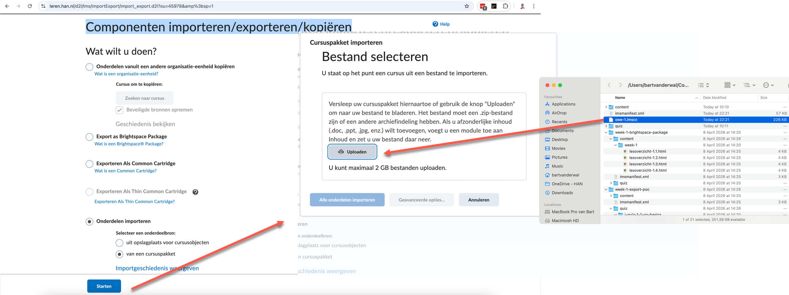
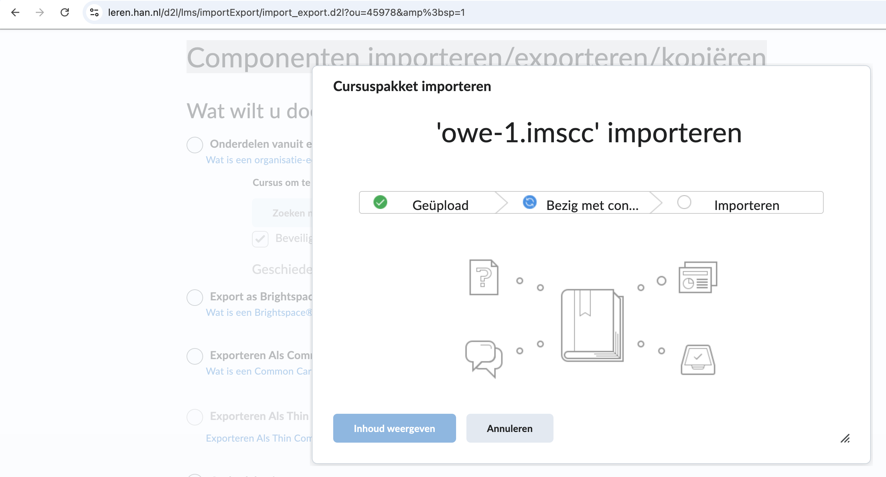

# Brightspacosaurus

CLI-tool die Markdown-cursusmateriaal uit de OWE-1-monorepo omzet naar een Brightspace Common Cartridge (`.imscc`)-pakket.

## Vereisten

- [Deno](https://deno.com/) ≥ 2.0 — zie [ADR 008](../../adr/adr008-brightspacosaurus-runtime-deno-vs-nodejs.md) voor de motivatie van deze keuze

## Commando's uitvoeren

Alle commando's worden uitgevoerd vanuit deze map (`scripts/brightspacosaurus/`).

### Tests draaien

```sh
deno task test
```

Dit voert alle unit- en property-based tests uit met de benodigde permissies.

### Prepare (Markdown → HTML)

```sh
deno task prepare
```

Scant de standaard bronmappen (`6.3.Studentenmateriaal/` en `scripts/brightspace/`) en zet Markdown om naar HTML in `build/brightspace/content/`.

### Pack (HTML + QTI → .imscc)

```sh
deno task pack
```

Verpakt de inhoud van `build/brightspace/` tot `build/brightspace/owe-1.imscc`.

### Marp-export (docentenslides → Marp Markdown)

```sh
deno task marp
```

Scant `6.2.Onderwijsmateriaal-voor-docenten/6.2.4.Instructiemateriaal/` op `slides-les-*.md` en schrijft Marp-compatible Markdown naar `build/marp-slides/` met dezelfde relatieve mappenstructuur. De bronbestanden blijven leidend; de uitvoer in `build/` is afgeleid materiaal.

De export voegt Marp-frontmatter toe, zet `## Slide N - ...` om naar Marp-slidekoppen en neemt spreeknotities op als HTML-comments, zodat Marp ze als presenter notes kan verwerken. Marp gebruikt `---` als slide-scheiding en kan Markdown exporteren naar HTML, PDF en PowerPoint (Marp, z.d.; Marpit, z.d.).

Voor een latere PPTX-export kun je Marp CLI gebruiken, bijvoorbeeld:

```sh
npx @marp-team/marp-cli build/marp-slides/week-2/les-1/slides-les-2.1.md --pptx
```

Marp CLI staat nu niet als npm dependency in deze repository. De huidige taak genereert alleen Marp-compatible Markdown; PowerPoint-export is een optionele vervolgstap. Als PPTX-export onderdeel wordt van CI of van een vaste docentworkflow, leg dan `@marp-team/marp-cli` vast als devDependency en vervang het losse `npx`-voorbeeld door een npm-script.

## Importeren in Brightspace

Na het genereren van `owe-1.imscc` importeer je het als volgt in Brightspace:

1. Ga naar de cursus waarin je wilt importeren.
2. Open **Cursus tools** → **Componenten importeren/exporteren/kopiëren**.
3. Scroll naar het onderdeel **Onderdelen importeren** en selecteer de radiobutton.
4. Kies **van een cursuspakket** (niet "uit opslagplaats voor cursusobjecten").
5. Klik **Starten**.
6. Sleep het bestand `build/brightspace/owe-1.imscc` naar het uploadblok (of klik om te bladeren).
7. Kies **Alle onderdelen importeren**.
8. Wacht tot de import is voltooid (dit kan enkele minuten duren; de voortgang wordt getoond met groene vinkjes).

De bijbehorende schermen:




## Beperkingen van Brightspace-import

Brightspace Common Cartridge import is additief voor content-modules en quizzen: het voegt items toe, maar verwijdert of overschrijft bestaande modules of quizzen niet. Er is geen deduplicatie op basis van identifier of titel.

De importwizard biedt wel de optie **"Bestaande bestanden overschrijven"**. Deze geldt voor bestanden in Manage Files (afbeeldingen, PDF's, HTML-bestanden) — niet voor content-modules of quizzen als geheel.

Dit betekent:

- Opnieuw importeren in dezelfde cursus levert duplicaten op voor modules en quizzen.
- Bestanden (afbeeldingen, PDF's) worden wél overschreven als de optie is aangevinkt en het pad overeenkomt.
- Verwijderen van eerder geïmporteerde content-modules moet handmatig in Brightspace.
- Er is geen "sync" of "deploy" — alleen een one-way push.

### Aanbevolen werkwijze

- **Itereren/testen**: importeer in een schone cursus (maak een nieuwe sandbox aan of reset de bestaande).
- **Productie**: importeer eenmalig in de doelcursus. Bij wijzigingen: gebruik "Geselecteerde onderdelen importeren" om alleen gewijzigde weken toe te voegen, en verwijder handmatig wat vervangen is.
- **Alternatief**: genereer per-week pakketten in plaats van één cursuspakket, zodat je selectief kunt importeren met beperkte schade bij duplicaten.

### Opruimen vóór herimport

Omdat import additief is voor modules en quizzen, moet je oude items handmatig verwijderen voordat je opnieuw importeert. Hieronder de stappen per type.

#### Content (lesmateriaal)

1. Ga naar **Content** in de cursus.
2. Navigeer naar de module(s) die je opnieuw wilt importeren (bijv. "Week 3").
3. Klik op het dropdown-menu (⋮) bij de module → **Module verwijderen**.
4. Bevestig. Dit verwijdert de module inclusief alle topics erin.

Je kunt ook individuele topics verwijderen als je slechts een deel wilt vervangen.

#### Quizzen

1. Ga naar **Assessment** → **Quizzes**.
2. Vink de quizzen aan die bij de vorige import horen (herkenbaar aan naam/prefix).
3. Klik **Verwijderen** (bovenaan de lijst).
4. Bevestig de verwijdering.

Let op: als een quiz al pogingen bevat (studentresultaten), waarschuwt Brightspace je. Verwijder in dat geval alleen in een test-/sandboxcursus, of archiveer de resultaten eerst.

#### Volgorde

1. Verwijder eerst de oude content en quizzen.
2. Importeer daarna het nieuwe `.imscc`-pakket.
3. Controleer of de nieuwe items correct zijn verschenen.

De source of truth blijft Git. Brightspace is het distributiekanaal, niet de bewaarplaats.

## Projectstructuur

```text
scripts/brightspacosaurus/
├── deno.json                  # taken en imports
├── README.md                  # dit bestand
├── SKILL.md                   # agent-instructies voor Kiro
├── src/
│   ├── types.ts               # TypeScript-interfaces
│   ├── source-scanner.ts      # bronmappen scannen
│   ├── markdown-converter.ts  # Markdown → HTML (unified/remark)
│   ├── manifest-builder.ts    # imsmanifest.xml genereren
│   ├── quiz-converter.ts      # quiz-Markdown → QTI XML
│   ├── packer.ts              # HTML + QTI → .imscc
│   └── main.ts                # CLI-entry point
└── tests/
    ├── source-scanner.test.ts
    ├── markdown-converter.test.ts
    ├── manifest-builder.test.ts
    ├── quiz-converter.test.ts
    ├── packer.test.ts
    └── cli.test.ts
```

## Ontwerpbeslissingen

- Deno als runtime i.p.v. Node.js — zie [ADR 008](../../adr/adr008-brightspacosaurus-runtime-deno-vs-nodejs.md)
- unified (remark/rehype) voor Markdown→HTML i.p.v. marked — zie [ADR 010](../../adr/adr010-brightspacosaurus-unified-pipeline-markdown-conversie.md)
- Convention over configuration — geen YAML-configuratiebestand nodig
- Alle uitvoer in `build/`, nooit naast bronbestanden

## Week- en niveauconventie

Brightspacosaurus en de Docusaurus-preview gebruiken dezelfde mapconventie voor weken en niveaus. Daardoor blijven lokale preview en Brightspace-export inhoudelijk gelijk.

| Mapnaam | Niveau | Label |
|---------|--------|-------|
| `week-1` | 1 | Week 1 — Niveau 1 |
| `week-2` t/m `week-4` | 2 | Week N — Niveau 2 |
| `week-5` t/m `week-7` | 3 | Week N — Niveau 3 |
| `week-8` | 4 | Week 8 — Niveau 4 |

Docusaurus gebruikt deze conventie voor `_category_.json`, generated index pages en niveau-banners. Brightspacosaurus gebruikt dezelfde labels in het `imsmanifest.xml`, zodat Brightspace dezelfde weekgroepering krijgt.

## Bronnen

- Marp. (z.d.). *Markdown Presentation Ecosystem*. Geraadpleegd op 14 mei 2026, van https://marp.app/
- Marpit. (z.d.). *Directives*. Geraadpleegd op 14 mei 2026, van https://marpit.marp.app/directives

## Spec

De volledige feature-spec (requirements, ontwerp, taken) staat in [`.kiro/specs/brightspacosaurus/`](../../.kiro/specs/brightspacosaurus/).
