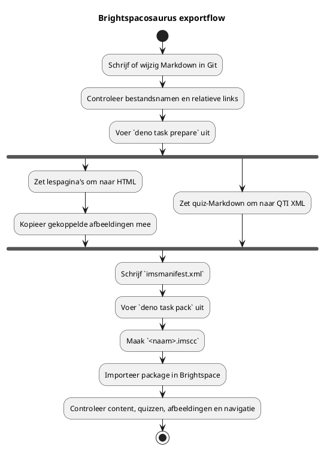

---
author:
  - Bart van der Wal
subtitle: "Publicatiepijplijn voor cursusmateriaal vanuit Git naar Brightspace"
date: \today
lang: nl
---

\begin{titlepage}
\centering
\vspace*{3cm}
\includegraphics[width=0.4\textwidth]{images/bsosaurus-logo.png}\\[2em]
{\Huge\bfseries Handleiding Brightspacosaurus\par}
\vspace{1em}
{\Large Publicatiepijplijn voor cursusmateriaal\\vanuit Git naar Brightspace\par}
\vfill
{\large Bart van der Wal\\[0.5em]\today\par}
\end{titlepage}

# Handleiding Brightspacosaurus

*Auteur(s)*: Bart van der Wal
*Versie*: 1.0

## 1. Introductie

Brightspacosaurus (BSS) is een build-tool die Markdown-cursusmateriaal omzet naar een IMS Common Cartridge-pakket (`.imscc`) dat je direct in Brightspace kunt importeren. Optioneel converteert BSS reader-Markdown naar PDF via pandoc.

Als ICT-docent kijk je waarschijnlijk iets anders naar een Learning Management System (LMS) dan andere docenten. Waar een docent denkt in "ik upload een bestand en maak een quiz", denk jij in datamodellen, versiebeheer en automatisering. Dat is de bril die deze handleiding hanteert: je cursusmateriaal staat als Markdown in Git en BSS publiceert het naar Brightspace.

Deze handleiding beschrijft:

- Hoe Brightspace cursusmateriaal onder de motorkap organiseert (datamodel, import/export)
- Hoe je BSS installeert en configureert
- Hoe je lesmateriaal publiceert vanuit Markdown-bronbestanden (`prepare` en `pack`)
- Hoe quizzen worden omgezet naar QTI en readers naar PDF
- De importprocedure in Brightspace en het additieve importgedrag

### 1.1 Veelgestelde vragen

#### 1.1.1 Hoe moet content eruitzien voor een efficiënte Brightspace-export?

Lesmateriaal schrijf je in Markdown. BSS converteert dit naar IMS Common Cartridge (`.imscc`) die Brightspace direct importeert (zie Figuur 1). Per les één bestand, met H1 als lestitel en H2+ als secties. Afbeeldingen link je relatief met `images/afbeelding.png`. Bestanden met prefix `quiz-` worden automatisch omgezet naar QTI.

#### 1.1.2 Hoe organiseer ik vragen zodat ze naar meerdere systemen kunnen?

De Markdown-bronbestanden zijn de single source of truth. BSS genereert momenteel QTI 1.2 voor Brightspace (de Quizzes-tool ondersteunt alleen 1.2; Course Import accepteert ook 2.x/3.x met beperkte feature-support). Andere toetssystemen zoals ANS ondersteunen QTI 3.0 als importformaat.

#### 1.1.3 Hoe scheid ik docent- en studentmateriaal?

Houd docent- en studentmateriaal in gescheiden bronmappen. BSS scant uitsluitend de geconfigureerde bronmap (`sourcesDir`) voor studentzichtbare content. Docentmateriaal (antwoordmodellen, didactische toelichting) hoort niet in die map. Bestanden met het suffix `-antwoorden-docent` sluit BSS bovendien expliciet uit van conversie.


*Figuur 1*: Inhoud van een uitgepakt Common Cartridge-pakket.

BSS genereert dit pakketformaat automatisch vanuit Markdown-bronbestanden en afbeeldingen. Het archief bevat een `imsmanifest.xml`, content-mappen met HTML-bestanden en afbeeldingen. Na import in Brightspace verschijnen de lespagina's als modules en topics.


*Figuur 2*: Brightspace Bestanden beheren met reader-PDF's.

Readers worden als losse PDF's gegenereerd via pandoc en apart geüpload naar Brightspace. Studenten downloaden ze als naslagmateriaal.

---

## 2. Context: Git, Brightspacosaurus en Brightspace

BSS positioneert materiaal in Git als de single source of truth (SST) voor onderwijsmateriaal. Git als kern/SST wringt met Brightspace, omdat Brightspace is gemaakt met het idee dat het LMS zelf de beheerplek voor cursusinhoud is.

Het BSS-proces draait dat om: Markdown in Git is leidend; Brightspace is een publicatiekanaal.

Voordelen van Git boven direct beheer in Brightspace:

- Je hebt echt versiebeheer.
- Je gebruikt een snelle teksteditor in plaats van een WYSIWYG-editor op een webpagina.
- Je kunt samenwerken aan onderwijsmateriaal; tekstbestanden in Git lenen zich goed voor reviews en merge requests.

De termen **import** en **export** zijn daardoor verwarrend:

- Vanuit Git en BSS is het een **export**: we exporteren bronmateriaal naar een `.imscc`-pakket.
- Vanuit Brightspace is het een **import**: Brightspace importeert dat `.imscc`-pakket in een cursus.
- In deze handleiding gebruiken we daarom: **BSS-export** voor het maken van het pakket en **Brightspace-import** voor het binnenhalen in Brightspace.

Idealiter krijgt de pipeline later Brightspace API-toegang. Dan kan BSS niet alleen het `.imscc`-bestand maken, maar ook bestaande modules/topics verwijderen of het pakket automatisch importeren. Zolang die API-route ontbreekt, blijft de import deels handmatig. Als tijdelijke workaround voor het additieve importgedrag levert BSS een optioneel opschoningsscript mee (zie §11).

Docentmateriaal vraagt een aparte keuze. Brightspace kan content verbergen of de beschikbaarheid beperken, maar BSS exporteert bewust alleen de studentzichtbare bronmap. Een echte docentenpublicatie kan op drie manieren:

1. Een aparte Brightspace-cursus of sandbox voor docentenmateriaal.
2. Een aparte, verborgen module in dezelfde cursus, na import handmatig beperkt tot docenten.
3. Geen Brightspace-publicatie: docentenhandleidingen blijven in Git of als PDF buiten de studentcursus.

Voor de meeste situaties is optie 3 het minst risicovol: docentmateriaal bevat antwoorden en interne keuzes die niet per ongeluk studentzichtbaar mogen worden.

---

## 3. Brightspace datamodel

Brightspace (D2L) organiseert cursusmateriaal primair via een course offering met Content-modules en topics. D2L beschrijft dat docenten in Content modules, submodules en topics kunnen maken; topics kunnen onder andere bestanden, tekst en HTML bevatten (D2L, z.d.-a).

| Entiteit | Brightspace-term | Analogie |
|----------|-----------------|----------|
| Course | Course Offering / Org Unit | Een repository |
| Module | Content Module | Een map/package |
| Page | Page | Een HTML-pagina in Brightspace |
| Topic | Content Topic | Een gekoppeld item in een module, zoals een pagina, bestand, link of activiteit |
| Quiz | Quiz Activity | Een assessment-object met items |
| Assignment | Dropbox Folder | Een inleverlocatie |


*Figuur 3*: Brightspace link naar test of quiz vanuit lesmateriaal.

Een **module** bevat **topics**. Een topic kan een Brightspace Page zijn, maar ook een toegevoegd bestand of een bestaande activiteit. D2L noemt bij het maken van course content expliciet de route `Create New > Page` binnen een module (D2L, z.d.-b).

Een **quiz** is geen gewone contentpagina. D2L beschrijft dat een quiz vanuit Content of direct vanuit de Quizzes-tool kan worden aangemaakt en dat studenten quizzen ook via de Quizzes-tool kunnen openen (D2L, z.d.-c; D2L, z.d.-d). Vanuit lesmateriaal kun je ook een link opnemen naar een quiz (zie Figuur 3).

Een **assignment** kan vanuit Content als nieuwe assignment worden gemaakt, maar blijft functioneel onderdeel van de Assignments-tool (D2L, z.d.-e).

Afbeeldingen en HTML-bestanden die als content gebruikt worden, komen in Brightspace terecht als course files / Manage Files-content. D2L beschrijft dat een bestand als Content topic kan worden aangewezen vanuit Manage Files en waarschuwt dat het verplaatsen van zo'n bestand links kan breken (D2L, z.d.-f).

---

## 4. Installatie en configuratie

### 4.1 Vereisten

- **Deno** ≥ 1.40: runtime voor Brightspacosaurus
- **Pandoc** (getest met 3.9): voor reader-PDF-conversie via xelatex. Compatibiliteit met andere versies is niet gegarandeerd (Pandoc volgt geen semver maar een eigen `EPOCH.MAJOR.MINOR.PATCH`-schema (Pandoc, z.d.)). Alleen nodig als je readers of een docentenhandleiding-PDF genereert.
- **TeX Live** met `xelatex` — PDF-engine (op macOS: `brew install --cask mactex` of `brew install basictex`)

### 4.2 Configuratie

Alle projectspecifieke instellingen worden beheerd via een `brightspacosaurus.config.json` in de root van je cursusproject. BSS zoekt dit bestand standaard in de werkdirectory (`Deno.cwd()`); met `--config <pad>` kun je een ander pad opgeven. CLI-argumenten prevaleren altijd boven waarden uit het configuratiebestand.

Een minimaal configuratiebestand:

```json
{
  "courseName": "Cursus X",
  "version": "1.0.0",
  "sourcesDir": "bronmateriaal/lessen/"
}
```

De belangrijkste velden:

| Veld | Verplicht | Beschrijving |
|------|-----------|--------------|
| `courseName` | ja | Cursusnaam zoals weergegeven in het manifest |
| `version` | ja | Versienummer (semver), gebruikt in de `.imscc`-bestandsnaam en HTML-badge |
| `sourcesDir` | ja | Bronmap voor lespagina's en quizzen |
| `readersDir` | nee | Bronmap voor reader-Markdown (PDF-conversie via pandoc) |
| `assetsDir` | nee | Map met statische assets (banners, logo's) |
| `outputDir` | nee | Build-uitvoermap (standaard `build/brightspace`) |

> **Volledige configuratiereferentie:** zie de [README.md](../README.md) voor alle configureerbare velden, standaardwaarden, CLI-vlaggen en een uitgebreid voorbeeld. Een kant-en-klaar voorbeeld staat in `brightspacosaurus.config.example.json` en in de `examples/`-map.

Ontbrekende optionele configuratie wordt stilzwijgend overgeslagen: zonder `readersDir` slaat BSS de reader-PDF-conversie over, zonder `docentenHandleiding` slaat het de docentenhandleiding-generatie over.

---

## 5. Werkwijze: van Markdown naar Brightspace

BSS converteert quizzen naar QTI-formaat (Question and Test Interoperability). QTI is een open standaard van 1EdTech (voorheen IMS Global) voor het uitwisselen van toetsvragen en assessments tussen systemen (1EdTech, z.d.). Brightspace importeert QTI-bestanden als assessments in de Tests/Quizzes-tool, zodat vragen niet handmatig hoeven te worden overgetypt.



De bronbestanden blijven leidend:

- Lespagina's en studentmateriaal staan in de geconfigureerde bronmap (`sourcesDir`).
- Quizbestanden met prefix `quiz-` zet BSS om naar QTI.
- Docentenantwoordmodellen met suffix `-antwoorden-docent` importeert BSS niet als studentpagina.
- Afgeleide uitvoer staat in de build-map (`outputDir`) en hoort niet handmatig aangepast te worden.

### 5.1 De twee commando's

Voer de export uit vanuit de root van je cursusproject:

```sh
deno task prepare
deno task pack
```

`prepare` scant de bronmappen, converteert Markdown naar HTML, converteert quiz-Markdown naar QTI en schrijft de tussenuitvoer naar de build-map. `pack` verpakt die map tot een `.imscc`-archief (bijvoorbeeld `cursus.imscc`, waarbij de naam wordt afgeleid van `name`/`courseName` uit de config).

Met `--readers-only` genereer je alleen de reader- en docenten-PDF's zonder de rest van de build.

### 5.2 Importgedrag: additief met overschrijfoptie

Brightspace-import is standaard additief voor content-modules en quizzen: een nieuwe import voegt items toe maar verwijdert of overschrijft bestaande modules of quizzen niet automatisch. Dubbele imports leiden tot dubbele items.

De importwizard biedt wel de optie **"Bestaande bestanden overschrijven"**. Deze optie geldt voor bestanden in Manage Files (afbeeldingen, PDF's, HTML-bestanden) — niet voor content-modules of quizzen als geheel. Concreet:

- **Lespagina's (content topics)**: worden bij herimport als nieuw item toegevoegd, niet overschreven. Handmatig verwijderen vóór herimport is nodig.
- **Bestanden (afbeeldingen, PDF's)**: worden wél overschreven als de optie is aangevinkt en het pad overeenkomt.
- **Quizzen**: worden als nieuw assessment toegevoegd, niet overschreven.


*Figuur 4*: Handmatig verwijderen van een pagina in Brightspace.

Figuur 4 laat zien hoe je een pagina handmatig verwijdert.

- Stap 0: Navigeer naar de module in Content.
- Stap 1: Klik op de ellipses (⋮) naast het topic.
- Stap 2: Kies **Remove**.
- Stap 3: Bevestig met **Yes, remove also contents** als je ook de onderliggende bestanden wilt verwijderen.
- Stap 4: Bevestig met **Remove**.

Aanbevolen werkwijze: vink "Bestaande bestanden overschrijven" aan, maar verwijder oude content-modules handmatig vóór herimport als de structuur is gewijzigd. Voor bulkverwijdering zie §11.


*Figuur 5*: Brightspace import — componenten selecteren.


*Figuur 6*: Optie — bestaande bestanden overschrijven.

Controleer na import minimaal:

1. Verschijnen de content topics in de verwachte volgorde?
2. Tonen lespagina's koppen, lijsten, tabellen, codeblokken en afbeeldingen correct?
3. Staan quizzen in de Tests/Quizzes-tool en openen ze zonder foutmelding?
4. Ontbreken docentenantwoordmodellen in de studentzichtbare content?
5. Zijn dubbele modules of oude versies handmatig verwijderd voordat je opnieuw importeert?

### 5.3 Importopties in Brightspace

Bij het importeren van een cursuspakket toont Brightspace twee optionele vinkjes:

#### 5.3.1 Metadata importeren — Ja, aanvinken

Metadata beschrijven cursusobjecten (modules, topics) op een gestructureerde manier — denk aan taal, trefwoorden en catalogusinformatie. BSS genereert metadata in het manifest (titel, taal `nl-NL`). Deze meenemen zorgt dat Brightspace de titels en structuur correct overneemt (D2L, z.d.-g).

#### 5.3.2 Gedeelde startpagina's en navigatiebalken — Nee, niet aanvinken

Deze optie koppelt een gedeelde homepage of navigatiebalk die elders is gedefinieerd. Het BSS-pakket bevat geen verwijzingen naar gedeelde homepages of navbars — het gebruikt de standaard cursusnavigatie. Dit vinkje uitzetten voorkomt dat Brightspace per ongeluk een verkeerde navbar activeert.

### 5.4 Aanbevolen importprocedure

1. Ga naar **Cursus tools** → **Componenten importeren/exporteren/kopiëren**.
2. Kies **Onderdelen importeren** → **van een cursuspakket**.
3. Upload het `.imscc`-pakket.
4. Vink **Metadata** aan ✓.
5. Laat **Gedeelde startpagina's en navigatiebalken** uit ✗.
6. Klik **Importeren**.
7. Wacht tot de import is voltooid (kan enkele minuten duren bij grote pakketten).

Kies bij voorkeur een schone sandboxcursus voor tests.

---

## 6. Import/export: IMS Common Cartridge

Brightspace kan cursuscomponenten importeren en exporteren via Common Cartridge. D2L beschrijft Common Cartridge als een open standaard voor content, assessments en digitale content, en noemt import vanuit een course package als ondersteunde route (D2L, z.d.-g).


*Figuur 7*: Inhoud van een uitgepakt `.imscc`-pakket.

Het manifest beschrijft de resources; de content-mappen bevatten de HTML-bestanden en afbeeldingen die Brightspace importeert.

BSS genereert een `.imscc`-pakket conform IMS Common Cartridge 1.3 vanuit Markdown-bronbestanden. Brightspace ondersteunt meerdere Common Cartridge-versies; bij versie 1.1 noemt D2L expliciet de `.imscc`-extensie als herkenbare package-extensie (D2L, z.d.-h).

---

## 7. Quizzen en QTI

De Source Scanner classificeert bestanden met het prefix `quiz-` als quizbestanden. BSS parseert een quiz-Markdown bestand op basis van dit formaat:

- **H1** als quiztitel
- **H2** als vraagnummer
- Opties als `- A. tekst` tot en met `- D. tekst`
- `Correct antwoord: **X**` als aanduiding van het juiste antwoord

Per quiz-Markdown bestand genereert BSS één geldig QTI 1.2 XML-bestand conform het IMS CC QTI-profiel (`cc.exam.v0p1`). De QTI-bestanden verschijnen in Brightspace zowel in de Quizzes-tool als in de content-navigatie.

### 7.1 Afbeeldingen in quizzen

Een quiz kan een **header-afbeelding** krijgen via de quiz-instellingen in Brightspace (handmatig). In het QTI-formaat dat BSS genereert, kun je afbeeldingen embedden in vraagteksten via HTML-img-tags. Een quiz-banner als geheel is een Brightspace UI-instelling, niet onderdeel van QTI.

### 7.2 Docent- en studentvarianten

Praktische afspraak voor bestandsnamen:

- Lespagina's worden geïmporteerd als content topics.
- Bestanden met prefix `quiz-` worden geconverteerd naar QTI en geïmporteerd als assessment.
- Bestanden met suffix `-antwoorden-docent` worden niet als studentpagina of assessment geïmporteerd.

Brightspace heeft zelf al een aparte tool/navigatie voor tests en quizzen. BSS converteert quiz-Markdown daarom naar QTI-assessments en bouwt geen extra contentmodule voor tests.

---

## 8. Readers: naslagmateriaal als PDF

Readers (bijvoorbeeld geheugenmodellen, klassendiagrammen, PlantUML- of Git-uitleg) zijn naslagmateriaal dat vanuit meerdere lessen wordt gerefereerd. Ze staan in de geconfigureerde readers-bronmap (`readersDir`).

De Source Scanner classificeert bestanden met prefix `reader-` als readerbestanden. BSS zet ze om naar PDF via pandoc met xelatex of lualatex als PDF-engine. Enkele eigenschappen:

- Als pandoc niet beschikbaar is, logt BSS een waarschuwing en slaat het de reader-PDF-conversie over zonder de build af te breken.
- De `--resource-path` van pandoc wordt op de directory van het bronbestand gezet, zodat relatieve afbeeldingsreferenties correct worden geresolveerd.
- Mislukt een reader-conversie, dan rapporteert BSS het bestand en gaat door met de overige readers, maar retourneert na afloop een niet-nul exitcode.

BSS neemt reader-PDF's op in het IMSCC-pakket als webcontent-resource onder een "Readers"-module in het manifest.

### 8.1 Mapping naar Brightspace

In Brightspace kun je de reader-PDF's als volgt aanbieden:

1. Upload de reader-PDF's naar **Bestanden beheren** (Manage Files) in de cursus.
2. Link vanuit relevante lespagina's naar de PDF via een relatieve URL.
3. Optioneel: maak een top-level module "Naslagmateriaal" met links naar de PDF's.


*Figuur 8*: Brightspace Bestanden beheren — reader-PDF's worden vanuit lespagina's gelinkt.

---

## 9. Afbeeldingen in de export

BSS neemt afbeeldingen uit lespagina's (Markdown ``) automatisch mee in het `.imscc`-pakket. Voorwaarden:

1. Het pad is relatief ten opzichte van het Markdown-bronbestand.
2. Het bestand bestaat op dat pad.
3. De afbeelding staat in een map die BSS scant.

BSS converteert Markdown-afbeeldingsreferenties naar HTML-img-tags en kopieert de afbeeldingsbestanden mee in het `.imscc`-archief. Als een gerefereerde afbeelding niet bestaat, logt BSS een waarschuwing met het bronbestand en het ontbrekende pad.

Naast de afbeeldingen die vanuit Markdown worden gerefereerd, kun je via het `assetsDir`-configuratieveld extra statische assets (banners, logo's) aanleveren die BSS meekopieert naar de build.

---

## 10. Eigen styling

BSS levert een standaard CSS-stylesheet (`brightspacosaurus.css`) mee, gebaseerd op de HAN-huisstijl. Deze stylesheet is generiek en bevat geen cursusspecifieke kleuren of selectors.

Wil je eigen styling toevoegen, dan configureer je een `customCss`-pad in het configuratiebestand. BSS voegt die stylesheet dan toe naast de standaard-stylesheet. Zonder `customCss` gebruikt BSS uitsluitend de standaard-stylesheet.

---

## 11. Bulk-verwijderen van content via browser-console

Omdat Brightspace-import additief is (zie §5.2), moet je bij herimport eerst bestaande content verwijderen. Handmatig kost dat vier kliks per item — bij tientallen pagina's is dat onwerkbaar. Het meegeleverde script `utils/verwijder-brightspace-paginas.js` automatiseert dit deels. Dit is een bewust hacky workaround voor het ontbreken van API-toegang tot Brightspace: je plakt het script integraal in de JavaScript-console van je browser (F12/Developer Tools → tabblad **Console**) en drukt Enter.

Het script is experimenteel en afhankelijk van Brightspace's interne HTML-structuur. Het functioneert onafhankelijk van de BSS-kern (geen gedeelde imports of configuratie).

### 11.1 Gebruik

1. Open de cursus in Brightspace → **Inhoud** (Content).
2. Navigeer naar de module waarvan je items wilt verwijderen.
3. Selecteer het eerste item waar je wilt beginnen.
4. Open DevTools (F12) → **Console**.
5. Kopieer de inhoud van `utils/verwijder-brightspace-paginas.js` en plak in de console.
6. Druk Enter. Het script vraagt hoeveel items je wilt verwijderen.

### 11.2 Werking

Het script:

- Pollt snel (50 ms) op UI-reacties in plaats van vaste wachttijden.
- Wacht tot de bevestigingsdialoog **dicht** is voordat het aan het volgende item begint — dit voorkomt een stapel open dialogen.
- Klikt de radio "ook onderliggende bestanden verwijderen" als die aanwezig is.
- Slaat items zonder verwijderoptie (quizzen, assignments) over en gaat door met het volgende.
- Sluit succes-toasts direct weg.
- Houdt een set bij van mislukte objectId's zodat het niet eindeloos dezelfde items probeert.

### 11.3 Beperkingen

- Het script werkt via DOM-manipulatie en is afhankelijk van Brightspace's interne HTML-structuur. Bij een Brightspace-update kan het breken.
- Quizzen en assignments die als link in een module staan, hebben een ander verwijdermechanisme en worden overgeslagen.
- Bij grote aantallen (100+) kan het helpen om tussendoor F5 te drukken en het script opnieuw te draaien — Brightspace's interne state raakt soms corrupt na veel DOM-manipulatie in één sessie.
- Het script is bedoeld als tijdelijke workaround totdat Brightspace API-toegang beschikbaar is.

---

## Bronnen

- 1EdTech. (z.d.). *Question and Test Interoperability (QTI)*. Geraadpleegd op 3 juni 2026, van https://www.1edtech.org/standards/qti
- D2L. (z.d.-a). *Add and organize learning materials in the Classic Content experience*. Brightspace Community. Geraadpleegd op 14 mei 2026, van https://community.d2l.com/brightspace/kb/articles/2750-add-and-organize-learning-materials-in-the-classic-content-experience
- D2L. (z.d.-b). *Add and organize course content*. Brightspace Community. Geraadpleegd op 14 mei 2026, van https://community.d2l.com/brightspace/kb/articles/4983-add-and-organize-course-content
- D2L. (z.d.-c). *Create and configure a quiz*. Brightspace Community. Geraadpleegd op 14 mei 2026, van https://community.d2l.com/brightspace/kb/articles/3413-create-and-configure-a-quiz
- D2L. (z.d.-d). *Using the Quizzes tool*. Brightspace Community. Geraadpleegd op 14 mei 2026, van https://community.d2l.com/brightspace/kb/articles/18174-using-the-quizzes-tool
- D2L. (z.d.-e). *Create an assignment*. Brightspace Community. Geraadpleegd op 14 mei 2026, van https://community.d2l.com/brightspace/kb/articles/2776-create-an-assignment
- D2L. (z.d.-f). *Create a Content topic in Manage Files*. Brightspace Community. Geraadpleegd op 14 mei 2026, van https://community.d2l.com/brightspace/kb/articles/3670-create-a-content-topic-in-manage-files
- D2L. (z.d.-g). *About Import/Export/Copy Components*. Brightspace Community. Geraadpleegd op 14 mei 2026, van https://community.d2l.com/brightspace/kb/articles/16786-about-import-export-copy-components
- D2L. (z.d.-h). *Import, export, or copy course components*. Brightspace Community. Geraadpleegd op 14 mei 2026, van https://community.d2l.com/brightspace/kb/articles/16788-import-export-or-copy-course-components
- Pandoc. (z.d.). *Releases*. Geraadpleegd op 21 mei 2026, van https://pandoc.org/releases.html
