---
author:
  - Bart van der Wal
subtitle: "Publicatiepijplijn voor cursusmateriaal vanuit Git naar Brightspace"
date: \today
lang: nl
---

\begin{titlepage}
\centering
\vspace*{3cm}
\includegraphics[width=0.4\textwidth]{images/bsosaurus-logo.png}\\[2em]
{\Huge\bfseries Handleiding Brightspacosaurus\par}
\vspace{1em}
{\Large Publicatiepijplijn voor cursusmateriaal\\vanuit Git naar Brightspace\par}
\vfill
{\large Bart van der Wal\\[0.5em]\today\par}
\end{titlepage}

# Handleiding Brightspacosaurus

*Datum*: Mei en Juni 2026
*Auteur(s)*: Bart van der Wal
*Laatste wijziging*: 13-6-2026
*Versie*: 0.2

## 1. Introductie

Als ICT-docent kijk je waarschijnlijk iets anders naar een Learning Management System (LMS) dan de meest andere docenten/reguliere gebruikers. Waar een docent Nederlands denkt in "ik upload een bestand en maak een quiz", denk jij in datamodellen, API's en automatisering. Dat is in ieder geval de bril die deze handleiding hanteert.

Deze handleiding beschrijft:

- Hoe Docusaurus en Brightspace cursusmateriaal tonen
- Hoe Brightspace onder de motorkap werkt (datamodel, import/export)
- Hoe wij lesmateriaal publiceren vanuit Markdown-bronbestanden
- De visuele stijl van onze cursusmodules
- Praktische werkwijze voor het beheren van content

### 1.1 Veelgestelde vragen

#### 1.1.1 Hoe moet content eruit zien voor efficiënte Brightspace-export?

Lesmateriaal schrijf je in Markdown. Brightspacosaurus converteert dit naar IMS Common Cartridge (`.imscc`) die Brightspace direct importeert (zie Figuur 1). Per les één bestand (`lesoverzicht-X.Y.md`), met H1 als lestitel en H2+ als secties. Afbeeldingen link je relatief met `images/afbeelding.png`. Bestanden met prefix `quiz-` worden automatisch omgezet naar QTI.

#### 1.1.2 Hoe organiseren we vragen zodat ze naar ANS én Brightspace kunnen?

De markdown-bronbestanden zijn de single source of truth. Brightspacosaurus genereert momenteel QTI 1.2 voor Brightspace (de Quizzes-tool ondersteunt alleen 1.2; Course Import accepteert ook 2.x/3.x met beperkte feature-support). ANS ondersteunt QTI 3.0 als importformaat. Zie issue #19 voor de geplande omschakeling naar QTI 3.0 als universeel exportformaat.

#### 1.1.3 Hoe organiseren we cursusoverzicht, lesplannen en oefeningen?

De repo gebruikt een vaste mappenstructuur: `6.1` voor docentenhandleiding, `6.2` voor docentmateriaal (niet studentzichtbaar), `6.3.1` voor lesoverzichten (Brightspace-content), `6.3.2` voor readers (PDF via pandoc). Scheiding docent/student is cruciaal. Zie §2 voor de volledige context.

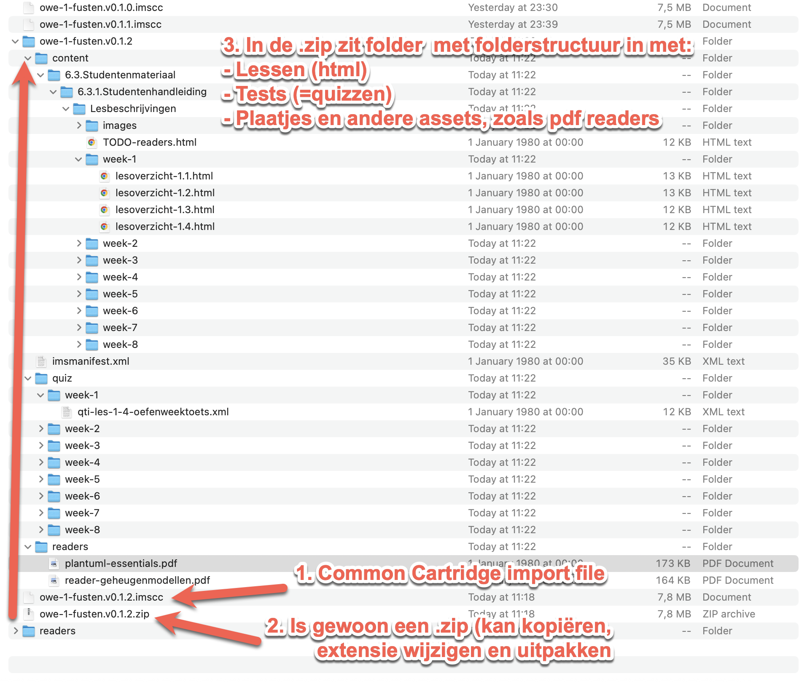

*Figuur 1*: Inhoud van een uitgepakt Common Cartridge-pakket.

Brightspacosaurus genereert dit pakketformaat automatisch vanuit Markdown-bronbestanden en afbeeldingen in de repo. Het archief bevat een `imsmanifest.xml`, content-mappen met HTML-bestanden en afbeeldingen. Na import in Brightspace verschijnen de lespagina's als modules en topics.

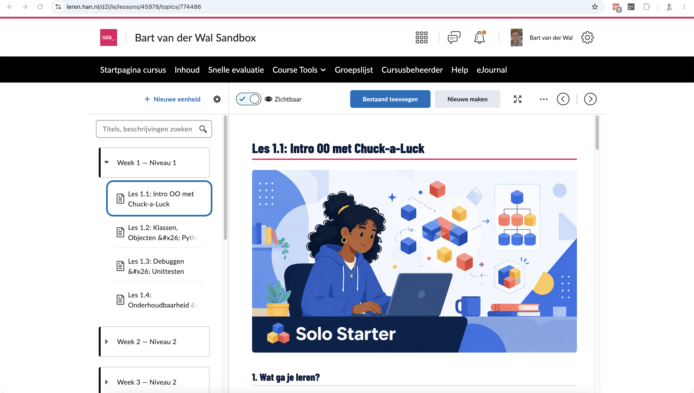

*Figuur 2*: Brightspace Bestanden beheren met reader-PDF's.

Brightspacosaurus genereerReaders worden als losse PDF's gegenereerd via pandoc en apart geüpload naar Brightspace (niet via het Common Cartridge-pakket). Studenten downloaden ze als naslagmateriaal.

Brightspacosaurus heeft vooral een reproduceerbare werkwijze nodig: lokaal previewen, exporteren, importeren en controleren.

---

## 2. Context: GitLab, Brightspacosaurus, Docusaurus en Brightspace

Brightspacosaurus positioneert materiaal in Git als de single source of truth (SST) voor onderwijsmateriaal. Git als kern/SST wringt echter met Brightspace, omdat Brightspace is gemaakt met het idee dat dit Learning Management System (LMS) zelf de beheerplek voor cursusinhoud is.

Ons proces draait dat om: Markdown in Git is leidend; Brightspace is een publicatiekanaal.

Voordelen van Git boven Brightspace:

- Je hebt echt versiebeheer
- Snelle tekst editor gebruiken i.p.v. WYSIWYG op een webpagina
- Je samen kunt werken/ontwikkelen aan je onderwijs, en tekstbestanden in Git beter aansluit voor , en 

Ter vergelijking: dezelfde weekstructuur in Docusaurus (lokale preview) en in Brightspace (productie):

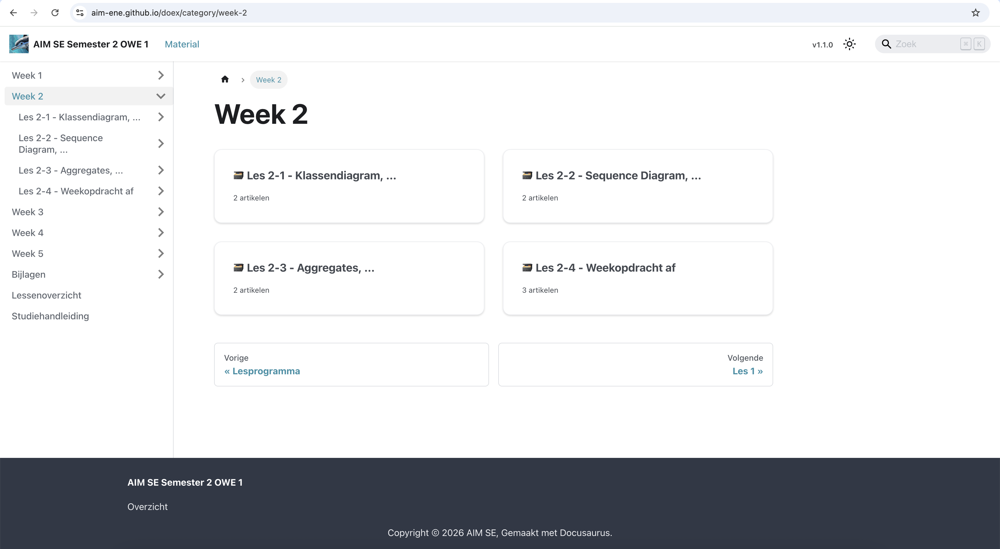

*Figuur 3*: Docusaurus weekoverzicht met doc cards.

De lokale preview toont dezelfde structuur als wat studenten straks in Brightspace zien. Dit maakt het mogelijk om materiaal te reviewen zonder eerst te importeren.

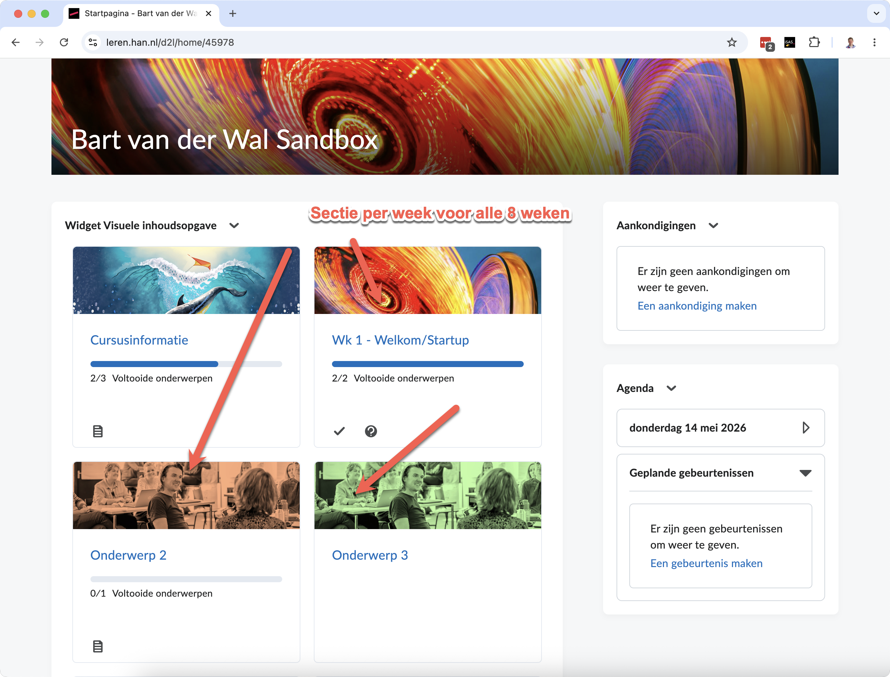

*Figuur 4*: Brightspace contentnavigatie met modules en topics.

Het resultaat na import van het Common Cartridge-pakket. Elke week is een module; elk lesoverzicht een topic daarbinnen.

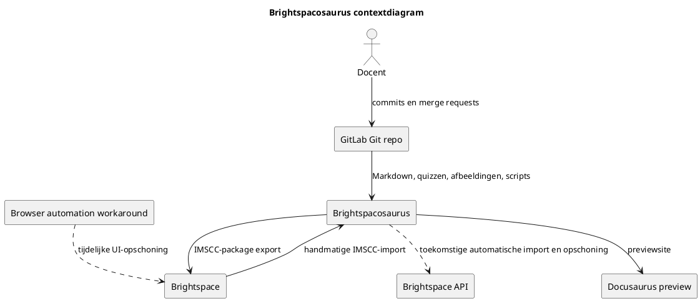

*Figuur 5*: Contextdiagram van Brightspacosaurus als publicatiepijplijn vanuit GitLab.

De termen **import** en **export** zijn daardoor verwarrend:

- Vanuit GitLab en Brightspacosaurus is het een **export**: we exporteren bronmateriaal naar een `.imscc`-pakket.
- Vanuit Brightspace is het een **import**: Brightspace importeert dat `.imscc`-pakket in een cursus.
- In deze handleiding gebruiken we daarom: **Brightspacosaurus-export** voor het maken van het pakket en **Brightspace-import** voor het binnenhalen in Brightspace.

Idealiter krijgt de pipeline later Brightspace API-toegang. Dan kan Brightspacosaurus niet alleen het `.imscc`-bestand maken, maar ook bestaande modules/topics verwijderen of het pakket automatisch importeren. Zolang die API-route ontbreekt, blijft de import deels handmatig.

Een mogelijke tijdelijke workaround is browserautomatisering: een eenvoudige browserextensie of JavaScript-snippet die in de Brightspace UI oude modules doorloopt, op **Remove** klikt en daarna **Yes, remove also contents** bevestigt. Dat is geen gewenste eindoplossing, maar kan het additieve importgedrag beheersbaar maken in testcursussen.

Docentmateriaal vraagt een aparte keuze. Brightspace kent wel mogelijkheden om content te verbergen of beschikbaarheid te beperken, maar Brightspacosaurus exporteert nu bewust alleen studentzichtbaar materiaal uit `6.3.Studentenmateriaal/`. Een echte docentenpublicatie kan op drie manieren:

1. Een aparte Brightspace-cursus of sandbox voor docentenmateriaal.
2. Een aparte, verborgen module in dezelfde cursus, na import handmatig beperkt tot docenten.
3. Geen Brightspace-publicatie: docentenhandleidingen blijven in GitLab of als PDF buiten de studentcursus.

Voor nu is optie 3 het minst risicovol: docentmateriaal bevat antwoorden, didactische toelichting en interne keuzes die niet per ongeluk studentzichtbaar mogen worden.

---

## 3. Brightspace datamodel

Brightspace (D2L) organiseert cursusmateriaal primair via een course offering met Content-modules en topics. D2L beschrijft dat docenten in Content modules, submodules en topics kunnen maken; topics kunnen onder andere bestanden, tekst en HTML bevatten (D2L, z.d.-a). .

| Entiteit | Brightspace-term | Analogie |
|----------|-----------------|----------|
| Course | Course Offering / Org Unit | Een repository |
| Module | Content Module | Een map/package |
| Page | Page | Een HTML-pagina in Brightspace |
| Topic | Content Topic | Een gekoppeld item in een module, zoals een pagina, bestand, link of activiteit |
| Quiz | Quiz Activity | Een assessment-object met items |
| Assignment | Dropbox Folder | Een inleverlocatie |

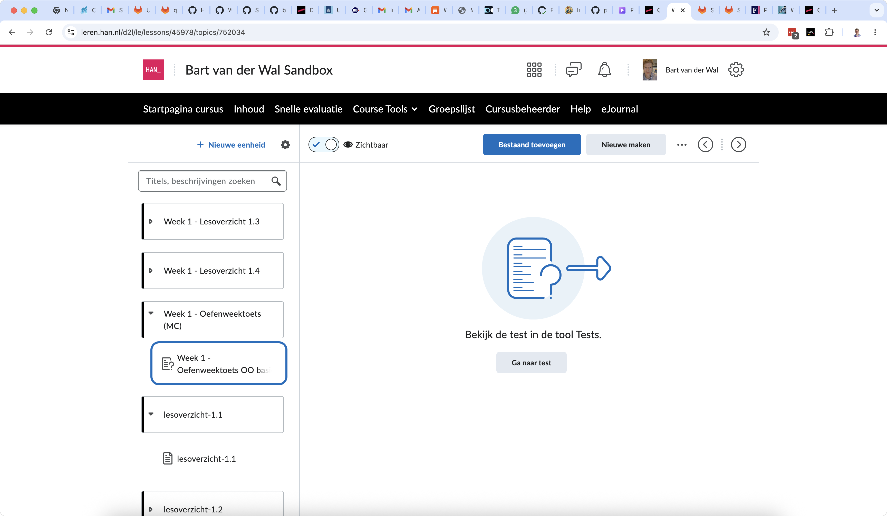

*Figuur 6*: Brightspace link naar test of quiz vanuit lesmateriaal.

Een **module** bevat **topics**. Een topic kan een Brightspace Page zijn, maar ook een toegevoegd bestand of een bestaande activiteit. D2L noemt bij het maken van course content expliciet de route `Create New > Page` binnen een module (D2L, z.d.-b). .

Een **quiz** is geen gewone contentpagina. D2L beschrijft dat een quiz vanuit Content of direct vanuit de Quizzes-tool kan worden aangemaakt en dat studenten quizzen ook via de Quizzes-tool kunnen openen (D2L, z.d.-c; D2L, z.d.-d). . Wel kun je vanuit lesmateriaal ook een link opnemen naar een quiz (zie Figuur 3).

Een **assignment** kan vanuit Content als nieuwe assignment worden gemaakt, maar blijft functioneel onderdeel van de Assignments-tool (D2L, z.d.-e). .

Afbeeldingen en HTML-bestanden die als content gebruikt worden, komen in Brightspace terecht als course files / Manage Files-content. D2L beschrijft dat een bestand als Content topic kan worden aangewezen vanuit Manage Files en waarschuwt dat verplaatsen van zo'n bestand links kan breken (D2L, z.d.-f). .

---

## 4. Werkwijze: van Markdown naar Brightspace

Deze workflow beschrijft de huidige implementatie van Brightspacosaurus. De handmatige importvalidatie in Brightspace blijft een aparte controle: D2L ondersteunt import vanuit een course package, maar de exacte weergave in onze HAN-omgeving moet je na elke structurele wijziging blijven controleren (D2L, z.d.-g; D2L, z.d.-h).

Brightspacosaurus converteert quizzen naar QTI-formaat (Question and Test Interoperability). QTI is een open standaard van 1EdTech (voorheen IMS Global) voor het uitwisselen van toetsvragen en assessments tussen systemen (1EdTech, z.d.). Brightspace importeert QTI-bestanden als assessments in de Tests/Quizzes-tool, zodat vragen niet handmatig hoeven te worden overgetypt.

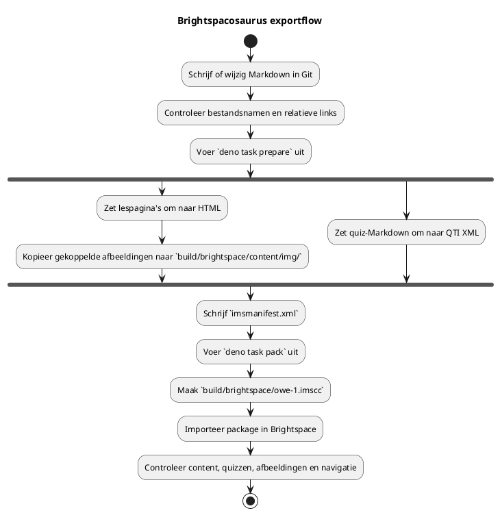

De bronbestanden blijven leidend:

- Lespagina's en studentmateriaal staan in `6.3.Studentenmateriaal/`.
- Quizbestanden met prefix `quiz-` zet Brightspacosaurus om naar QTI.
- Docentenantwoordmodellen met `-antwoorden-docent` importeert Brightspacosaurus niet als studentpagina.
- Afgeleide uitvoer staat in `build/` en hoort niet handmatig aangepast te worden.

### 4.1 Vereisten

- **Deno** ≥ 1.40: runtime voor Brightspacosaurus-scripts
- **Pandoc** getest met 3.9: voor reader-PDF-conversie via xelatex. Compatibiliteit met andere versies is niet gegarandeerd (Pandoc volgt geen semver maar een eigen `EPOCH.MAJOR.MINOR.PATCH`-schema volgens hun documentatie (Pandoc, z.d.))
- **TeX Live** met `xelatex` — PDF-engine (op macOS: `brew install --cask mactex` of `brew install basictex`)

In CI (`.gitlab-ci.yml`) worden `pandoc`, `texlive-xetex` en `fonts-dejavu` automatisch geïnstalleerd.

Voer de export uit vanuit `scripts/brightspacosaurus/`:

```sh
deno task prepare
deno task pack
```

`prepare` scant de bronmappen, converteert Markdown naar HTML, converteert quiz-Markdown naar QTI en schrijft de tussenuitvoer naar `build/brightspace/`. `pack` verpakt die map tot `build/brightspace/owe-1.imscc`.

### 4.2 Docusaurus-preview starten

```sh
npm start --prefix scripts/docusaurus
```

De `prestart`-hook draait automatisch twee stappen vóór het starten:

1. **`copy-assets`** — kopieert niveau-banners en andere `.png`-bestanden uit `scripts/brightspacosaurus/assets/` naar `Lesbeschrijvingen/images/` (voor webpack-bundling) en naar `static/img/niveau-banners/` (voor de variant-picker).
2. **`generate-metadata`** — genereert `_category_.json` bestanden per week-map voor de sidebar-navigatie.

Dezelfde hooks draaien ook bij `npm run build` (via `prebuild`). Je hoeft `copy-assets` of `generate-metadata` nooit handmatig uit te voeren.

Importeer het pakket daarna in Brightspace via **Cursus tools** → **Componenten importeren/exporteren/kopiëren** → **Onderdelen importeren** → **van een cursuspakket**. Kies bij voorkeur een schone sandboxcursus voor tests.

### 4.3 Importgedrag: additief met overschrijfoptie

Brightspace-import is standaard additief voor content-modules en quizzen: een nieuwe import voegt items toe maar verwijdert of overschrijft bestaande modules of quizzen niet automatisch. Dubbele imports leiden tot dubbele items.

De importwizard biedt wel de optie **"Bestaande bestanden overschrijven"**. Deze optie geldt voor bestanden in Manage Files (afbeeldingen, PDF's, HTML-bestanden) — niet voor content-modules of quizzen als geheel. Concreet:

- **Lespagina's (content topics)**: worden bij herimport als nieuw item toegevoegd, niet overschreven. Handmatig verwijderen vóór herimport is nodig.
- **Bestanden (afbeeldingen, PDF's)**: worden wél overschreven als de optie is aangevinkt en het pad overeenkomt.
- **Quizzen**: worden als nieuw assessment toegevoegd, niet overschreven.

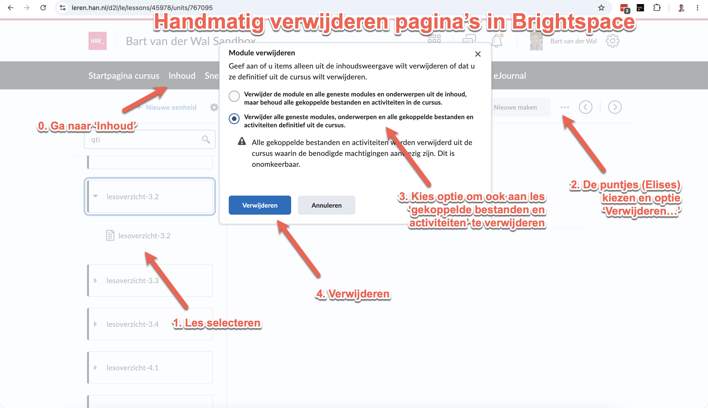

*Figuur 7*: Handmatig verwijderen van een pagina in Brightspace.

Figuur 7 geeft aan hoe je een pagina verwijdert handmatig.

- Stap 0: Navigeer naar de module in Content.
- Stap 1: klik op de puntjes elipses (⋮) naast het topic.
- Stap 2: kies **Remove**.
- Stap 3: bevestig met **Yes, remove also contents** als je ook de onderliggende bestand of bestanden wilt verwijderen.
- Stap 4: Bevestig met **Remove**.

Aanbevolen werkwijze: vink "Bestaande bestanden overschrijven" aan, maar verwijder oude content-modules handmatig vóór herimport als de structuur is gewijzigd.

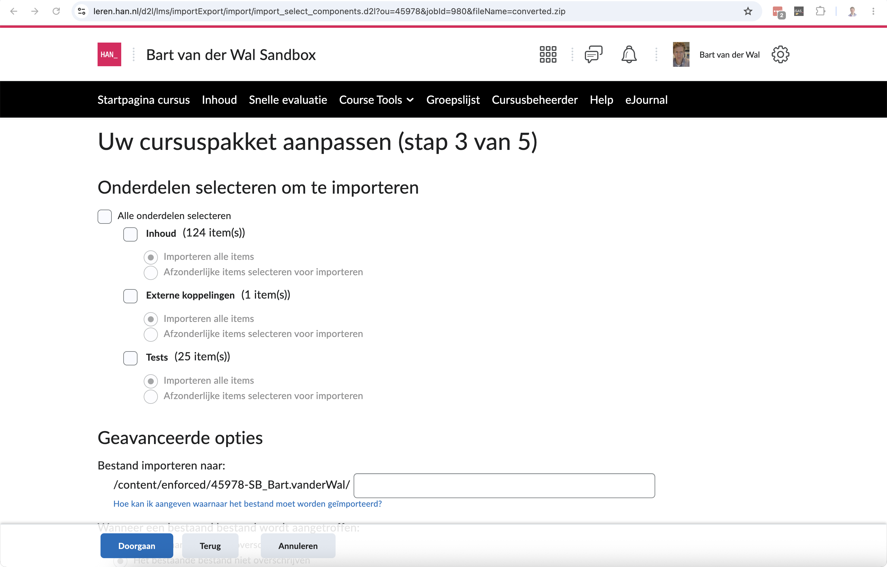

*Figuur 8*: Brightspace import, selecteren componenten

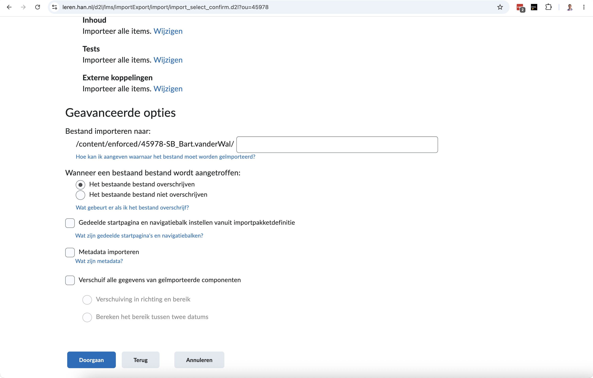

*Figuur 9*: Optie: bestaande bestanden overschrijven

Controleer na import minimaal:

1. Verschijnen de content topics in de verwachte volgorde?
2. Tonen lespagina's koppen, lijsten, tabellen, codeblokken en afbeeldingen correct?
3. Staan quizzen in de Tests/Quizzes-tool en openen ze zonder foutmelding?
4. Ontbreken docentenantwoordmodellen in de studentzichtbare content?
5. Zijn dubbele modules of oude versies handmatig verwijderd voordat je opnieuw importeert?

Screenshots van het importproces horen nog in deze sectie zodra de volgende Brightspace-import is gevalideerd.

### 4.4 Importopties in Brightspace

Bij het importeren van een cursuspakket toont Brightspace twee optionele vinkjes:

#### 4.4.1 Metadata importeren — Ja, aanvinken

Metadata beschrijven cursusobjecten (modules, topics) op een gestructureerde manier — denk aan taal, trefwoorden en catalogusinformatie. Brightspacosaurus genereert metadata in het manifest (titel, taal `nl-NL`). Deze meenemen zorgt dat Brightspace de titels en structuur correct overneemt. Na import kun je metadata bewerken via de opslagplaats voor cursusobjecten of direct in de inhoudstool (D2L, z.d.-g).

#### 4.4.2 Gedeelde startpagina's en navigatiebalken — Nee, niet aanvinken

Deze optie koppelt een gedeelde homepage of navigatiebalk die elders is gedefinieerd (bijv. op organisatieniveau). Ons pakket bevat geen verwijzingen naar gedeelde homepages of navbars — we gebruiken de standaard cursusnavigatie. Dit vinkje uitzetten voorkomt dat Brightspace per ongeluk een verkeerde navbar activeert.

### 4.5 Aanbevolen importprocedure

1. Ga naar **Cursus tools** → **Componenten importeren/exporteren/kopiëren**
2. Kies **Onderdelen importeren** → **van een cursuspakket**
3. Upload `owe-1.imscc`
4. Vink **Metadata** aan ✓
5. Laat **Gedeelde startpagina's en navigatiebalken** uit ✗
6. Klik **Importeren**
7. Wacht tot de import is voltooid (kan enkele minuten duren bij grote pakketten)

---

## 5. Import/export: IMS Common Cartridge

Brightspace kan cursuscomponenten importeren en exporteren via Common Cartridge. D2L beschrijft Common Cartridge als een open standaard voor content, assessments en digitale content, en noemt import vanuit een course package als ondersteunde route (D2L, z.d.-g). .


*Figuur 10*: Inhoud van een uitgepakt `.imscc`-pakket.

Het manifest beschrijft de resources; de content-mappen bevatten de HTML-bestanden en afbeeldingen die Brightspace importeert. Zie screenshot van figuur 6 die de .imscc en beeld van uitgepakte content erin in finder/explorer.

Brightspacosaurus genereert een `.imscc`-pakket conform IMS Common Cartridge 1.3 vanuit Markdown-bronbestanden. Brightspace ondersteunt meerdere Common Cartridge-versies; bij versie 1.1 noemt D2L expliciet de `.imscc`-extensie als herkenbare package-extensie (D2L, z.d.-h).

**Afbeeldingen in een import-package** neemt Brightspacosaurus automatisch mee als ze:

1. In het ZIP-bestand staan (relatief pad vanuit de content-map)
2. Gerefereerd worden vanuit een HTML-topic via een HTML-img-tag of vanuit Markdown via ``

Brightspacosaurus converteert Markdown-afbeeldingsreferenties naar HTML-img-tags en kopieert de afbeeldingsbestanden mee in het `.imscc`-archief.

---

## 6. Quizzen en afbeeldingen

Een quiz kan een **header-afbeelding** krijgen via de quiz-instellingen in Brightspace (handmatig). In het QTI-formaat dat Brightspacosaurus genereert, kun je afbeeldingen embedden in vraag-teksten via HTML-img-tags in de HTML van de vraag. Een quiz-banner als geheel is een Brightspace UI-instelling, niet onderdeel van QTI.

_TODO — screenshots toevoegen van quiz-instellingen in Brightspace._

## 7. Navigatie: Docusaurus-preview en Brightspace

De Markdown-bestanden voor quizzen hebben geen `sidebar_position` nodig. Die metadata is alleen relevant voor Docusaurus-sidebars en wordt niet gebruikt door Brightspace of QTI.

In de lokale Docusaurus-preview staan quizzen in een apart horizontaal hoofdmenu **Tests**, naast **Handleiding**. Docusaurus beschrijft sidebars als geordende bomen van documenten en ondersteunt meerdere sidebars; onze preview gebruikt daarom twee sidebars: één voor de handleiding en één voor tests (Docusaurus, z.d.-a).

Docusaurus kan sidebars automatisch uit de bestandsstructuur opbouwen. De documentatie noemt daarbij ook `sidebar_position` frontmatter, maar alleen als metadata binnen een autogenerated sidebar slice (Docusaurus, z.d.-b). . In deze repository kiezen we juist voor convention over configuration: `scripts/docusaurus/sidebars.js` leest bestandsnamen en H1-titels, zodat quizbestanden geen `sidebar_position: 50` nodig hebben.

Docusaurus noemt de klikbare weekoverzichten **generated index pages**. Zo'n pagina toont de directe kinderen van een sidebar-categorie als cards; de cards zelf komen uit de Docusaurus `DocCardList`-component (Docusaurus, z.d.-d). . In onze expliciete `sidebars.js` krijgt elke weekcategorie daarom een `link` met `type: 'generated-index'`. De weekcategorie blijft dus een sidebar-categorie, maar klikken op de weektitel opent nu ook een overzichtspagina.

Voor Brightspace is het antwoord: **nee, niet doen in onze package-structuur**. Brightspace heeft zelf al een aparte tool/navigatie voor tests en quizzen. Brightspacosaurus moet quiz-Markdown daarom blijven converteren naar QTI-assessments en niet proberen daar een extra contentmodule **Tests** omheen te bouwen.

Praktische afspraak:

- `lesoverzicht-*.md` en andere lespagina's worden geïmporteerd als content topics.
- `quiz-*-vragen-en-antwoorden.md` wordt geconverteerd naar QTI en geïmporteerd als assessment.
- `quiz-*-antwoorden-docent.md` wordt niet als studentpagina of assessment geïmporteerd.
- Docusaurus mag quizzen tonen in het hoofdmenu **Tests** omdat dat alleen lokale preview-navigatie is.
- Brightspace gebruikt de eigen tests/quizzen-navigatie; de Common Cartridge-export hoeft daar geen extra module voor te maken.

De Docusaurus-preview draait in docs-only/no-blog mode: `routeBasePath: '/'` serveert de docs op de root en `blog: false` schakelt de blog uit, zoals Docusaurus voor docs-only sites beschrijft (Docusaurus, z.d.-c). . We gebruiken ook geen losse Docusaurus `pages`-sectie voor cursusinhoud; de preview is bedoeld als documentatie- en testpreview, niet als marketingwebsite of blog.

---

## 7a. Readers: naslagmateriaal als aparte docs-instantie

Readers (geheugenmodellen, klassendiagrammen, PlantUML, Git) staan in `6.3.Studentenmateriaal/6.3.2.Readers/`. Ze zijn bewust gescheiden van de weekstructuur in `6.3.1.Studentenhandleiding/Lesbeschrijvingen/`:

- Readers zijn **naslagmateriaal** dat vanuit meerdere weken wordt gerefereerd.
- In Brightspace worden ze als **PDF geüpload** via Bestanden beheren en gelinkt vanuit lespagina's — niet als losse HTML-pagina's in de content-tree.
- In de Docusaurus-preview zijn ze beschikbaar via een **apart dropdown-menu "Readers"** in de navbar.

### 7a.1 Technische implementatie

Docusaurus ondersteunt meerdere docs-instanties via de `@docusaurus/plugin-content-docs` plugin met een uniek `id` per instantie (Docusaurus, z.d.-e). In `docusaurus.config.js`:

```js
plugins: [
  ['@docusaurus/plugin-content-docs', {
    id: 'readers',
    path: '../../6.3.Studentenmateriaal/6.3.2.Readers',
    routeBasePath: 'readers',
    sidebarPath: false,
  }],
],
```

Het navbar-item is een hardcoded dropdown (geen autogenerated sidebar):

```js
{
  type: 'dropdown',
  label: 'Readers',
  position: 'left',
  items: [
    { to: '/readers/', label: 'Overzicht' },
    { to: '/readers/reader-geheugenmodellen', label: 'Geheugenmodellen' },
    // ...
  ],
}
```

### 7a.2 Mapping naar Brightspace

In Brightspace is er geen apart "Readers"-menu. De equivalente aanpak:

1. Upload de reader-PDF's naar **Bestanden beheren** (Manage Files) in de cursus.
2. Link vanuit relevante lespagina's naar de PDF via een relatieve URL.
3. Optioneel: maak een top-level module "Naslagmateriaal" met links naar de PDF's.


*Figuur 11*: Brightspace Bestanden beheren — reader-PDF's staan in een `readers/`-map en worden vanuit lespagina's gelinkt.

Brightspacosaurus exporteert readers voorlopig **niet** als onderdeel van het `.imscc`-pakket. De PDF-export is een aparte stap (handmatig of via een toekomstig `deno task export-readers`).

---

## 8. Brightspace UI en navigatie

_TODO — screenshots en uitleg over:_

- _Module-structuur in de content-editor_
- _Hoe een module-banner eruitziet voor studenten_
- _Quiz-beheer interface_
- _Rubrics en beoordelingen_

---

## 9. Visuele stijl: niveau-visuals

Elk niveau (N1–N4) heeft een herkenbare header-visual. De visuals maken voor studenten direct duidelijk in welk blok ze zitten. Ze worden gebruikt als bannerafbeelding bij de module-pagina's in Brightspace.

### 9.1 Stijlrichtlijnen

- **Stijl:** Minimalistisch flat design, modern, clean — met kleurcontrast en visuele energie
- **Doelgroep:** HBO-ICT studenten (18–22 jaar) — professioneel maar fris
- **Geen tekst in het beeld** behalve de niveaunaam (achteraf toevoegen in Figma/Canva)
- **Aspect ratio:** 16:9 (past in Brightspace banners en module-headers)
- **Kleurpaletten:** per niveau anders zodat studenten visueel herkennen waar ze zijn
- **Mensen:** gestileerd/abstract, varieer in huidskleur en geslacht over de set heen
- **Technische elementen:** herkenbaar maar niet letterlijk (suggestie van structuur)

De generatie-instructies (prompts) waarmee deze visuals zijn gemaakt staan in een apart document: `fusten-niveau-visuals-generatie.md`. Gebruik dat als startpunt voor het genereren van varianten of visuals voor andere OWE's. Zie Figuur 3 en 4 voor hoe de visuals eruitzien in respectievelijk Docusaurus-preview en Brightspace.

---

## 10. Niveau 1 — Solo Starter (week 1–2)

**Focus:** OO-basis, klassen, objecten. Individueel werk, kleine programma's.

**Kleurpalet:** Blauw + wit met pops of yellow en coral

**Kernbeeld:** Eén persoon, bouwstenen/blokken die structuur vormen uit chaos.


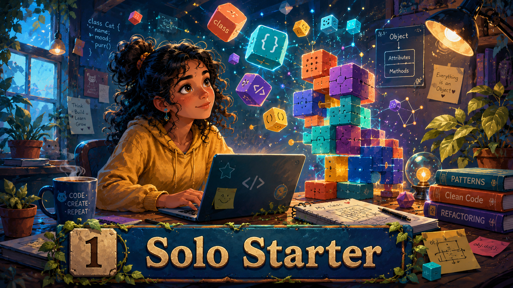

TODO: Optie 3 invoegen.

---

## 11. Niveau 2 — Backend Builder (week 3–4)

**Focus:** Spring Boot, testen, REST, lagen-architectuur. Nog steeds individueel.

**Kleurpalet:** Oranje + teal met accentkleuren per laag

**Kernbeeld:** Gestapelde lagen in verschillende kleuren, testpiramide, structuur en kwaliteit.


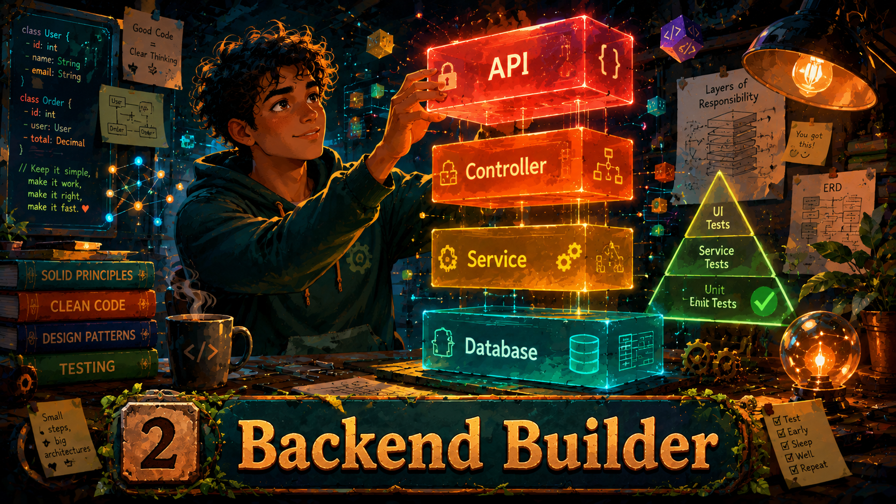

---

## 12. Niveau 3 — Frontend Crafter (week 5–7)

**Focus:** React, accessibility, componenten, Storybook, code reviews. Eerste samenwerking via peer feedback.

**Kleurpalet:** Paars + mint met gold en pink accenten

**Kernbeeld:** UI-componenten als kleurrijke puzzelstukken, browser, accessibility icoon.


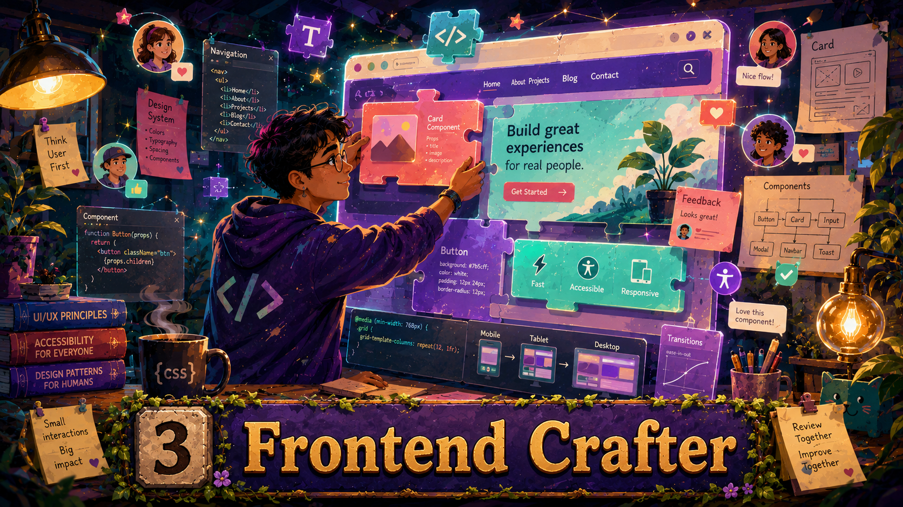

---

## 13. Niveau 4 — Full Stack Team (week 8)

**Focus:** Teamwerk, product-mode, vertical slice. Drietal werkt aan bestaande full-stack applicatie.

**Kleurpalet:** Diepblauw + koraal met teal en gold accenten

**Kernbeeld:** Drie personen, samenwerking, vertical slice door alle lagen.


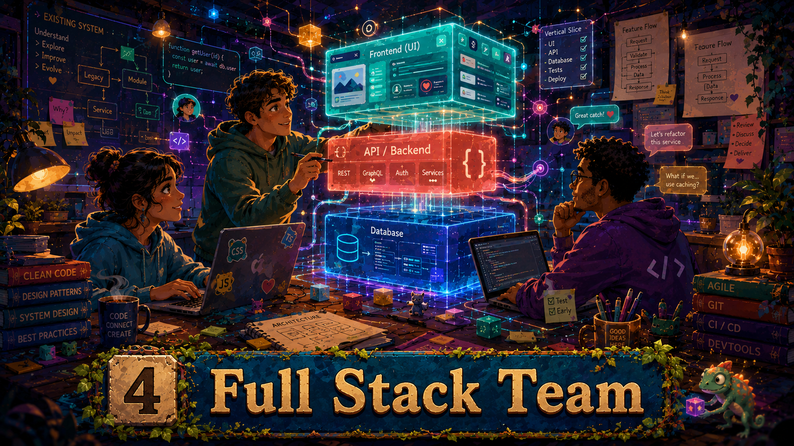

---

## 14. Niveaunamen en herbruikbaarheid

| Niveau | Weken | Naam | Kleurpalet | Focus |
|--------|-------|------|------------|-------|
| N1 | 1–2 | Solo Starter | Blauw + wit | OO-basis, klassen, objecten |
| N2 | 3–4 | Backend Builder | Oranje + teal | Spring Boot, testen, REST, lagen |
| N3 | 5–7 | Frontend Crafter | Paars + mint | React, accessibility, componenten |
| N4 | 8 | Full Stack Team | Diepblauw + koraal | Teamwerk, product-mode, vertical slice |

De namen zijn bewust casus-onafhankelijk (geen "Chuck-a-Luck" of "Filmfestival") zodat ze herbruikbaar zijn bij een casuswissel.

---

## 15. Waar te gebruiken

- **Brightspace niveau-header:** Eén banner per niveau-module (niet per les) — handmatig per module in te stellen, zie [§16.1](#161-per-module-afbeelding-in-brightspace-handmatig)
- **Studentenhandleiding:** als visuele scheiding tussen niveaus
- **Presentaties/slides:** als achtergrond of decoratie-element
- **Quiz-header:** optioneel, handmatig in te stellen per quiz in Brightspace

Bewust NIET per les een aparte banner — dat levert eindeloos herhaling op.

---

## 16. Afbeeldingen in de Brightspace-export

Brightspacosaurus neemt afbeeldingen uit lesoverzichten (Markdown ``) automatisch mee in het `.imscc`-pakket. Voorwaarden:

1. Het pad is relatief ten opzichte van het Markdown-bronbestand
2. Het bestand bestaat op dat pad
3. De afbeelding staat in een map die Brightspacosaurus scant

Voor niveau-banners: voeg `` toe direct na de H1 van het eerste lesoverzicht van elk niveau. Een bannerafbeelding staat nooit vóór de H1; de H1 blijft de eerste inhoudelijke kop van de pagina. Brightspacosaurus kopieert de afbeelding mee.

### 16.1 Per-module afbeelding in Brightspace (handmatig)

Brightspace toont per module optioneel een afbeelding bovenaan de modulepagina. Deze module-afbeelding is een Brightspace UI-instelling en zit niet in de IMSCC-standaard; Brightspacosaurus kan dit dus niet automatisch zetten. Na import moet je dit per module eenmalig handmatig configureren.

Werkwijze:

1. Open de cursus in Brightspace → **Inhoud** (Content).
2. Navigeer naar de niveau-module (bijv. *Niveau 1 — Solo Starter*).
3. Klik in de modulekop op de actiepijl (▾) naast de modulenaam → **Module bewerken** (Edit Module).
4. Kies **Voeg afbeelding toe** (Add Image) en upload de bijbehorende niveau-banner uit `6.3.Studentenmateriaal/images/niveau-{n}-{naam}-b.png`. Gebruik dezelfde afbeelding die ook in het lesoverzicht staat, zodat Docusaurus-preview en Brightspace visueel hetzelfde tonen.
5. Sla op. Brightspace gebruikt de afbeelding voortaan als modulebanner in de inhoudslijst en als thumbnail op de cursushomepage.

Aanbeveling: gebruik de `-b`-variant als standaard, gelijk aan de Docusaurus-default. Studenten kunnen in Docusaurus via de variantkiezer (A/B/C) wisselen; in Brightspace is de getoonde variant de variant die je hier instelt.

Bij een herimport in dezelfde cursus blijft de eerder ingestelde modulebanner staan zolang de module zelf niet is verwijderd. Verwijder je de module en importeer je opnieuw, dan moet je de afbeelding opnieuw instellen. Dit pleit ervoor om bij wijzigingen aan een enkele module alleen die module bij te werken via een gerichte import in plaats van de hele cursus te vervangen.

---

## 17. Nabewerking van gegenereerde visuals

1. Exporteer als PNG (hoogste resolutie)
2. Voeg niveaunaam toe als overlay in Canva/Figma (lettertype: Inter of Poppins, semi-bold)
3. Sla op in `images/` met semantische naam: `niveau-{n}-{naam}-{variant}.png`
4. Verwijs ernaar in Markdown via relatief pad

---

## 18. Bulk-verwijderen van content via browser-console

Omdat Brightspace-import additief is (zie sectie 4), moet je bij herimport eerst bestaande content verwijderen. Handmatig kost dat 4 kliks per item — bij tientallen pagina's is dit vrij onwerkbaar. Het script `verwijder-brightspace-paginas.js` automatiseert dit deels. Dit is we; een ietwat hacky aanpak, en een workaround voor gebrek aan API toegang tot Brightspace. De werkwijze is dit (stuk JavaScript) script integraal te copy-pasten naar de JavaScript console in de Browser (F12/Developer tools -> tabblad 'Console) en op 'Enter' drukken voor uitvoeren. Op moment van schrijven is dit nog wel wat buggy, mogelijk is dit ook niet oplosbaar, vanwege gebruik iframe voor pop-up en dergelijke constructies door Brightspace.

### 18.1 Gebruik

1. Open de cursus in Brightspace → **Inhoud** (Content).
2. Navigeer naar de module waarvan je items wilt verwijderen.
3. Selecteer het eerste item waar je wilt beginnen.
4. Open DevTools (F12) → **Console**.
5. Kopieer de inhoud van `scripts/brightspacosaurus/verwijder-brightspace-paginas.js` en plak in de console.
6. Druk Enter. Het script vraagt hoeveel items je wilt verwijderen.

### 18.2 Werking

Het script:

- Pollt snel (50ms) op UI-reacties in plaats van vaste wachttijden.
- Wacht tot de bevestigingsdialoog **dicht** is voordat het aan het volgende item begint — voorkomt een stapel open dialogen.
- Klikt de radio "ook onderliggende bestanden verwijderen" als die aanwezig is.
- Skipt items zonder verwijderoptie (quizzen, assignments) en gaat door met het volgende.
- Sluit succes-toasts ("het is gelukt") direct weg.
- Houdt een set bij van mislukte objectId's zodat het niet eindeloos dezelfde items probeert.

### 18.3 Beperkingen

- Het script werkt via DOM-manipulatie en is afhankelijk van Brightspace's interne HTML-structuur. Bij een Brightspace-update kan het breken.
- Quizzen en assignments die als link in een module staan, hebben een ander verwijdermechanisme en worden overgeslagen.
- Bij grote aantallen (100+) kan het helpen om tussendoor F5 te drukken en het script opnieuw te draaien — Brightspace's interne state raakt soms corrupt na veel DOM-manipulatie in één sessie.
- Het script is bedoeld als tijdelijke workaround totdat Brightspace API-toegang beschikbaar is.

### 18.4 Screenshot: lege cursus na bulk-verwijdering

_TODO — screenshot toevoegen van lege Brightspace-omgeving na succesvolle bulk-verwijdering._

---

## 19. Centralisatie van Brightspace-documentatie

Al het Brightspacosaurus-gerelateerde materiaal staat in `scripts/brightspacosaurus/`:

| Bestand | Inhoud |
|---------|--------|
| `docs/brightspacosaurus-handleiding.md` | Dit document — Docusaurus-preview, Brightspace-export, datamodel, werkwijze |
| `docs/*.png` | Screenshots bij deze handleiding |
| `assets/` | Niveau-visuals en import-screenshots |
| `referentie-exports/` | Voorbeeld-exports uit Brightspace voor analyse en regressiecontrole |

Andere Brightspacosaurus-gerelateerde bestanden elders in de repo (handleidingen, screenshots) kunnen hier naartoe verplaatst worden om één centraal punt te hebben.

---

## Bronnen

- 1EdTech. (z.d.). *Question and Test Interoperability (QTI)*. Geraadpleegd op 3 juni 2026, van https://www.1edtech.org/standards/qti
- D2L. (z.d.-a). *Add and organize learning materials in the Classic Content experience*. Brightspace Community. Geraadpleegd op 14 mei 2026, van https://community.d2l.com/brightspace/kb/articles/2750-add-and-organize-learning-materials-in-the-classic-content-experience
- D2L. (z.d.-b). *Add and organize course content*. Brightspace Community. Geraadpleegd op 14 mei 2026, van https://community.d2l.com/brightspace/kb/articles/4983-add-and-organize-course-content
- D2L. (z.d.-c). *Create and configure a quiz*. Brightspace Community. Geraadpleegd op 14 mei 2026, van https://community.d2l.com/brightspace/kb/articles/3413-create-and-configure-a-quiz
- D2L. (z.d.-d). *Using the Quizzes tool*. Brightspace Community. Geraadpleegd op 14 mei 2026, van https://community.d2l.com/brightspace/kb/articles/18174-using-the-quizzes-tool
- D2L. (z.d.-e). *Create an assignment*. Brightspace Community. Geraadpleegd op 14 mei 2026, van https://community.d2l.com/brightspace/kb/articles/2776-create-an-assignment
- D2L. (z.d.-f). *Create a Content topic in Manage Files*. Brightspace Community. Geraadpleegd op 14 mei 2026, van https://community.d2l.com/brightspace/kb/articles/3670-create-a-content-topic-in-manage-files
- D2L. (z.d.-g). *About Import/Export/Copy Components*. Brightspace Community. Geraadpleegd op 14 mei 2026, van https://community.d2l.com/brightspace/kb/articles/16786-about-import-export-copy-components
- D2L. (z.d.-h). *Import, export, or copy course components*. Brightspace Community. Geraadpleegd op 14 mei 2026, van https://community.d2l.com/brightspace/kb/articles/16788-import-export-or-copy-course-components
- Docusaurus. (z.d.-a). *Sidebar*. Geraadpleegd op 14 mei 2026, van https://docusaurus.io/docs/sidebar
- Docusaurus. (z.d.-b). *Autogenerated*. Geraadpleegd op 14 mei 2026, van https://docusaurus.io/docs/s idebar/autogenerated
- Docusaurus. (z.d.-c). *Docs Introduction*. Geraadpleegd op 14 mei 2026, van https://docusaurus.io/docs/docs-introduction
- Docusaurus. (z.d.-d). *Sidebar items*. Geraadpleegd op 14 mei 2026, van https://docusaurus.io/docs/sidebar/items
- Docusaurus. (z.d.-e). *Docs Multi-instance*. Geraadpleegd op 20 mei 2026, van https://docusaurus.io/docs/docs-multi-instance
- Pandoc. (z.d.). *Releases*. Geraadpleegd op 21 mei 2026, van https://pandoc.org/releases.html
