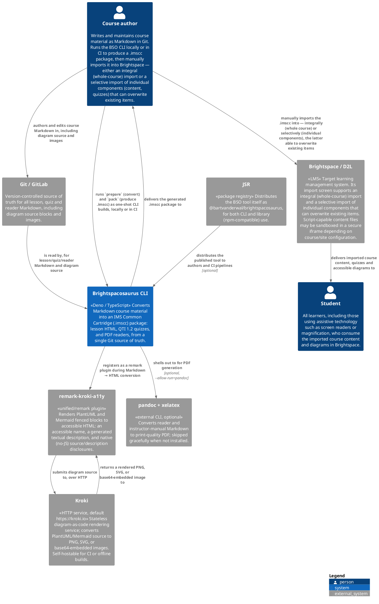
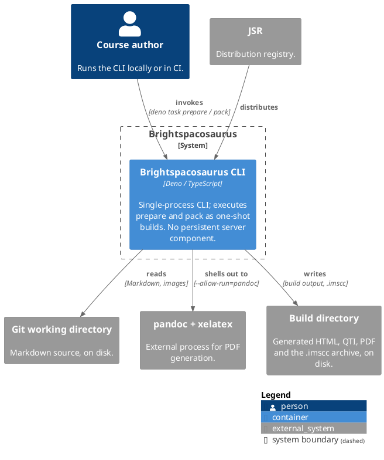
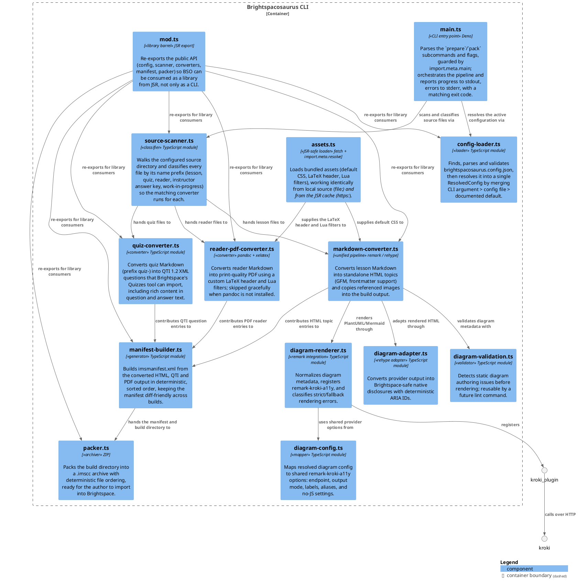

# Brightspacosaurus — Software Guidebook

Brightspacosaurus (BSO) is a CLI build tool that converts Markdown course material in Git into an IMS Common Cartridge (`.imscc`) package for import into Brightspace.

This guidebook follows the structure of Simon Brown's [Software Guidebook](https://leanpub.com/software-architecture-for-developers) (the C4 model author). It is developer- and architect-facing documentation. For user-facing details (installation, configuration fields, the Brightspace import walkthrough), see the [README](../README.md) and the [user manual](user-manual.md) rather than duplicating them here.

---

## 1. Context

### The problem

Course authors want a single source of truth for their material. Keeping content as Markdown in Git gives them version control, review workflows, diffs, and reuse. Brightspace (the target LMS) offers none of that: its authoring surface is a WYSIWYG editor where content is re-typed by hand. Re-authoring material directly in Brightspace is error-prone, not reviewable, and drifts away from the source over time.

BSO bridges that gap. It takes the Markdown that already lives in Git and produces a Common Cartridge package that Brightspace can import — so the author edits in one place (Git) and publishes to another (Brightspace) with a repeatable build step.

### Actors and external systems

| Actor / System                                                     | Role                                                                                                                                                                                                                                                                                                                                                                                                                                                                                                     |
| ------------------------------------------------------------------ | -------------------------------------------------------------------------------------------------------------------------------------------------------------------------------------------------------------------------------------------------------------------------------------------------------------------------------------------------------------------------------------------------------------------------------------------------------------------------------------------------------- |
| Course author                                                      | Writes and maintains course material as Markdown in Git; runs the CLI (`prepare`, `pack`) locally or in CI; sets diagram configuration (endpoint, rendering mode). After the build, the author manually imports the resulting `.imscc` into Brightspace, choosing an **integral import** (the whole course as one package) or a **selective import** of individual components (content topics, quizzes) — a selective import can overwrite items already present in the course with the same identifier. |
| Student (all learners, including those using assistive technology) | Consumes the imported course in Brightspace, including diagrams and accessibility features. BSO does not rely on custom JavaScript for diagram controls, because Brightspace content sandboxing and content frames are security-sensitive and tenant/course dependent.                                                                                                                                                                                                                                    |
| Git / GitLab                                                       | Source of truth for all course material and diagram source blocks.                                                                                                                                                                                                                                                                                                                                                                                                                                       |
| Brightspace / D2L                                                  | Target LMS; the manual import destination for the generated `.imscc`. Its import UI offers both integral and selective/overwrite import; BSO has no programmatic API into it. Content files that execute scripts may be sandboxed in a secure iframe, depending on Brightspace configuration.                                                                                                                                                                                                            |
| JSR                                                                | Distribution registry for the BSO tool itself (`@bartvanderwal/brightspacosaurus`).                                                                                                                                                                                                                                                                                                                                                                                                                      |
| remark-kroki-a11y                                                  | Unified (remark) plugin for rendering PlantUML and Mermaid diagrams to accessible HTML with disclosure controls and natural-language descriptions.                                                                                                                                                                                                                                                                                                                                                       |
| Kroki                                                              | Diagram rendering service (default public https://kroki.io; can be self-hosted for CI/offline builds). Renders diagram source to PNG, SVG, or base64-embedded images over HTTP.                                                                                                                                                                                                                                                                                                                          |
| pandoc                                                             | External CLI tool used for PDF generation (readers, instructor manual), invoked via `--allow-run=pandoc`. Optional; skipped gracefully when absent.                                                                                                                                                                                                                                                                                                                                                      |

### System context



> Rendered via Kroki (`https://kroki.io/plantuml/svg/...`) using the [C4-PlantUML](https://github.com/plantuml-stdlib/C4-PlantUML) standard library, consistent with how BSO itself renders PlantUML/Mermaid diagrams for course content.

### A note on "import" vs "export"

The terminology can be confusing because it depends on the vantage point:

- From the **Git / BSO** perspective, producing the `.imscc` is an **export** of the source material into a portable package.
- From the **Brightspace** perspective, the same file is **imported** into a course.

Throughout this guidebook: _export_ refers to BSO writing the package, _import_ refers to loading it into Brightspace. BSO never imports; it only exports.

### Diagram rendering in context

As of version 0.8.0, BSO integrates **diagram rendering** as a core feature of the `prepare` command. When a lesson Markdown file contains PlantUML or Mermaid fenced blocks, BSO uses `remark-kroki-a11y` to render them to accessible HTML during the build. This happens only for **lesson content** (standard `.md` files converted to HTML topics); **quiz questions** follow a different path (see [ADR 011](adr/adr011-brightspacosaurus-rich-quiz-content.md)).

Key points:

- **Configuration**: The diagram service endpoint and output mode are set in `brightspacosaurus.config.json` (optional; documented defaults apply).
- **Accessibility**: Every diagram includes an accessible name and (when possible) a natural-language description. Disclosure controls (source, description) use native `<details>` elements that work without client-side JavaScript, because diagram accessibility must not depend on scripts inside Brightspace topic content. This is a requirement for diagram disclosure specifically, not a blanket no-JS rule for the whole page: other, unrelated progressive-enhancement scripts may be added elsewhere (e.g. a copy-to-clipboard button on code blocks) as long as they degrade gracefully when Brightspace blocks scripts.
- **Error handling**: The build can be configured to fail strictly (stop on any diagram error) or fall back gracefully (warn, retain source block, continue). See Section 6 "Software Architecture" for the error classification strategy.

---

## 2. Functional Overview

BSO exposes two commands (see the [README](../README.md) for full CLI usage).

### `prepare` — Markdown to build artifacts

Scans the configured source directory and writes conversion output into the build directory (`outputDir`, default `build/brightspace`):

- Lesson Markdown → standalone HTML (`content/`)
- Quiz Markdown (prefix `quiz-`) → QTI 1.2 XML (`quiz/`)
- Reader Markdown (prefix `reader-`) → PDF via pandoc (`readers/`), if configured
- Instructor manual → composed PDF (`docenten/`), if configured
- Referenced images copied into the build directory

During lesson conversion, PlantUML and Mermaid fenced blocks are rendered by `remark-kroki-a11y` through a Kroki-compatible HTTP endpoint. The optional `diagrams` config controls the endpoint (`krokiUrl`, default `https://kroki.io`), output mode (`img-html-base64` by default), and error policy (`failOnError`, default `true`). In strict mode the build fails on invalid diagram metadata, invalid source, or unreachable Kroki. In fallback mode BSO warns, keeps the original fenced block, and continues.

### `pack` — build directory to `.imscc`

Generates `imsmanifest.xml` from the build output and packages everything into a `.imscc` archive (a ZIP under the hood). If `prepare` has not run yet, `pack` runs it first.

### File classification by prefix

`source-scanner.ts` classifies files by name, not by content:

| Pattern                        | Treated as                     | Destination                              |
| ------------------------------ | ------------------------------ | ---------------------------------------- |
| `quiz-*.md`                    | Quiz                           | QTI 1.2 XML                              |
| `quiz-*-antwoorden-docent.md`  | Instructor answer key          | **Excluded** (never shipped to students) |
| `reader-*.md` (top level)      | Reader                         | PDF via pandoc                           |
| `*.pdf` (top level)            | Pre-built reader               | Copied through as-is                     |
| `TODO-*.md`, `transcript-*.md` | Work-in-progress / transcripts | Excluded                                 |
| any other `*.md`               | Lesson page                    | HTML                                     |

Instructor answer keys are deliberately skipped so answers never leak into a student-facing package.

### Configuration

All project-specific behaviour comes from `brightspacosaurus.config.json`, never from the source code. The required fields are `courseName`, `version`, and `sourcesDir`; the rest (readers, assets, output directory, custom CSS, instructor manual) are optional with sensible defaults. CLI arguments override config values. See the [README configuration section](../README.md#configuration) for the full field reference.

---

## 3. Quality Attributes

### Reproducibility and determinism

Commands are idempotent: running `prepare`/`pack` repeatedly on the same input produces byte-identical output. Archive entries use deterministic file ordering (manifest entries are sorted; scanned files are sorted). This keeps `.imscc` output stable and diff-friendly across builds and CI runs.

Manifest navigation order is also deterministic and intentionally mirrors the authored lesson structure. BSO groups content and quiz entries by their first output subdirectory (for example `week-6`) and then sorts entries within that group by a natural lesson/quiz code extracted from the title or file name. When a lesson page and quiz share the same code, the lesson HTML (`webcontent`) appears before the QTI quiz item. This produces Brightspace menu sequences such as `Les 6.1` → `Quiz 6.1` → `Les 6.2` → `Quiz 6.2`, without course-specific manifest cleanup scripts. See GitHub issue #22.

### Security by design

BSO runs on Deno, which requires explicit permission grants (`--allow-read`, `--allow-write`, `--allow-run=pandoc`, `--allow-env`). There are no automatic postinstall scripts, which removes a common supply-chain attack vector. Publishing via JSR keeps the distribution surface small. See [ADR 008](adr/adr008-brightspacosaurus-runtime-deno-vs-nodejs.md).

### Portability

The tool is location-independent: it uses `Deno.cwd()` as the repository root, so it works regardless of where the BSO code itself lives. It runs identically from local source (`file://`) or from the JSR cache (`https://`), and is npm-compatible through Deno's compatibility layer.

### Maintainability

The core is a set of small, single-responsibility modules under `src/`, each doing one conversion step. Behaviour is config-driven, so adapting the tool to a new course means editing JSON, not code.

### Accessibility by design

Brightspace topic content can support custom JavaScript, but BSO does not treat it as a dependable accessibility mechanism. D2L documents a multi-page content-topic pattern where course designers include JavaScript in HTML content topics; the same article notes that this requires an advanced course designer (D2L, n.d.-i). Separately, D2L community documentation says script-capable content may be sandboxed in a secure iframe depending on course configuration. BSO therefore keeps diagram source and natural-language descriptions available through native `<details>/<summary>` controls, independent of whether scripts run. Rendered images and inline SVGs receive deterministic ARIA relationships to the generated description where available. This is an accessibility intent and implementation constraint, not a blanket WCAG conformance claim; representative Brightspace pages still need manual assistive-technology verification.

### Error resilience

Diagram errors are categorized as `kroki-unreachable`, `invalid-source`, or `invalid-parameter`. Static authoring issues are detected before contacting Kroki; render-time failures from `remark-kroki-a11y` are wrapped as `DiagramError`. Strict mode fails fast with source-file context. Fallback mode logs an actionable warning and keeps the original code block in the generated page so authors can still publish non-diagram content when they choose that policy.

---

## 4. Constraints

| Constraint                                | Detail                                                                                                                                                                               |
| ----------------------------------------- | ------------------------------------------------------------------------------------------------------------------------------------------------------------------------------------ |
| Runtime                                   | Deno ≥ 2.0 required.                                                                                                                                                                 |
| Quiz format                               | QTI **1.2** — the Brightspace Quizzes tool only supports 1.2.                                                                                                                        |
| Package format                            | IMS Common Cartridge **1.3**.                                                                                                                                                        |
| PDF toolchain                             | pandoc + xelatex/lualatex, required **only** for PDF generation (readers, instructor manual). Gracefully skipped when absent.                                                        |
| Brightspace import is additive            | Import adds modules and quizzes but never removes or deduplicates them. This is a platform constraint, not a BSO design choice. Re-importing produces duplicates; cleanup is manual. |
| No Brightspace API                        | There is no programmatic API access (yet). The import step is partly manual.                                                                                                         |
| Diagram rendering service                 | PlantUML and Mermaid rendering needs a reachable Kroki-compatible endpoint. Local Kroki requires the Mermaid companion service for Mermaid diagrams.                                 |
| Diagrams in lessons only                  | Diagram rendering is scoped to the HTML/Brightspace lesson route. Quiz questions follow the QTI route; see ADR 011.                                                                  |
| No custom JavaScript for diagram controls | Source and description controls must work as native HTML because Brightspace content sandboxing and script behavior can vary by course/site configuration.                          |

---

## 5. Principles

- **Convention over configuration.** Sensible defaults everywhere; only three fields are required. The build directory, output name, and instructor-manual location all derive from defaults unless overridden.
- **Single source of truth.** Markdown in Git is authoritative. Every artifact (HTML, QTI, PDF, manifest, `.imscc`) is generated and never hand-edited. Brightspace is a distribution channel, not the store of record.
- **Config-driven, no hardcoded paths.** Nothing project-specific lives in the code; it all comes from `brightspacosaurus.config.json` or CLI arguments.
- **Separation of tool core from course content.** The tool ships no course-specific assets. Bundled assets (default CSS, LaTeX header, Lua filters) are generic scaffolding, not content.

---

## 6. Software Architecture

### Container diagram

BSO has a single container: the CLI process itself. There is no server, no database, and no persistent runtime — the whole system runs on one device (the author's machine or a CI runner) for the duration of one `prepare`/`pack` invocation.



### Module structure

The core lives under `src/`, split by conversion responsibility:

| Module                    | Responsibility                                                                                                      |
| ------------------------- | ------------------------------------------------------------------------------------------------------------------- |
| `main.ts`                 | CLI entry point (`prepare`, `pack`), guarded by `import.meta.main`.                                                 |
| `config-loader.ts`        | Load, validate and resolve `brightspacosaurus.config.json`.                                                         |
| `source-scanner.ts`       | Scan source directories, classify files by prefix.                                                                  |
| `markdown-converter.ts`   | Markdown → HTML (unified / remark / rehype).                                                                        |
| `diagram-config.ts`       | Resolve BSO diagram settings into shared `remark-kroki-a11y` options for BSO and preview parity.                    |
| `diagram-renderer.ts`     | Register `remark-kroki-a11y`, normalize diagram metadata, classify render errors, and apply strict/fallback policy. |
| `diagram-adapter.ts`      | Adapt generated diagram HTML to Brightspace-safe native disclosures and deterministic ARIA relationships.           |
| `diagram-validation.ts`   | Detect static diagram authoring issues without rendering, reusable by future linting.                               |
| `quiz-converter.ts`       | Quiz Markdown → QTI 1.2 XML.                                                                                        |
| `reader-pdf-converter.ts` | Reader Markdown → PDF via pandoc.                                                                                   |
| `manifest-builder.ts`     | Generate `imsmanifest.xml` and sort Brightspace navigation entries by module/week and natural lesson/quiz code.      |
| `packer.ts`               | Pack the build directory into a `.imscc` archive.                                                                   |
| `assets.ts`               | Load bundled assets (CSS, LaTeX, Lua) in a JSR-safe way.                                                            |
| `types.ts`                | Shared TypeScript interfaces.                                                                                       |
| `mod.ts`                  | Barrel export for library use via JSR.                                                                              |

### Component diagram

Components inside the single `Brightspacosaurus CLI` container:



### Data flow

**`prepare`:** resolve config → scan sources → for each classified file run the matching converter (HTML / QTI / PDF) into the build directory → copy referenced images.

**Diagram path inside lesson HTML:** Markdown source → static diagram validation → metadata normalization (`imgType`, `imgTitle`) → `remark-kroki-a11y` → Kroki HTTP render → accessible provider HTML → Brightspace adapter → final standalone HTML topic.

**`pack`:** ensure `prepare` output exists (run it if not) → scan build output for HTML, QTI and reader PDFs → sort manifest entries by module/week and natural lesson/quiz code → write `imsmanifest.xml` → ZIP the build directory into `<name>.v<version>.imscc`.

### Config resolution pipeline

Config loading is a four-step pipeline in `config-loader.ts`:

```
findConfigFile  →  loadConfig  →  validateConfig  →  resolveConfig
```

1. **`findConfigFile`** — locate `brightspacosaurus.config.json` (explicit `--config` path or default in the working directory). Returns `null` if none is found.
2. **`loadConfig`** — read and JSON-parse the file, failing fast with a clear message on invalid JSON.
3. **`validateConfig`** — enforce the schema: required fields present and non-empty, optional fields of the correct type, `teacherManual` well-formed.
4. **`resolveConfig`** — merge with CLI overrides using the precedence **CLI argument > config file > default**, and resolve every relative path against the repo root. The output is a `ResolvedConfig` with absolute paths.

When no config file exists but `--sources` is given, `resolveFromCliOnly` produces a minimal `ResolvedConfig` with defaults.

---

## 7. Code

### Conventions

- **Idempotent commands** — repeated runs on identical input yield identical output. `prepare` clears its output subdirectories before regenerating.
- **stderr / stdout discipline** — progress goes to `stdout`; errors and warnings go to `stderr`.
- **Exit codes** — `0` success; `1` general/config error; `2` source directory not found; `3` path escapes the repo root, or reader PDF conversion failed. Errors carry an optional `exitCode` that `main.ts` honours.

### Asset loading (JSR-safe)

Bundled assets in `assets/` are **never** loaded with `import.meta.url` + `Deno.readTextFile()`. That works locally (`file://`) but fails from the JSR cache with _"Must be a file URL"_, because JSR serves modules over `https://`.

`src/assets.ts` provides the safe alternative:

- **`loadAssetText(name)`** — resolves the asset URL with `import.meta.resolve()` and loads it with `fetch()`. `fetch` works uniformly across `file://`, `https://` and `jsr:`. Results are cached per process.
- **`materializeAsset(name)`** — writes an asset to a temporary file (preserving its extension) and returns the path. External tools such as pandoc need a real file on disk (`--include-in-header`, `--lua-filter`) and cannot read a URL.

Every new asset must also be added to `publish.include` in `deno.json`, otherwise it is missing from the JSR package.

### Path handling

`convertMarkdown` takes a `baseDir` option. Passing `sourcesDir` as the base flattens deep source directory structures so that manifest grouping uses the correct subdirectory (e.g. `week-1`) rather than the full nested path from the repo root.

### HTML entity handling

Page titles for the manifest are extracted from the generated HTML (the `<h1>`). rehype has already escaped that HTML (`&amp;`, `&#x26;`, etc.). Because `manifest-builder.ts` escapes again when writing XML, titles are first decoded with `decodeHtmlEntities` — handling named and numeric (hex and decimal) entities — to avoid double-escaping (e.g. `&amp;` becoming `&amp;amp;`).

### Diagram rendering and error classification

`diagram-renderer.ts` adds two remark steps before Markdown is converted to HTML. First, it walks mdast code blocks and adds missing diagram metadata: `imgType` follows the fence language and `imgTitle` comes from the nearest preceding heading, falling back to a stable positional title. Second, it registers `remark-kroki-a11y` with options from `diagram-config.ts`.

`diagram-adapter.ts` runs after raw provider HTML has been parsed by `rehype-raw`. It keeps provider-generated source and natural-language descriptions, converts tabbed source/description panels to native disclosures for Brightspace, and assigns deterministic IDs such as `bso-diagram-1-description`. Image diagrams use `aria-describedby`; inline SVGs get `role="img"`, a stable `<title>`, `aria-labelledby`, and `aria-describedby` when a description exists.

`diagram-validation.ts` detects offline authoring issues before a Kroki request is made: unsupported diagram declarations, unknown fence options, non-local `src=`, empty diagram blocks, and inconsistent option values. Rendering failures are wrapped in `DiagramError` with category `kroki-unreachable`, `invalid-source`, or `invalid-parameter`. The resolved `diagrams.failOnError` setting decides whether that error fails the build or becomes a warning plus original-code fallback.

---

## 8. Design Decisions

### Preview/output parity

The Docusaurus preview and the Brightspace/IMSCC export are two render targets for the same Markdown source. Every author-visible feature — lessons, quizzes, links, includes, diagrams, flashcards and accessibility behavior — should work in both Docusaurus and Brightspace and remain usable and visually coherent after Brightspace import.

The preferred way to achieve this is code reuse: share parsers, renderers, assets, semantic HTML contracts and browser behavior wherever the two targets allow it. Do not create parallel implementations when a shared implementation is possible. Some target-specific work remains unavoidable because Docusaurus and Brightspace have different rendering, sandboxing and import behavior; therefore parity always requires some tests in both targets, plus a real Brightspace import test for LMS-specific behavior. But this should be minimized through code reuse (same JS in Docusaurus as in Brightspace, use Docusaurus plugins and standards when possible for new features wanted in Brigthspace).

The shared implementation contracts belong with the relevant components and assets. The contribution rules in [CONTRIBUTING.md](../CONTRIBUTING.md) require new features to document and test both targets where applicable.

The significant architectural decisions are recorded as Architecture Decision Records in the [ADR index](adr/README.md).

### Deno over Node.js — [ADR 008](adr/adr008-brightspacosaurus-runtime-deno-vs-nodejs.md)

**Context:** the tool runs in CI with repository and build-process access, making supply-chain security a first-class concern. **Decision:** use Deno as the runtime. **Rationale:** Deno's explicit permission model limits file access to declared paths, and it does not run postinstall scripts automatically — closing a well-known npm supply-chain vector.

### unified (remark / rehype) for Markdown → HTML — [ADR 010](adr/adr010-brightspacosaurus-unified-markdown-pipeline.md)

**Context:** Markdown must convert to clean, standalone HTML with GFM, frontmatter and rich content. **Decision:** use the unified pipeline (remark-parse, remark-gfm, remark-frontmatter, remark-rehype, rehype-stringify). **Rationale:** a well-established, composable, plugin-driven pipeline with predictable output.

### Rich content in quiz questions — [ADR 011](adr/adr011-brightspacosaurus-rich-quiz-content.md)

**Context:** quiz questions need more than plain text (code, formatting). **Decision:** support rich content in quiz Markdown when converting to QTI. **Rationale:** questions stay authored in Markdown while producing valid QTI 1.2 for Brightspace.

### Reader PDF conversion via pandoc — [ADR 014](adr/adr014-reader-pdf-conversion.md)

**Context:** readers and the instructor manual need print-quality PDF output. **Decision:** convert reader Markdown to PDF via pandoc with a xelatex/lualatex engine, a custom LaTeX header and Lua filters. **Rationale:** pandoc gives high-quality typesetting; PDF generation is optional and skipped when pandoc is absent, so the core build never hard-depends on it.

Reader PDFs use a mandatory separate cover page ('voorblad', AIM Controle Kaart) before the table of contents. BSO derives deterministic cover metadata from reader frontmatter, the first H1, the configured course name, the configured version and, when `git` is available and permitted, the last commit date of the reader Markdown file. It deliberately does not inject the current date automatically because repeated builds must remain reproducible.

### Publication via JSR — [ADR 015](adr/adr015-brightspacosaurus-publication-via-jsr.md)

**Context:** the tool should be reusable both as an executable CLI and as an importable library. **Decision:** publish to JSR as `@bartvanderwal/brightspacosaurus`. **Rationale:** native Deno support with no separate build step, automatically indexed TypeScript types, versioning, and minimal impedance mismatch with the toolchain.

### Asset loading via fetch + materialize for JSR compatibility — _(new; GitHub issue #5)_

**Context:** bundled assets were loaded with `import.meta.url` + `Deno.readTextFile()`. This works from local source (`file://`) but fails from the JSR cache with _"Must be a file URL"_, because JSR serves modules over `https://`. **Decision:** introduce `src/assets.ts` with `loadAssetText` (`import.meta.resolve()` + `fetch()`) for text assets, and `materializeAsset` (write to a temp file) for external tools such as pandoc that require a real file path. **Rationale:** `fetch` works uniformly across `file://`, `https://` and `jsr:`; temp-file materialization bridges the gap for external processes that cannot read URLs. See GitHub issue #5.

### Diagram rendering via remark-kroki-a11y — [ADR 016](adr/adr016-diagram-rendering-via-remark-kroki-a11y.md)

**Context:** lesson HTML needs PlantUML/Mermaid rendering and accessibility support, while Brightspace topic content cannot safely assume custom JavaScript is available or allowed. **Decision:** run `remark-kroki-a11y` in-process, share one option mapper with preview, adapt provider HTML to native Brightspace disclosures, and keep offline validation reusable. **Rationale:** keeps rendering and natural-language descriptions in one upstream provider while giving BSO deterministic no-JS output and strict/fallback error policy.

### Config file over convention-only — _(brightspacosaurus-generiek spec)_

**Context:** the original tool was convention-based and tied to one specific course's directory layout. **Decision:** move to a config-driven, generic tool where all project specifics live in `brightspacosaurus.config.json`. **Rationale:** decouples the tool from any single course, making it reusable and publishable. See `.kiro/specs/brightspacosaurus-generiek/`.

---

## 9. Deployment

### Distribution via JSR

```sh
# As a library
deno add jsr:@bartvanderwal/brightspacosaurus

# Run the CLI directly, no install
deno x jsr:@bartvanderwal/brightspacosaurus/cli prepare

# Or install a permanent command
deno install --allow-read --allow-write --allow-run=pandoc,git --allow-env --allow-net \
  -n brightspacosaurus jsr:@bartvanderwal/brightspacosaurus/cli
```

BSO is also usable from Node.js projects through Deno's npm-compatibility layer.

### CI pipeline usage

A typical GitLab CI job runs `prepare` + `pack` and publishes the resulting `.imscc` as a build artifact:

```yaml
build-imscc:
  image: denoland/deno:latest
  script:
    - deno run --allow-read --allow-write --allow-run=pandoc --allow-env --allow-net
      jsr:@bartvanderwal/brightspacosaurus/cli prepare
    - deno run --allow-read --allow-write --allow-env
      jsr:@bartvanderwal/brightspacosaurus/cli pack
  artifacts:
    paths:
      - build/**/*.imscc
```

### Manual import step

The final step — importing the `.imscc` into a Brightspace course — remains manual (Import/Export/Copy Components in Brightspace). See the [user manual](user-manual.md) and the README's Brightspace import section for the walkthrough and additive-import caveats.

---

## 10. Decision Log / Changelog

### Architecture Decision Records

The [`docs/adr/`](adr/README.md) directory is the running decision log:

| ADR                                                                           | Summary                                                                    |
| ----------------------------------------------------------------------------- | -------------------------------------------------------------------------- |
| [008](adr/adr008-brightspacosaurus-runtime-deno-vs-nodejs.md) | Deno over Node.js — permission model and no auto postinstall scripts. |
| [010](adr/adr010-brightspacosaurus-unified-markdown-pipeline.md) | unified (remark/rehype) pipeline for Markdown → HTML. |
| [011](adr/adr011-brightspacosaurus-rich-quiz-content.md) | Rich content in quiz questions. |
| [014](adr/adr014-brightspacosaurus-reader-pdf-conversion.md) | Reader PDF conversion via pandoc. |
| [015](adr/adr015-brightspacosaurus-publication-via-jsr.md) | Publication via JSR. |
| [016](adr/adr016-diagram-rendering-via-remark-kroki-a11y.md) | Diagram rendering via remark-kroki-a11y with no-JS Brightspace adaptation. |

### Versioning

The version lives in `deno.json` and follows semver (patch for bugfixes, minor for features on the current `0.x` line). The version is bumped in the same change as the corresponding feature or fix so the JSR publication stays correct. Significant behavioural changes are captured as ADRs and tracked as GitHub issues (for example, the JSR asset-loading fix under issue #5).

### Spec history

Design and requirements history lives in two Kiro specs:

- `.kiro/specs/brightspacosaurus/` — the original bootstrap of the tool.
- `.kiro/specs/brightspacosaurus-generiek/` — the later step toward a generic, config-driven, JSR-published tool.

---

## References

- D2L. (n.d.-i). _Improve navigation in multi-page content topics_. Brightspace Community. Retrieved September 13, 2026, from https://community.d2l.com/brightspace/kb/articles/3365-improve-navigation-in-multi-page-content-topics
