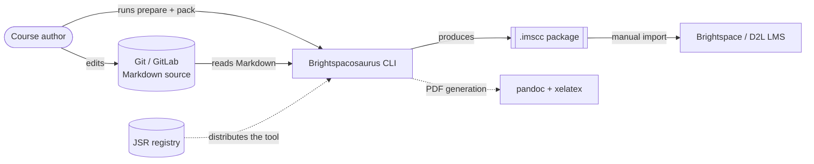
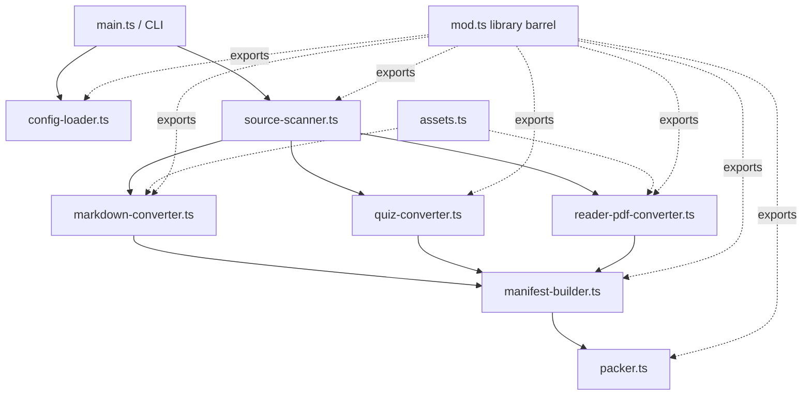

# Brightspacosaurus — Software Guidebook

Brightspacosaurus (BSS) is a CLI build tool that converts Markdown course material in Git into an IMS Common Cartridge (`.imscc`) package for import into Brightspace.

This guidebook follows the structure of Simon Brown's [Software Guidebook](https://leanpub.com/software-architecture-for-developers) (the C4 model author). It is developer- and architect-facing documentation. For user-facing details (installation, configuration fields, the Brightspace import walkthrough), see the [README](../README.md) and the [user manual](user-manual.md) rather than duplicating them here.

---

## 1. Context

### The problem

Course authors want a single source of truth for their material. Keeping content as Markdown in Git gives them version control, review workflows, diffs, and reuse. Brightspace (the target LMS) offers none of that: its authoring surface is a WYSIWYG editor where content is re-typed by hand. Re-authoring material directly in Brightspace is error-prone, not reviewable, and drifts away from the source over time.

BSS bridges that gap. It takes the Markdown that already lives in Git and produces a Common Cartridge package that Brightspace can import — so the author edits in one place (Git) and publishes to another (Brightspace) with a repeatable build step.

### Actors and external systems

| Actor / System | Role |
|----------------|------|
| Course author | Runs the CLI (`prepare`, `pack`); edits Markdown in Git. |
| Git / GitLab | Source of truth for all course material. |
| Brightspace / D2L | Target LMS; the import destination for the generated `.imscc`. |
| JSR | Distribution registry for the BSS tool itself (`@bartvanderwal/brightspacosaurus`). |
| pandoc | External tool used for PDF generation (readers, instructor manual). Optional. |

### System context



### A note on "import" vs "export"

The terminology can be confusing because it depends on the vantage point:

- From the **Git / BSS** perspective, producing the `.imscc` is an **export** of the source material into a portable package.
- From the **Brightspace** perspective, the same file is **imported** into a course.

Throughout this guidebook: *export* refers to BSS writing the package, *import* refers to loading it into Brightspace. BSS never imports; it only exports.

---

## 2. Functional Overview

BSS exposes two commands (see the [README](../README.md) for full CLI usage).

### `prepare` — Markdown to build artifacts

Scans the configured source directory and writes conversion output into the build directory (`outputDir`, default `build/brightspace`):

- Lesson Markdown → standalone HTML (`content/`)
- Quiz Markdown (prefix `quiz-`) → QTI 1.2 XML (`quiz/`)
- Reader Markdown (prefix `reader-`) → PDF via pandoc (`readers/`), if configured
- Instructor manual → composed PDF (`docenten/`), if configured
- Referenced images copied into the build directory

### `pack` — build directory to `.imscc`

Generates `imsmanifest.xml` from the build output and packages everything into a `.imscc` archive (a ZIP under the hood). If `prepare` has not run yet, `pack` runs it first.

### File classification by prefix

`source-scanner.ts` classifies files by name, not by content:

| Pattern | Treated as | Destination |
|---------|------------|-------------|
| `quiz-*.md` | Quiz | QTI 1.2 XML |
| `quiz-*-antwoorden-docent.md` | Instructor answer key | **Excluded** (never shipped to students) |
| `reader-*.md` (top level) | Reader | PDF via pandoc |
| `*.pdf` (top level) | Pre-built reader | Copied through as-is |
| `TODO-*.md`, `transcript-*.md` | Work-in-progress / transcripts | Excluded |
| any other `*.md` | Lesson page | HTML |

Instructor answer keys are deliberately skipped so answers never leak into a student-facing package.

### Configuration

All project-specific behaviour comes from `brightspacosaurus.config.json`, never from the source code. The required fields are `courseName`, `version`, and `sourcesDir`; the rest (readers, assets, output directory, custom CSS, instructor manual) are optional with sensible defaults. CLI arguments override config values. See the [README configuration section](../README.md#configuration) for the full field reference.

---

## 3. Quality Attributes

### Reproducibility and determinism

Commands are idempotent: running `prepare`/`pack` repeatedly on the same input produces byte-identical output. Archive entries use deterministic file ordering (manifest entries are sorted; scanned files are sorted). This keeps `.imscc` output stable and diff-friendly across builds and CI runs.

### Security by design

BSS runs on Deno, which requires explicit permission grants (`--allow-read`, `--allow-write`, `--allow-run=pandoc`, `--allow-env`). There are no automatic postinstall scripts, which removes a common supply-chain attack vector. Publishing via JSR keeps the distribution surface small. See [ADR 008](../adr/adr008-brightspacosaurus-runtime-deno-vs-nodejs.md).

### Portability

The tool is location-independent: it uses `Deno.cwd()` as the repository root, so it works regardless of where the BSS code itself lives. It runs identically from local source (`file://`) or from the JSR cache (`https://`), and is npm-compatible through Deno's compatibility layer.

### Maintainability

The core is a set of small, single-responsibility modules under `src/`, each doing one conversion step. Behaviour is config-driven, so adapting the tool to a new course means editing JSON, not code.

---

## 4. Constraints

| Constraint | Detail |
|-----------|--------|
| Runtime | Deno ≥ 2.0 required. |
| Quiz format | QTI **1.2** — the Brightspace Quizzes tool only supports 1.2. |
| Package format | IMS Common Cartridge **1.3**. |
| PDF toolchain | pandoc + xelatex/lualatex, required **only** for PDF generation (readers, instructor manual). Gracefully skipped when absent. |
| Brightspace import is additive | Import adds modules and quizzes but never removes or deduplicates them. This is a platform constraint, not a BSS design choice. Re-importing produces duplicates; cleanup is manual. |
| No Brightspace API | There is no programmatic API access (yet). The import step is partly manual. |

---

## 5. Principles

- **Convention over configuration.** Sensible defaults everywhere; only three fields are required. The build directory, output name, and instructor-manual location all derive from defaults unless overridden.
- **Single source of truth.** Markdown in Git is authoritative. Every artifact (HTML, QTI, PDF, manifest, `.imscc`) is generated and never hand-edited. Brightspace is a distribution channel, not the store of record.
- **Config-driven, no hardcoded paths.** Nothing project-specific lives in the code; it all comes from `brightspacosaurus.config.json` or CLI arguments.
- **Separation of tool core from course content.** The tool ships no course-specific assets. Bundled assets (default CSS, LaTeX header, Lua filters) are generic scaffolding, not content.

---

## 6. Software Architecture

### Module structure

The core lives under `src/`, split by conversion responsibility:

| Module | Responsibility |
|--------|----------------|
| `main.ts` | CLI entry point (`prepare`, `pack`), guarded by `import.meta.main`. |
| `config-loader.ts` | Load, validate and resolve `brightspacosaurus.config.json`. |
| `source-scanner.ts` | Scan source directories, classify files by prefix. |
| `markdown-converter.ts` | Markdown → HTML (unified / remark / rehype). |
| `quiz-converter.ts` | Quiz Markdown → QTI 1.2 XML. |
| `reader-pdf-converter.ts` | Reader Markdown → PDF via pandoc. |
| `manifest-builder.ts` | Generate `imsmanifest.xml`. |
| `packer.ts` | Pack the build directory into a `.imscc` archive. |
| `assets.ts` | Load bundled assets (CSS, LaTeX, Lua) in a JSR-safe way. |
| `types.ts` | Shared TypeScript interfaces. |
| `mod.ts` | Barrel export for library use via JSR. |

### Component diagram



### Data flow

**`prepare`:** resolve config → scan sources → for each classified file run the matching converter (HTML / QTI / PDF) into the build directory → copy referenced images.

**`pack`:** ensure `prepare` output exists (run it if not) → scan build output for HTML, QTI and reader PDFs → build sorted manifest entries → write `imsmanifest.xml` → ZIP the build directory into `<name>.v<version>.imscc`.

### Config resolution pipeline

Config loading is a four-step pipeline in `config-loader.ts`:

```
findConfigFile  →  loadConfig  →  validateConfig  →  resolveConfig
```

1. **`findConfigFile`** — locate `brightspacosaurus.config.json` (explicit `--config` path or default in the working directory). Returns `null` if none is found.
2. **`loadConfig`** — read and JSON-parse the file, failing fast with a clear message on invalid JSON.
3. **`validateConfig`** — enforce the schema: required fields present and non-empty, optional fields of the correct type, `docentenHandleiding` well-formed.
4. **`resolveConfig`** — merge with CLI overrides using the precedence **CLI argument > config file > default**, and resolve every relative path against the repo root. The output is a `ResolvedConfig` with absolute paths.

When no config file exists but `--sources` is given, `resolveFromCliOnly` produces a minimal `ResolvedConfig` with defaults.

---

## 7. Code

### Conventions

- **Idempotent commands** — repeated runs on identical input yield identical output. `prepare` clears its output subdirectories before regenerating.
- **stderr / stdout discipline** — progress goes to `stdout`; errors and warnings go to `stderr`.
- **Exit codes** — `0` success; `1` general/config error; `2` source directory not found; `3` path escapes the repo root, or reader PDF conversion failed. Errors carry an optional `exitCode` that `main.ts` honours.

### Asset loading (JSR-safe)

Bundled assets in `assets/` are **never** loaded with `import.meta.url` + `Deno.readTextFile()`. That works locally (`file://`) but fails from the JSR cache with *"Must be a file URL"*, because JSR serves modules over `https://`.

`src/assets.ts` provides the safe alternative:

- **`loadAssetText(name)`** — resolves the asset URL with `import.meta.resolve()` and loads it with `fetch()`. `fetch` works uniformly across `file://`, `https://` and `jsr:`. Results are cached per process.
- **`materializeAsset(name)`** — writes an asset to a temporary file (preserving its extension) and returns the path. External tools such as pandoc need a real file on disk (`--include-in-header`, `--lua-filter`) and cannot read a URL.

Every new asset must also be added to `publish.include` in `deno.json`, otherwise it is missing from the JSR package.

### Path handling

`convertMarkdown` takes a `baseDir` option. Passing `sourcesDir` as the base flattens deep source directory structures so that manifest grouping uses the correct subdirectory (e.g. `week-1`) rather than the full nested path from the repo root.

### HTML entity handling

Page titles for the manifest are extracted from the generated HTML (the `<h1>`). rehype has already escaped that HTML (`&amp;`, `&#x26;`, etc.). Because `manifest-builder.ts` escapes again when writing XML, titles are first decoded with `decodeHtmlEntities` — handling named and numeric (hex and decimal) entities — to avoid double-escaping (e.g. `&amp;` becoming `&amp;amp;`).

---

## 8. Design Decisions

The significant decisions, most captured as Architecture Decision Records in [`adr/`](../adr/).

### Deno over Node.js — [ADR 008](../adr/adr008-brightspacosaurus-runtime-deno-vs-nodejs.md)

**Context:** the tool runs in CI with repository and build-process access, making supply-chain security a first-class concern.
**Decision:** use Deno as the runtime.
**Rationale:** Deno's explicit permission model limits file access to declared paths, and it does not run postinstall scripts automatically — closing a well-known npm supply-chain vector.

### unified (remark / rehype) for Markdown → HTML — [ADR 010](../adr/adr010-brightspacosaurus-unified-pipeline-markdown-conversie.md)

**Context:** Markdown must convert to clean, standalone HTML with GFM, frontmatter and rich content.
**Decision:** use the unified pipeline (remark-parse, remark-gfm, remark-frontmatter, remark-rehype, rehype-stringify).
**Rationale:** a well-established, composable, plugin-driven pipeline with predictable output.

### Rich content in quiz questions — [ADR 011](../adr/adr011-brightspacosaurus-rijke-inhoud-quizvragen.md)

**Context:** quiz questions need more than plain text (code, formatting).
**Decision:** support rich content in quiz Markdown when converting to QTI.
**Rationale:** questions stay authored in Markdown while producing valid QTI 1.2 for Brightspace.

### Reader PDF conversion via pandoc — [ADR 014](../adr/adr014-reader-pdf-conversie-via-brightspacosaurus.md)

**Context:** readers and the instructor manual need print-quality PDF output.
**Decision:** convert reader Markdown to PDF via pandoc with a xelatex/lualatex engine, a custom LaTeX header and Lua filters.
**Rationale:** pandoc gives high-quality typesetting; PDF generation is optional and skipped when pandoc is absent, so the core build never hard-depends on it.

### Publication via JSR — [ADR 015](../adr/adr015-brightspacosaurus-publicatie-via-jsr.md)

**Context:** the tool should be reusable both as an executable CLI and as an importable library.
**Decision:** publish to JSR as `@bartvanderwal/brightspacosaurus`.
**Rationale:** native Deno support with no separate build step, automatically indexed TypeScript types, versioning, and minimal impedance mismatch with the toolchain.

### Asset loading via fetch + materialize for JSR compatibility — *(new; GitHub issue #5)*

**Context:** bundled assets were loaded with `import.meta.url` + `Deno.readTextFile()`. This works from local source (`file://`) but fails from the JSR cache with *"Must be a file URL"*, because JSR serves modules over `https://`.
**Decision:** introduce `src/assets.ts` with `loadAssetText` (`import.meta.resolve()` + `fetch()`) for text assets, and `materializeAsset` (write to a temp file) for external tools such as pandoc that require a real file path.
**Rationale:** `fetch` works uniformly across `file://`, `https://` and `jsr:`; temp-file materialization bridges the gap for external processes that cannot read URLs. See GitHub issue #5.

### Config file over convention-only — *(brightspacosaurus-generiek spec)*

**Context:** the original tool was convention-based and tied to one specific course's directory layout.
**Decision:** move to a config-driven, generic tool where all project specifics live in `brightspacosaurus.config.json`.
**Rationale:** decouples the tool from any single course, making it reusable and publishable. See `.kiro/specs/brightspacosaurus-generiek/`.

---

## 9. Deployment

### Distribution via JSR

```sh
# As a library
deno add jsr:@bartvanderwal/brightspacosaurus

# Run the CLI directly, no install
deno x jsr:@bartvanderwal/brightspacosaurus/cli prepare

# Or install a permanent command
deno install --allow-read --allow-write --allow-run=pandoc --allow-env \
  -n brightspacosaurus jsr:@bartvanderwal/brightspacosaurus/cli
```

BSS is also usable from Node.js projects through Deno's npm-compatibility layer.

### CI pipeline usage

A typical GitLab CI job runs `prepare` + `pack` and publishes the resulting `.imscc` as a build artifact:

```yaml
build-imscc:
  image: denoland/deno:latest
  script:
    - deno run --allow-read --allow-write --allow-run=pandoc --allow-env
        jsr:@bartvanderwal/brightspacosaurus/cli prepare
    - deno run --allow-read --allow-write --allow-env
        jsr:@bartvanderwal/brightspacosaurus/cli pack
  artifacts:
    paths:
      - build/**/*.imscc
```

### Manual import step

The final step — importing the `.imscc` into a Brightspace course — remains manual (Import/Export/Copy Components in Brightspace). See the [user manual](user-manual.md) and the README's Brightspace import section for the walkthrough and additive-import caveats.

---

## 10. Decision Log / Changelog

### Architecture Decision Records

The [`adr/`](../adr/) directory is the running decision log:

| ADR | Summary |
|-----|---------|
| [008](../adr/adr008-brightspacosaurus-runtime-deno-vs-nodejs.md) | Deno over Node.js — permission model and no auto postinstall scripts. |
| [010](../adr/adr010-brightspacosaurus-unified-pipeline-markdown-conversie.md) | unified (remark/rehype) pipeline for Markdown → HTML. |
| [011](../adr/adr011-brightspacosaurus-rijke-inhoud-quizvragen.md) | Rich content in quiz questions. |
| [014](../adr/adr014-reader-pdf-conversie-via-brightspacosaurus.md) | Reader PDF conversion via pandoc. |
| [015](../adr/adr015-brightspacosaurus-publicatie-via-jsr.md) | Publication via JSR. |

### Versioning

The version lives in `deno.json` and follows semver (patch for bugfixes, minor for features on the current `0.x` line). The version is bumped in the same change as the corresponding feature or fix so the JSR publication stays correct. Significant behavioural changes are captured as ADRs and tracked as GitHub issues (for example, the JSR asset-loading fix under issue #5).

### Spec history

Design and requirements history lives in two Kiro specs:

- `.kiro/specs/brightspacosaurus/` — the original bootstrap of the tool.
- `.kiro/specs/brightspacosaurus-generiek/` — the later step toward a generic, config-driven, JSR-published tool.
