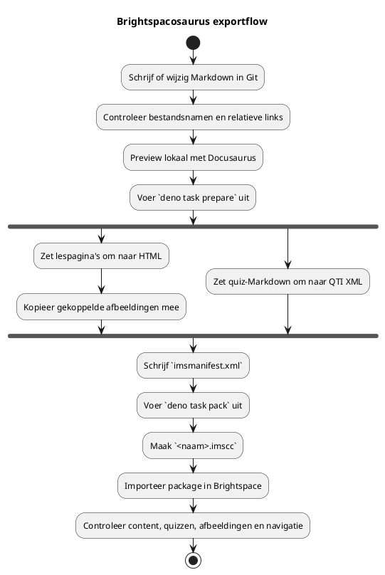
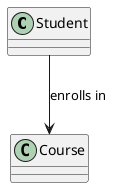

---
author:
  - Bart van der Wal
subtitle: "Publication pipeline for course material from Git to Brightspace"
date: \today
lang: en
---

\begin{titlepage} \centering \vspace*{3cm} \includegraphics[width=0.4\textwidth]{images/bsosaurus-logo.png}\\[2em] {\Huge\bfseries Brightspacosaurus User Manual\par} \vspace{1em} {\Large Publication pipeline for course material\\from Git to Brightspace\par} \vfill {\large Bart van der Wal\\[0.5em]\today\par} \end{titlepage}

# Brightspacosaurus User Manual

_Author(s)_: Bart van der Wal _Version_: 1.0

## 1. Introduction

Brightspacosaurus (BSO) is a build tool that converts Markdown course material into an IMS Common Cartridge package (`.imscc`) that you can import directly into Brightspace. Optionally, BSO converts reader Markdown to PDF via pandoc.

As an IT lecturer you probably look at a Learning Management System (LMS) a little differently than other lecturers. Where a lecturer thinks in terms of "I upload a file and create a quiz", you think in terms of data models, version control and automation. That is the lens this manual takes: your course material lives as Markdown in Git and BSO publishes it to Brightspace.

This manual describes:

- How Brightspace organizes course material under the hood (data model, import/export)
- How you install and configure BSO
- How you publish course material from Markdown source files (`prepare` and `pack`)
- How quizzes are converted to QTI and readers to PDF
- The import procedure in Brightspace and the additive import behavior

### 1.1 Frequently asked questions

#### 1.1.1 What should content look like for an efficient Brightspace export?

You write course material in Markdown. BSO converts this to IMS Common Cartridge (`.imscc`) that Brightspace imports directly (see Figure 1). One file per lesson, with H1 as the lesson title and H2+ as sections. You link images relatively with `images/afbeelding.png`. Files with the `quiz-` prefix are automatically converted to QTI.

#### 1.1.2 How do I organize questions so they can go to multiple systems?

The Markdown source files are the single source of truth. BSO currently generates QTI 1.2 for Brightspace (the Quizzes tool only supports 1.2; Course Import also accepts 2.x/3.x with limited feature support). Other assessment systems such as ANS support QTI 3.0 as an import format.

#### 1.1.3 How do I separate teacher and student material?

Keep teacher and student material in separate source directories. BSO only scans the configured source directory (`sourcesDir`) for student-visible content. Teacher material (answer keys, didactic explanation) does not belong in that directory. In addition, BSO explicitly excludes files with the suffix `-antwoorden-docent` from conversion.


_Figure 1_: Contents of an unpacked Common Cartridge package.

BSO generates this package format automatically from Markdown source files and images. The archive contains an `imsmanifest.xml`, content directories with HTML files and images. After import into Brightspace, the lesson pages appear as modules and topics.


_Figure 2_: Brightspace Manage Files with reader PDFs.

Readers are generated as separate PDFs via pandoc and uploaded to Brightspace separately. Students download them as reference material.

---

## 2. Context: Git, Brightspacosaurus and Brightspace

BSO positions material in Git as the single source of truth (SST) for educational material. Git as the core/SST clashes with Brightspace, because Brightspace was built around the idea that the LMS itself is the place to manage course content.

The BSO process reverses that: Markdown in Git is authoritative; Brightspace is a publication channel.

Advantages of Git over managing directly in Brightspace:

- You have real version control.
- You use a fast text editor instead of a WYSIWYG editor on a web page.
- You can collaborate on educational material; text files in Git lend themselves well to reviews and merge requests.

The terms **import** and **export** are therefore confusing:

- From the perspective of Git and BSO it is an **export**: we export source material to an `.imscc` package.
- From the perspective of Brightspace it is an **import**: Brightspace imports that `.imscc` package into a course.
- In this manual we therefore use: **BSO export** for creating the package and **Brightspace import** for bringing it into Brightspace.

Ideally the pipeline will later gain Brightspace API access. Then BSO could not only create the `.imscc` file, but also delete existing modules/topics or import the package automatically. As long as that API route is missing, the import remains partly manual. As a temporary workaround for the additive import behavior, BSO ships an optional cleanup script (see §11).

Teacher material requires a separate choice. Brightspace can hide content or restrict its availability, but BSO deliberately exports only the student-visible source directory. A real teacher publication can be done in three ways:

1. A separate Brightspace course or sandbox for teacher material.
2. A separate, hidden module in the same course, manually restricted to teachers after import.
3. No Brightspace publication: teacher manuals stay in Git or as a PDF outside the student course.

For most situations, option 3 is the least risky: teacher material contains answers and internal choices that must not accidentally become student-visible.

---

## 3. Brightspace data model

Brightspace (D2L) organizes course material primarily through a course offering with Content modules and topics. D2L describes that lecturers can create modules, submodules and topics in Content; topics can contain files, text and HTML, among other things (D2L, n.d.-a).

| Entity     | Brightspace term           | Analogy                                                           |
| ---------- | -------------------------- | ----------------------------------------------------------------- |
| Course     | Course Offering / Org Unit | A repository                                                      |
| Module     | Content Module             | A folder/package                                                  |
| Page       | Page                       | An HTML page in Brightspace                                       |
| Topic      | Content Topic              | A linked item in a module, such as a page, file, link or activity |
| Quiz       | Quiz Activity              | An assessment object with items                                   |
| Assignment | Dropbox Folder             | A submission location                                             |


_Figure 3_: Brightspace link to a test or quiz from course material.

A **module** contains **topics**. A topic can be a Brightspace Page, but also an added file or an existing activity. When creating course content, D2L explicitly mentions the route `Create New > Page` within a module (D2L, n.d.-b).

A **quiz** is not an ordinary content page. D2L describes that a quiz can be created from Content or directly from the Quizzes tool, and that students can also open quizzes via the Quizzes tool (D2L, n.d.-c; D2L, n.d.-d). From course material you can also include a link to a quiz (see Figure 3).

An **assignment** can be created as a new assignment from Content, but functionally remains part of the Assignments tool (D2L, n.d.-e).

Images and HTML files used as content end up in Brightspace as course files / Manage Files content. D2L describes that a file can be designated as a Content topic from Manage Files and warns that moving such a file can break links (D2L, n.d.-f).

---

## 4. Installation and configuration

### 4.1 Requirements

- **Deno** ≥ 1.40: runtime for Brightspacosaurus
- **Pandoc** (tested with 3.9): for reader PDF conversion via xelatex. Compatibility with other versions is not guaranteed (Pandoc does not follow semver but its own `EPOCH.MAJOR.MINOR.PATCH` scheme (Pandoc, n.d.)). Only needed if you generate readers or a teacher manual PDF.
- **TeX Live** with `xelatex` — PDF engine (on macOS: `brew install --cask mactex` or `brew install basictex`)

### 4.2 Configuration

All project-specific settings are managed via a `brightspacosaurus.config.json` in the root of your course project. By default BSO looks for this file in the working directory (`Deno.cwd()`); with `--config <path>` you can specify a different path. CLI arguments always take precedence over values from the configuration file.

A minimal configuration file:

```json
{
  "courseName": "Cursus X",
  "version": "1.0.0",
  "sourcesDir": "bronmateriaal/lessen/"
}
```

The most important fields:

| Field                  | Required | Description                                                                                  |
| ---------------------- | -------- | -------------------------------------------------------------------------------------------- |
| `courseName`           | yes      | Course name as shown in the manifest                                                         |
| `version`              | yes      | Version number (semver), used in the `.imscc` filename and HTML badge                        |
| `sourcesDir`           | yes      | Source directory for lesson pages and quizzes                                                |
| `readersDir`           | no       | Source directory for reader Markdown (PDF conversion via pandoc)                             |
| `assetsDir`            | no       | Directory with static assets (banners, logos)                                                |
| `outputDir`            | no       | Build output directory (default `build/brightspace`)                                         |
| `quiz.maxAttempts`     | no       | Maximum number of attempts for generated quizzes (default `0`, unlimited)                    |
| `diagrams.krokiUrl`    | no       | Kroki endpoint for PlantUML/Mermaid rendering (default `https://kroki.io`)                   |
| `diagrams.output`      | no       | Diagram embedding mode (default `img-html-base64`)                                           |
| `diagrams.failOnError` | no       | Fail on diagram errors (default `true`); when `false`, warn and keep the original code block |

> **Full configuration reference:** see the [README.md](../README.md) for all configurable fields, default values, CLI flags and an extensive example. A ready-to-use example is available in `brightspacosaurus.config.example.json` and in the `examples/` directory.

Missing optional configuration is silently skipped: without `readersDir` BSO skips the reader PDF conversion, without `teacherManual` it skips the teacher manual generation.

---

## 5. Workflow: from Markdown to Brightspace

BSO converts quizzes to the QTI format (Question and Test Interoperability). QTI is an open standard from 1EdTech (formerly IMS Global) for exchanging test questions and assessments between systems (1EdTech, n.d.). Brightspace imports QTI files as assessments in the Tests/Quizzes tool, so questions do not have to be retyped by hand.



The source files remain authoritative:

- Lesson pages and student material live in the configured source directory (`sourcesDir`).
- BSO converts quiz files with the `quiz-` prefix to QTI.
- BSO can start the configured Docusaurus preview with `bso preview`, so authors can check formatting, links, code blocks and diagrams before the slower Brightspace import round-trip.
- BSO does not import teacher answer keys with the suffix `-antwoorden-docent` as a student page.
- Derived output lives in the build directory (`outputDir`) and should not be edited by hand.

### 5.1 The two commands

Run the export from the root of your course project:

```sh
deno task prepare
deno task pack
```

`prepare` scans the source directories, converts Markdown to HTML, converts quiz Markdown to QTI and writes the intermediate output to the build directory. `pack` packages that directory into an `.imscc` archive (for example `cursus.imscc`, where the name is derived from `name`/`courseName` in the config).

With `--readers-only` you generate only the reader and teacher PDFs without the rest of the build.

For fast author feedback, use `bso preview` when `docusaurusDir` is configured. This starts the Docusaurus development server for the course repository, so most content and formatting issues can be caught locally before creating and importing a new `.imscc` package.

### 5.2 Import behavior: additive with overwrite option

Brightspace import is additive by default for content modules and quizzes: a new import adds items but does not automatically delete or overwrite existing modules or quizzes. Duplicate imports lead to duplicate items.

The import wizard does offer the option **"Overwrite existing files"**. This option applies to files in Manage Files (images, PDFs, HTML files) — not to content modules or quizzes as a whole. Specifically:

- **Lesson pages (content topics)**: are added as a new item on re-import, not overwritten. Manual deletion before re-import is required.
- **Files (images, PDFs)**: are overwritten if the option is checked and the path matches.
- **Quizzes**: are added as a new assessment, not overwritten.


_Figure 4_: Manually removing a page in Brightspace.

Figure 4 shows how you manually remove a page.

- Step 0: Navigate to the module in Content.
- Step 1: Click the ellipsis (⋮) next to the topic.
- Step 2: Choose **Remove**.
- Step 3: Confirm with **Yes, remove also contents** if you also want to remove the underlying files.
- Step 4: Confirm with **Remove**.

Recommended workflow: check "Overwrite existing files", but manually remove old content modules before re-import if the structure has changed. For bulk deletion see §11.


_Figure 5_: Brightspace import — selecting components.


_Figure 6_: Option — overwrite existing files.

After import, check at minimum:

1. Do the content topics appear in the expected order?
2. Do lesson pages show headings, lists, tables, code blocks and images correctly?
3. Are quizzes in the Tests/Quizzes tool and do they open without an error?
4. Are teacher answer keys absent from the student-visible content?
5. Have duplicate modules or old versions been manually removed before you import again?

### 5.3 Import options in Brightspace

When importing a course package, Brightspace shows two optional checkboxes:

#### 5.3.1 Import metadata — Yes, check it

Metadata describe course objects (modules, topics) in a structured way — think of language, keywords and catalog information. BSO generates metadata in the manifest (title, language `nl-NL`). Including these ensures that Brightspace correctly adopts the titles and structure (D2L, n.d.-g).

#### 5.3.2 Shared home pages and navigation bars — No, do not check it

This option links a shared home page or navigation bar defined elsewhere. The BSO package contains no references to shared home pages or navbars — it uses the default course navigation. Leaving this box unchecked prevents Brightspace from accidentally activating the wrong navbar.

### 5.4 Recommended import procedure

1. Go to **Course tools** → **Import/Export/Copy Components**.
2. Choose **Import Components** → **from a course package**.
3. Upload the `.imscc` package.
4. Check **Metadata** ✓.
5. Leave **Shared home pages and navigation bars** unchecked ✗.
6. Click **Import**.
7. Wait until the import is complete (may take several minutes for large packages).

Preferably choose a clean sandbox course for tests.

### 5.5 PlantUML and Mermaid diagrams in lesson pages

BSO renders PlantUML and Mermaid fenced code blocks in lesson Markdown during `prepare`. The renderer uses `remark-kroki-a11y` and a Kroki-compatible HTTP service. By default BSO uses the public `https://kroki.io` endpoint and embeds rendered SVG as a base64 image in the generated Brightspace HTML.

Example:

````markdown

````

Optional configuration:

```json
{
  "diagrams": {
    "krokiUrl": "https://kroki.io",
    "output": "img-html-base64",
    "failOnError": true
  }
}
```

For CI, privacy-sensitive material, or offline work you can point `diagrams.krokiUrl` to a self-hosted Kroki service. A local Docker Kroki setup renders PlantUML directly; Mermaid requires the `yuzutech/kroki-mermaid` companion container. The public `https://kroki.io` service includes that companion.

Brightspace lesson pages should not depend on custom JavaScript for core accessibility behavior. Depending on Brightspace configuration, script-capable content files can be sandboxed in a secure iframe, and browser/security restrictions can also affect embedded scripts. BSO therefore adapts the generated diagram output to native HTML controls: source and natural-language descriptions are exposed through `<details>/<summary>`, and descriptions are associated with the rendered image where available. This improves screen-reader and no-JavaScript access, but it is not a formal WCAG conformance claim. Before publishing an important course, check representative pages manually in Brightspace with the assistive technologies your students use.

`diagrams.failOnError` controls the build policy. With the default `true`, invalid diagram metadata, invalid source, or an unreachable Kroki endpoint fails the build. With `false`, BSO logs a warning, keeps the original fenced code block in the generated page, and continues.

---

## 6. Import/export: IMS Common Cartridge

Brightspace can import and export course components via Common Cartridge. D2L describes Common Cartridge as an open standard for content, assessments and digital content, and mentions import from a course package as a supported route (D2L, n.d.-g).


_Figure 7_: Contents of an unpacked `.imscc` package.

The manifest describes the resources; the content directories contain the HTML files and images that Brightspace imports.

BSO generates an `.imscc` package conforming to IMS Common Cartridge 1.3 from Markdown source files. Brightspace supports multiple Common Cartridge versions; for version 1.1 D2L explicitly mentions the `.imscc` extension as a recognizable package extension (D2L, n.d.-h).

---

## 7. Quizzes and QTI

The Source Scanner classifies files with the `quiz-` prefix as quiz files. BSO parses a quiz Markdown file based on this format:

- **H1** as the quiz title
- **H2** as the question number
- Options as `- A. text` through `- D. text`
- `Correct antwoord: **X**` as the indicator of the correct answer

For each quiz Markdown file, BSO generates one valid QTI 1.2 XML file conforming to the IMS CC QTI profile (`cc.exam.v0p1`). The QTI files appear in Brightspace both in the Quizzes tool and in the content navigation.

Generated quizzes get a maximum attempt count through QTI metadata. Configure it with `quiz.maxAttempts` in `brightspacosaurus.config.json`; when omitted, BSO uses `0`, which means unlimited attempts. The value must be a non-negative integer. In the IMS Common Cartridge output, BSO writes Brightspace's `cc_maxattempts` metadata field; `0` is exported as `unlimited`, matching Brightspace's own Common Cartridge export.

### 7.1 Images in quizzes

A quiz can be given a **header image** via the quiz settings in Brightspace (manually). In the QTI format that BSO generates, you can embed images in question texts via HTML img tags. A quiz banner as a whole is a Brightspace UI setting, not part of QTI.

### 7.2 Teacher and student variants

Practical convention for filenames:

- Lesson pages are imported as content topics.
- Files with the `quiz-` prefix are converted to QTI and imported as an assessment.
- Files with the suffix `-antwoorden-docent` are not imported as a student page or assessment.

Brightspace itself already has a separate tool/navigation for tests and quizzes. BSO therefore converts quiz Markdown to QTI assessments and does not build an extra content module for tests.

---

## 8. Readers: reference material as PDF

Readers (for example memory models, class diagrams, PlantUML or Git explanations) are reference material that is referenced from multiple lessons. They live in the configured readers source directory (`readersDir`).

The Source Scanner classifies files with the `reader-` prefix as reader files. BSO converts them to PDF via pandoc with xelatex or lualatex as the PDF engine. Some properties:

- If pandoc is not available, BSO logs a warning and skips the reader PDF conversion without aborting the build.
- Pandoc's `--resource-path` is set to the directory of the source file, so that relative image references are resolved correctly.
- If a reader conversion fails, BSO reports the file and continues with the remaining readers, but returns a non-zero exit code afterwards.
- Generated reader PDFs get a mandatory separate cover page before the table of contents. The cover title comes from Markdown frontmatter `title`, otherwise from the first H1, otherwise from the file name. `author`/`auteur`, `date`/`datum` and `version`/`versie` frontmatter are used when present. Without an explicit date, BSO tries the last Git commit date of the reader Markdown file when `git` is available and permitted; otherwise it omits the date and falls back to the configured course name and version. BSO does not insert the current date automatically, so repeated builds stay reproducible.

BSO includes reader PDFs in the IMSCC package as a webcontent resource under a "Readers" module in the manifest.

### 8.1 Mapping to Brightspace

In Brightspace you can offer the reader PDFs as follows:

1. Upload the reader PDFs to **Manage Files** in the course.
2. Link to the PDF from relevant lesson pages via a relative URL.
3. Optionally: create a top-level module "Reference material" with links to the PDFs.


_Figure 8_: Brightspace Manage Files — reader PDFs are linked from lesson pages.

---

## 9. Images in the export

BSO automatically includes images from lesson pages (Markdown ``) in the `.imscc` package. Conditions:

1. The path is relative to the Markdown source file.
2. The file exists at that path.
3. The image is in a directory that BSO scans.

BSO converts Markdown image references to HTML img tags and copies the image files into the `.imscc` archive. If a referenced image does not exist, BSO logs a warning with the source file and the missing path.

In addition to the images referenced from Markdown, you can supply extra static assets (banners, logos) via the `assetsDir` configuration field, which BSO copies into the build.

---

## 10. Custom styling

BSO ships a default CSS stylesheet (`brightspacosaurus.css`), based on the HAN house style. This stylesheet is generic and contains no course-specific colors or selectors.

If you want to add your own styling, you configure a `customCss` path in the configuration file. BSO then adds that stylesheet alongside the default stylesheet. Without `customCss`, BSO uses only the default stylesheet.

---

## 11. Bulk-deleting content via the browser console

Because Brightspace import is additive (see §5.2), on re-import you first have to delete existing content. Manually this costs four clicks per item — with dozens of pages that is unworkable. The bundled script `utils/verwijder-brightspace-paginas.js` partly automates this. This is a deliberately hacky workaround for the lack of API access to Brightspace: you paste the script in full into your browser's JavaScript console (F12/Developer Tools → **Console** tab) and press Enter.

The script is experimental and depends on Brightspace's internal HTML structure. It functions independently of the BSO core (no shared imports or configuration).

### 11.1 Usage

1. Open the course in Brightspace → **Content**.
2. Navigate to the module whose items you want to delete.
3. Select the first item where you want to start.
4. Open DevTools (F12) → **Console**.
5. Copy the contents of `utils/verwijder-brightspace-paginas.js` and paste into the console.
6. Press Enter. The script asks how many items you want to delete.

### 11.2 How it works

The script:

- Polls quickly (50 ms) for UI reactions instead of using fixed wait times.
- Waits until the confirmation dialog is **closed** before starting on the next item — this prevents a stack of open dialogs.
- Clicks the "also delete underlying files" radio if it is present.
- Skips items without a delete option (quizzes, assignments) and continues with the next.
- Dismisses success toasts immediately.
- Keeps a set of failed object IDs so it does not endlessly retry the same items.

### 11.3 Limitations

- The script works via DOM manipulation and depends on Brightspace's internal HTML structure. A Brightspace update can break it.
- Quizzes and assignments that appear as a link in a module have a different delete mechanism and are skipped.
- With large numbers (100+) it can help to press F5 in between and run the script again — Brightspace's internal state sometimes becomes corrupt after a lot of DOM manipulation in one session.
- The script is intended as a temporary workaround until Brightspace API access is available.

---

## References

- 1EdTech. (n.d.). _Question and Test Interoperability (QTI)_. Retrieved June 3, 2026, from https://www.1edtech.org/standards/qti
- D2L. (n.d.-a). _Add and organize learning materials in the Classic Content experience_. Brightspace Community. Retrieved May 14, 2026, from https://community.d2l.com/brightspace/kb/articles/2750-add-and-organize-learning-materials-in-the-classic-content-experience
- D2L. (n.d.-b). _Add and organize course content_. Brightspace Community. Retrieved May 14, 2026, from https://community.d2l.com/brightspace/kb/articles/4983-add-and-organize-course-content
- D2L. (n.d.-c). _Create and configure a quiz_. Brightspace Community. Retrieved May 14, 2026, from https://community.d2l.com/brightspace/kb/articles/3413-create-and-configure-a-quiz
- D2L. (n.d.-d). _Using the Quizzes tool_. Brightspace Community. Retrieved May 14, 2026, from https://community.d2l.com/brightspace/kb/articles/18174-using-the-quizzes-tool
- D2L. (n.d.-e). _Create an assignment_. Brightspace Community. Retrieved May 14, 2026, from https://community.d2l.com/brightspace/kb/articles/2776-create-an-assignment
- D2L. (n.d.-f). _Create a Content topic in Manage Files_. Brightspace Community. Retrieved May 14, 2026, from https://community.d2l.com/brightspace/kb/articles/3670-create-a-content-topic-in-manage-files
- D2L. (n.d.-g). _About Import/Export/Copy Components_. Brightspace Community. Retrieved May 14, 2026, from https://community.d2l.com/brightspace/kb/articles/16786-about-import-export-copy-components
- D2L. (n.d.-h). _Import, export, or copy course components_. Brightspace Community. Retrieved May 14, 2026, from https://community.d2l.com/brightspace/kb/articles/16788-import-export-or-copy-course-components
- Pandoc. (n.d.). _Releases_. Retrieved May 21, 2026, from https://pandoc.org/releases.html
