# Brightspacosaurus User Manual

Publication pipeline for course material from Git to Brightspace

- *_*Author(s)*: Bart van der Wal
- *Version*: 1.0

## 1. Introduction

Brightspacosaurus (BSO) is a build tool that converts Markdown course material into an IMS Common Cartridge package (`.imscc`) that you can import directly into Brightspace. Optionally, BSO converts reader Markdown to PDF via pandoc.

Two capabilities set BSO apart from "just Markdown to HTML": a live Docusaurus preview (`bso preview`) lets you check the same author-visible content behavior before importing into Brightspace, and Markdown quiz files are converted to real QTI 1.2 assessments — not static pages — so they work as native Brightspace quizzes. Preview and export should stay on par; technical implementation details belong in the [Software Guidebook](software-guidebook.md).

As an IT lecturer you probably look at a Learning Management System (LMS) a little differently than other lecturers. Where a lecturer thinks in terms of "I upload a file and create a quiz", you think in terms of data models, version control and automation. That is the lens this manual takes: your course material lives as Markdown in Git and BSO publishes it to Brightspace.

This manual describes:

- How Brightspace organizes course material under the hood (data model, import/export)
- How you install and configure BSO
- How you publish course material from Markdown source files (`prepare` and `pack`)
- How quizzes are converted to QTI and readers to PDF
- The import procedure in Brightspace and the additive import behavior

### 1.1 Frequently asked questions

#### 1.1.1 What should content look like for an efficient Brightspace export?

You write course material in Markdown. BSO converts this to IMS Common Cartridge (`.imscc`) that Brightspace imports directly (see Figure 1). One file per lesson, with H1 as the lesson title and H2+ as sections. You link images relatively with `images/afbeelding.png`. Files with the `quiz-` prefix are automatically converted to QTI.

#### 1.1.2 How do I organize questions so they can go to multiple systems?

The Markdown source files are the single source of truth. BSO currently generates QTI 1.2 for Brightspace (the Quizzes tool only supports 1.2; Course Import also accepts 2.x/3.x with limited feature support). Other assessment systems such as ANS support QTI 3.0 as an import format.

#### 1.1.3 How do I separate teacher and student material?

Keep teacher and student material in separate source directories. BSO only scans the configured source directory (`sourcesDir`) for student-visible content. Teacher material (answer keys, didactic explanation) does not belong in that directory. In addition, BSO explicitly excludes files with the suffix `-antwoorden-docent` from conversion.

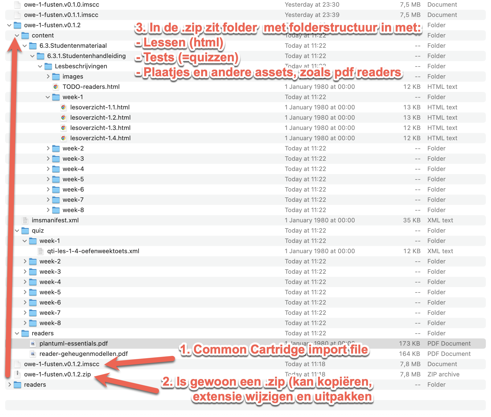

_Figure 1_: Contents of an unpacked Common Cartridge package.

BSO generates this package format automatically from Markdown source files and images. The archive contains an `imsmanifest.xml`, content directories with HTML files and images. After import into Brightspace, the lesson pages appear as modules and topics.

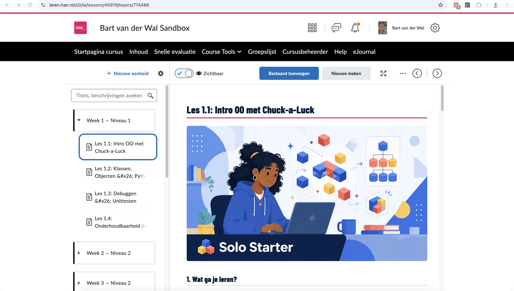

_Figure 2_: Brightspace Manage Files with reader PDFs.

Readers are generated as separate PDFs via pandoc and uploaded to Brightspace separately. Students download them as reference material.

---

## 2. Context: Git, Brightspacosaurus and Brightspace

BSO positions material in Git as the single source of truth (SST) for educational material. Git as the core/SST clashes with Brightspace, because Brightspace was built around the idea that the LMS itself is the place to manage course content.

The BSO process reverses that: Markdown in Git is authoritative; Brightspace is a publication channel.

Advantages of Git over managing directly in Brightspace:

- You have real version control.
- You use a fast text editor instead of a WYSIWYG editor on a web page.
- You can collaborate on educational material; text files in Git lend themselves well to reviews and merge requests.

The terms **import** and **export** are therefore confusing:

- From the perspective of Git and BSO it is an **export**: we export source material to an `.imscc` package.
- From the perspective of Brightspace it is an **import**: Brightspace imports that `.imscc` package into a course.
- In this manual we therefore use: **BSO export** for creating the package and **Brightspace import** for bringing it into Brightspace.

Ideally the pipeline will later gain Brightspace API access. Then BSO could not only create the `.imscc` file, but also delete existing modules/topics or import the package automatically. As long as that API route is missing, the import remains partly manual. As a temporary workaround for the additive import behavior, BSO ships an optional cleanup script (see §11).

Teacher material requires a separate choice. Brightspace can hide content or restrict its availability, but BSO deliberately exports only the student-visible source directory. A real teacher publication can be done in three ways:

1. A separate Brightspace course or sandbox for teacher material.
2. A separate, hidden module in the same course, manually restricted to teachers after import.
3. No Brightspace publication: teacher manuals stay in Git or as a PDF outside the student course.

For most situations, option 3 is the least risky: teacher material contains answers and internal choices that must not accidentally become student-visible.

---

## 3. Brightspace data model

Brightspace (D2L) organizes course material primarily through a course offering with Content modules and topics. D2L describes that lecturers can create modules, submodules and topics in Content; topics can contain files, text and HTML, among other things (D2L, n.d.-a).

| Entity     | Brightspace term           | Analogy                                                           |
| ---------- | -------------------------- | ----------------------------------------------------------------- |
| Course     | Course Offering / Org Unit | A repository                                                      |
| Module     | Content Module             | A folder/package                                                  |
| Page       | Page                       | An HTML page in Brightspace                                       |
| Topic      | Content Topic              | A linked item in a module, such as a page, file, link or activity |
| Quiz       | Quiz Activity              | An assessment object with items                                   |
| Assignment | Dropbox Folder             | A submission location                                             |

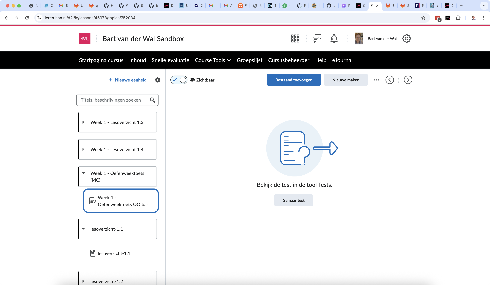

_Figure 3_: Brightspace link to a test or quiz from course material.

A **module** contains **topics**. A topic can be a Brightspace Page, but also an added file or an existing activity. When creating course content, D2L explicitly mentions the route `Create New > Page` within a module (D2L, n.d.-b).

A **quiz** is not an ordinary content page. D2L describes that a quiz can be created from Content or directly from the Quizzes tool, and that students can also open quizzes via the Quizzes tool (D2L, n.d.-c; D2L, n.d.-d). From course material you can also include a link to a quiz (see Figure 3).

An **assignment** can be created as a new assignment from Content, but functionally remains part of the Assignments tool (D2L, n.d.-e).

Images and HTML files used as content end up in Brightspace as course files / Manage Files content. D2L describes that a file can be designated as a Content topic from Manage Files and warns that moving such a file can break links (D2L, n.d.-f).

---

## 4. Installation and configuration

### 4.1 Requirements

- **Deno** ≥ 1.40: runtime for Brightspacosaurus
- **Pandoc** (tested with 3.9): for reader PDF conversion via xelatex. Compatibility with other versions is not guaranteed (Pandoc does not follow semver but its own `EPOCH.MAJOR.MINOR.PATCH` scheme (Pandoc, n.d.)). Only needed if you generate readers or a teacher manual PDF.
- **TeX Live** with `xelatex` — PDF engine (on macOS: `brew install --cask mactex` or `brew install basictex`)

### 4.2 Configuration

All project-specific settings are managed via a `brightspacosaurus.config.json` in the root of your course project. By default BSO looks for this file in the working directory (`Deno.cwd()`); with `--config <path>` you can specify a different path. CLI arguments always take precedence over values from the configuration file.

A minimal configuration file:

```json
{
  "courseName": "Cursus X",
  "version": "1.0.0",
  "sourcesDir": "bronmateriaal/lessen/"
}
```

The most important fields:

| Field                  | Required | Description                                                                                  |
| ---------------------- | -------- | -------------------------------------------------------------------------------------------- |
| `courseName`           | yes      | Course name as shown in the manifest                                                         |
| `version`              | yes      | Version number (semver), used in the `.imscc` filename and HTML badge                        |
| `sourcesDir`           | yes      | Source directory for lesson pages and quizzes                                                |
| `readersDir`           | no       | Source directory for reader Markdown (PDF conversion via pandoc)                             |
| `readerCoverLogo`      | no       | Logo on every reader PDF cover page, relative to the repository root                         |
| `teacherDashboard.module` | no    | Content module (`slug`, optional `title`) that holds the Voortgangsverkenner after the teacher page; default a separate instructor module; see [4.8](#48-teacher-progress-dashboard-voortgangsverkenner) |
| `readersModule`        | no       | Menu module for the reader PDFs: `slug` (default `readers`) and `title`; see [8.2](#82-menu-module-and-order) |
| `readerChapterNewPage` | no       | Start every chapter of a reader PDF on a new page (default `true`)                           |
| `assetsDir`            | no       | Directory with static assets (banners, logos)                                                |
| `outputDir`            | no       | Build output directory (default `build/brightspace`)                                         |
| `quiz.shuffleAnswers` | no       | Random answer order in QTI and quiz preview (boolean, default `false`)                       |
| `quiz.maxAttempts`     | no       | Maximum number of attempts for generated quizzes (default `0`, unlimited)                    |
| `diagrams.krokiUrl`    | no       | Kroki endpoint for PlantUML/Mermaid rendering (default `https://kroki.io`)                   |
| `diagrams.output`      | no       | Diagram embedding mode (default `img-html-base64`)                                           |
| `diagrams.locale`      | no       | Language of generated labels: diagram UI and reader PDF cover and document language (`nl` or `en`, default `nl`) |
| `diagrams.failOnError` | no       | Fail on diagram errors (default `true`); when `false`, warn and keep the original code block |
| `flashcards.sectionHeadings` | no | Headings whose term/definition lists become flashcards (default `["Core concepts"]`, `[]` disables); see [4.4](#44-core-concept-flashcards) |
| `teacherPage`          | no       | Teacher page in `sourcesDir` that shows the imported versions (default `for-teachers.md`); see [4.7](#47-teacher-page) |

> **Full configuration reference:** see the [README.md](../README.md) for all configurable fields, default values, CLI flags and an extensive example. A ready-to-use example is available in `brightspacosaurus.config.example.json` and in the `examples/` directory.

Missing optional configuration is silently skipped: without `readersDir` BSO skips the reader PDF conversion, without `teacherManual` it skips the teacher manual generation.

---

### 4.3 Reusable Markdown includes

An include inserts another Markdown file at the exact location of the directive. The include target must always be a Markdown link:

```markdown
{@include: [Learning goals](../partials/learning-goals.md)}
```

This syntax has two purposes. BSO can resolve the link during HTML and reader-PDF generation, while the source remains a normal, clickable Markdown link in an editor such as VS Code and in a Docusaurus preview. The visible link text is only an editor-facing label; BSO follows the link target and inserts the target file's Markdown content.

The older bare-path form is deliberately invalid:

```markdown
{@include: ../partials/learning-goals.md}
```

It produces an error instead of silently accepting content that is not clickable in the source. HTML links such as `<a href="...">...</a>` are not accepted as include syntax either; use the Markdown-link form. `bso lint` reports invalid include directives before a build is started.

Includes are resolved relative to the Markdown file that contains them. The same directive can therefore be used in lesson pages, reader Markdown and other included Markdown files, provided the relative path is correct.

Include-only partials must not appear as pages of their own. Keep them outside `sourcesDir` (as the demo course does with `partials/`), or prefix the file or folder with an underscore, e.g. `lessons/_shared/learning-goals.md`. BSO skips `_`-prefixed files and folders when scanning, and Docusaurus excludes them by default. The Docusaurus preview expands includes with the same code as the export, so partials do not need to be in the docs `include` list.

---

### 4.4 Core-concept flashcards

Flashcards support **retrieval practice**: a student tries to recall the definition before revealing it. This is useful for short core concepts such as terminology, APIs and testing vocabulary. The Learning Scientists describe the same concept-card pattern as writing the concept name on one side and its definition on the other, then saying or writing the answer and revisiting concepts that were difficult: [Be Your Own Teacher: How to Study with Flashcards](https://www.learningscientists.org/blog/2016/2/20-1).

Student story: _As a student, I want to practise the key terms from a lesson one at a time, so that I can actively recall a definition, reveal it when needed, and repeat the terms I do not yet know._

Use a `flashcards` container with one `flashcard` container per concept. The outer container must use **four colons** (`::::flashcards` / `::::`), while each inner card uses three (`:::flashcard` / `:::`). Using three for both closes the set too early; `bso lint` detects this. The `term:` line is the short front of the card. The Markdown block below it is the definition and may contain emphasis, inline code, links, lists or multiple paragraphs:

```markdown
::::flashcards

:::flashcard
term: Unit test

A **unit test** checks one small part of a system _in isolation_.
:::

::::
```

For lightweight cards, use a normal bullet list inside a single container (no inner directives):

```markdown
:::flashcards

- **request:** A client asks a server for data or an action.
- **response:** The server sends the result back, for example `200 OK`.

:::
```

Sections titled `Core concepts` become flashcards automatically. To recognize other glossary headings, configure their titles in `brightspacosaurus.config.json`:

```json
{
  "flashcards": {
    "sectionHeadings": ["Kernbegrippen", "Kern begrippen", "kern concepten"]
  }
}
```

This is an optional fragment to add to your existing course configuration. The list replaces the default `["Core concepts"]`; `[]` disables automatic heading recognition. With that setting, this plain Markdown becomes a flashcard set:

```markdown
## Kernbegrippen

- **request:** bericht waarmee een client een server om een handeling of gegevens vraagt.
- **response:** bericht waarmee de server het resultaat van een request terugstuurt.
- **statuscode:** HTTP-code die het resultaat van een request aanduidt, bijvoorbeeld `200`.
```

BSO always supports both syntaxes, without a setting. Lists under these headings stay real bulleted lists: each clickable term and its short definition share a line, and only the definition is hidden, so a long glossary stays compact. Rich definitions with multiple paragraphs or lists keep their block layout. Explicit `::::flashcards` sets show boxed cards, also under a flashcard heading. The "Show definitions" / "Hide definitions" button follows `diagrams.locale` (`Toon definities` / `Verberg definities` for `nl`). Terms are real buttons with `aria-expanded`, so keyboard and screen readers work.

Heading titles match exactly after trimming and ignoring letter case and a leading section number, so `## 7. Kernbegrippen` and `### 2.3 Kernbegrippen` match `Kernbegrippen`; all heading levels work. The section includes subsections and ends at the next heading of the same or a higher level. Conversion preserves headings and other content, but `bso lint` warns if the section contains anything other than complete term/definition bullet lists or a `::::flashcards` set, so a heading without any flashcards is reported. The default heading `Core concepts` (any letter case) is checked even when `flashcards` is not configured. Place introductory prose before the heading or in a separate section.

Each unordered list is converted only when every item has a non-empty term before the first colon (`:`) and a non-empty definition after it. Plain, **bold** and `inline-code` terms work, with the colon inside or outside their formatting. Definitions retain Markdown formatting, links, subsequent paragraphs and nested lists. Additional colons belong to the definition. Numbered lists, task lists and lists with incomplete items remain ordinary Markdown in full; other sections are unaffected.

The demo's “Core Concepts Flashcards” lesson includes both directive cards and an English `Core concepts` list, using `"sectionHeadings": ["Core concepts"]`. Both the Brightspace HTML export and the configured Docusaurus preview use the same transformation. For your own Docusaurus app, pass the same `flashcards` options to `remarkFlashcards`; see the [demo configuration](../demo-course-docs/docusaurus.config.js). `bso preview` supplies the selected course's options through `BSO_PREVIEW_FLASHCARDS_CONFIG`; direct Docusaurus builds must read them from the course configuration.

BSO renders the definitions as normal HTML first. JavaScript progressively adds global and per-card reveal controls, while keyboard focus and `aria-expanded` communicate state. If JavaScript is unavailable or storage is blocked, the definition remains usable. Flashcards are practice support, not a Brightspace quiz or formal assessment; use the QTI quiz format for graded questions.

The current implementation does not persist a student preference across pages until Brightspace storage behavior has been validated in a real course. The fallback is intentionally safe: no storage is required for the cards to work.

For Docusaurus preview parity and implementation details, see the [Software Guidebook](software-guidebook.md) and [CONTRIBUTING.md](../CONTRIBUTING.md). The demo uses the same `remarkFlashcards` transformation, CSS and `brightspacosaurus-flashcards.js` initializer as Brightspace. Docusaurus invokes the initializer after hydration and every client-side navigation.

### 4.5 Linting course material

`bso lint` applies developer best practices to course material: it checks flashcards, includes, diagrams, quiz authoring and source hygiene (frontmatter in lessons, hard-wrapped paragraphs) before you export, without building or contacting external services, so mistakes surface in your editor or CI instead of after the Brightspace import. It starts by saying which directories and how many files it scanned. It reports `file:line:column`, severity and rule. Errors return exit code 1; warnings alone return 0.

The `error` or `warning` word is colored (red and dark orange) only when stderr is a terminal, `NO_COLOR` is not set and `TERM` is not `dumb`; in a pipe or log the output stays plain. Only that word is colored, so `file:line:column` stays clickable. When there are diagnostics, one blank line precedes the summary line `Checked N Markdown files: X errors, Y warnings.`

`lesson-frontmatter` (warning) reports a YAML frontmatter block at the top of a lesson file. BSO uses frontmatter only for readers (`title`, `author`, `version`, `date`, `updated`, `coverImage`, `coverAlt`); it is not processed in lesson pages. Put the title as a `# heading` and remove the rest. The rule does not apply to readers, quizzes or included files.

`hard-wrapped-lines` (warning) reports a paragraph that looks wrapped at a fixed column: three or more lines that are all at least 50 characters long and differ by at most 25 characters. Markdown renders such line breaks as spaces, so the output does not change, but diffs get noisy and AI-assisted editing has to rewrap text. Write each paragraph on one line and let the editor wrap it. Breaks that end in two spaces or a backslash are intentional and ignored.

Quiz bias rules check that students cannot score without knowing the material. `quiz-length-bias` and `quiz-reverse-length-bias` (warnings) report a quiz where the correct option is the unique longest or shortest option in more than 40% of the questions (from four questions). `quiz-answer-length-ratio` (warning) reports a question whose correct option is more than twice as long as its shortest option. `quiz-only-giveaway` (warning) reports signal words such as "Alleen" at the start of options that are never correct. `quiz-position-bias` (warning) reports one letter that is correct in more than 45% of the questions (from six questions). `quiz-answer-key-mismatch` (error) reports a quiz and its `quiz-*-antwoorden-docent.md` that name a different correct answer. Adjust the thresholds and signal words in the configuration:

```json
{
  "lint": {
    "quizBias": {
      "maxLongestShare": 0.4,
      "maxShortestShare": 0.4,
      "maxLetterShare": 0.45,
      "maxLengthRatio": 2,
      "minQuestionsForLength": 4,
      "minQuestionsForPosition": 6,
      "giveawayWords": ["alleen"]
    }
  }
}
```

By default, lint scans `sourcesDir`, `readersDir` and their linked Markdown includes. To select only specific folders or subfolders, add this fragment to your configuration:

```json
{
  "lint": {
    "includeDirs": ["lessons/week-1", "lessons/week-2"]
  }
}
```

These paths are relative to the current working directory and replace the default source/reader inputs. They must remain inside the project root. `bso lint --sources lessons/week-1` overrides the selection. Linked includes are always checked as dependencies.

For the repository's regression examples, run `bso lint` in `examples/demo-course` (no diagnostics) and in `examples/demo-course-antipatterns` (30 intentional diagnostics and exit code 1). The [antipattern course](../examples/demo-course-antipatterns/README.md) has its own configuration and exactly one file for each linter rule. `bso lint` starts with the directories and file counts it scanned.

### 4.6 Links between lesson pages

Link to other lesson pages with a normal relative Markdown link, such as `[FAQ](../faq.md)`. BSO turns it into a link to the generated HTML page, so it also works in editors and in the Docusaurus preview.

In Brightspace a lesson page opens in a frame inside the course viewer. A plain link would open the next page inside that frame, while the content menu keeps showing the previous topic. Exported pages therefore contain a small script: after a click on a lesson link, it looks up the target topic in the course's table of contents (with the student's own Brightspace session) and lets Brightspace open that topic. The menu, previous/next navigation and progress then match the page on screen. If the lookup fails, for example because the target page is not a topic in the course, the plain link opens as before. Links with a new-tab target, external links and PDF links are left alone.

### 4.7 Teacher page

A teacher page is a lesson page you write yourself for teachers, for example with import instructions and contact details. BSO fills in the imported versions, so teachers can check after an import that Brightspace shows the current material. Later, the GitLab progress dashboard ([#37](https://github.com/bartvanderwal/brightspacosaurus/issues/37)) will appear on the same page.

By default BSO uses `for-teachers.md` in `sourcesDir`. Choose a different file with `teacherPage`, relative to `sourcesDir`:

```json
{
  "teacherPage": "voor-docenten.md"
}
```

Place the directive `{@bso-versions}` on its own line where the version table belongs:

```markdown
# For teachers

## Version information

{@bso-versions}
```

BSO replaces the directive with a table containing the course name and `version` from the configuration and the Brightspacosaurus version. Without the directive, the table follows the page's first H1. Directives in code blocks and on other pages stay unchanged. The Docusaurus preview shows the same table.

If the default page does not exist, BSO skips it without a message. If a configured `teacherPage` does not exist, `bso prepare` fails. The page is a normal topic in the cartridge: hide it for students in Brightspace after each import. It contains no secrets.

---

### 4.8 Teacher progress dashboard (Voortgangsverkenner)

When courses use GitLab for student assignments, instructors can monitor student work item progress across student repositories using the built-in **Voortgangsverkenner** (Teacher progress dashboard).

BSO generates this standalone client-side dashboard page at `content/docenten/voortgangsverkenner.html` and packages it into the instructor module (`module_docentenmateriaal`) in `imsmanifest.xml`. After importing the Common Cartridge into Brightspace, instructors keep this module hidden from students.

To avoid an extra module in the menu, put the dashboard in a content module with `teacherDashboard.module`, for example the module that holds the teacher page. The dashboard then comes directly after the teacher page and the "Instructor material (hide after import)" module is no longer created:

```json
"teacherDashboard": { "module": { "slug": "algemeen" }, ... }
```

`slug` is the folder name in `sourcesDir`, the same form as `readersModule`; the optional `title` sets the module title. If no content folder has that name, BSO creates a separate module with that title (or the slug). Without `module` nothing changes. Like the teacher page, instructors set the dashboard item to hidden from students after import. The dashboard shows no data without a GitLab token, so this is no data leak, but it avoids confusion.

Configure the dashboard under `teacherDashboard` in `brightspacosaurus.config.json`:

```json
{
  "teacherDashboard": {
    "gitlabUrl": "https://gitlab.aimsites.nl",
    "groupPath": "2026p1-fusten",
    "subgroups": ["Arnhem", "Nijmegen"],
    "repos": [
      { "prefix": "pod", "label": "POD" },
      { "prefix": "n1-chuck-a-luck", "label": "N1 Chuck-a-luck" },
      { "prefix": "n2-ticketfaster-api", "label": "N2 TicketFaster API" },
      { "prefix": "n2-expense-pro", "label": "N2 Expense Pro" },
      { "prefix": "n3-ticketfaster-frontend", "label": "N3 TicketFaster frontend" },
      { "prefix": "n3-expense-pro", "label": "N3 Expense Pro" }
    ],
    "teacherUsernames": ["docent1", "docent2"],
    "orangeThresholdPercent": 10,
    "redThresholdPercent": 50,
    "requireCommentsForDone": false
  }
}
```

#### Security and token handling

- The dashboard authenticates against GitLab with a **fine-grained personal access token** with read-only permissions. A classic token with scope `read_api` also works, but grants far more than the dashboard needs.
- **No secrets in cartridge:** The token is never written into the configuration or the exported package.
- **In-memory storage:** The dashboard keeps the token only in browser memory while the page is open. It is never persisted to `localStorage` or `sessionStorage` (preventing other scripts in Brightspace from reading it).
- **Password manager support:** The token input uses `<input type="password" autocomplete="current-password">` with a hidden username field so instructors can securely store and autofill it via their browser password manager.

#### Creating the access token

Create a fine-grained personal access token in GitLab under **User settings → Personal access tokens → Generate token**:

1. Under **Group and project access**, choose **Only specific group or projects that I'm a member of** and select the course group (for example `2026p1-fusten`). The token then covers its subgroups and projects, and nothing else.
2. Grant **Read** permissions only, in three categories:
   - **Project Planning**: `Work Item: Read` (issues and their comments) and `Label: Read`. Without this category every repository shows "Token mist leesrechten voor deze repo (403)".
   - **Repository**: only `Commit: Read` and `Merge Request: Read`. Merge requests are shown when they are linked to a work item, with their commits. The dashboard reads commit titles, authors and links to match commits to work items (`#<iid>` in the message) and to link to them. It never reads file contents, so `Code: Read`, branches, tags and the other repository permissions are not needed. Without `Commit: Read` the dashboard finds no commits, so finished work items turn orange; the repository view then shows a warning.
   - **Groups**: only `Group: Read`, to list the projects in each subgroup.
3. Do not grant member permissions. The dashboard links repositories to students by project name, not by membership, so it does not need to read member data.
4. Choose a short expiry date, for example the end of the course period.

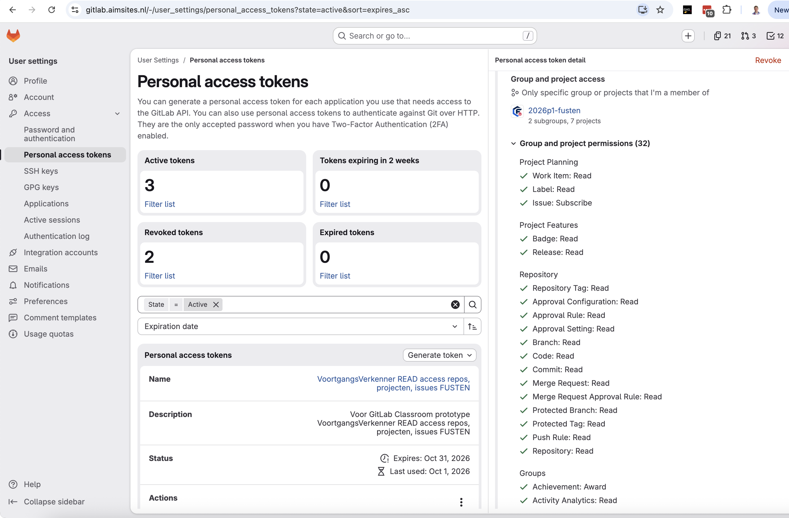

The screenshot shows a working token for FUSTEN. It grants more read permissions than the minimum listed above (need to know); the minimum is `Work Item: Read`, `Label: Read`, `Merge Request: Read`, `Commit: Read` and `Group: Read`. That minimum is derived from the API calls the dashboard makes and still has to be confirmed with a token that has only these permissions.

#### Showing the dashboard on the teacher page

Put the directive on its own line in the teacher page (`teacherPage`, default `for-teachers.md`):

```markdown
{@bso-teacher-dashboard}
```

BSO then shows the teacher page with two tabs: **Informatie** (the rest of the page) and **Voortgangsverkenner** (the dashboard in an embedded frame, at full width). Without JavaScript both parts are shown one after the other. The directive only works on the teacher page and needs `teacherDashboard` in the configuration; without it the page shows a short note instead.

The Docusaurus preview (`bso preview`) shows the same tabs and the same working dashboard, so you can test it with your token before importing. A course with its own Docusaurus configuration needs a few additions; they are described in the [Software Guidebook](software-guidebook.md#77-docusaurus-integration-of-the-voortgangsverkenner).

The dashboard stays a separate file (`docenten/voortgangsverkenner.html`) in the hidden instructor module. Hiding a topic in Brightspace does not necessarily block a direct URL for enrolled students; that is not a data leak, because the page contains no token or student data, only the group name and repository prefixes. Students cannot see other students' work without a token with read access to the course group.

The dashboard ships its own fonts (Atkinson Hyperlegible, SIL OFL 1.1) and libraries, so it makes no requests to third parties besides your GitLab server.

#### Using the dashboard

1. Open **Voortgangsverkenner** in the hidden instructor module, paste the token and choose **Gebruik**.
2. Choose the class and **Haal status uit GitLab**. The class overview shows a stoplight per student and per repository, with the share of green work items and a distribution bar.
3. Use **Toon repo's** to show only the repositories of the current assignment level, for example only the `n3-` repositories. Switch all on (**Alles aan**) to look back at earlier work.
4. Tick **Alleen aandacht nodig** to hide students, repositories and work items that are green or not yet due.
5. Open a student, repository and work item in the tree on the left. The work item shows its linked commits and merge requests; each link opens the commit, the merge request changes or the work item in GitLab in a new tab.
6. Adjust the thresholds under **Instellingen stoplicht**; colours update immediately. The defaults come from the configuration.

All fetched data stays in the page's memory and disappears when you close it. Use **Ververs deze student** to update one student without fetching the whole class again.

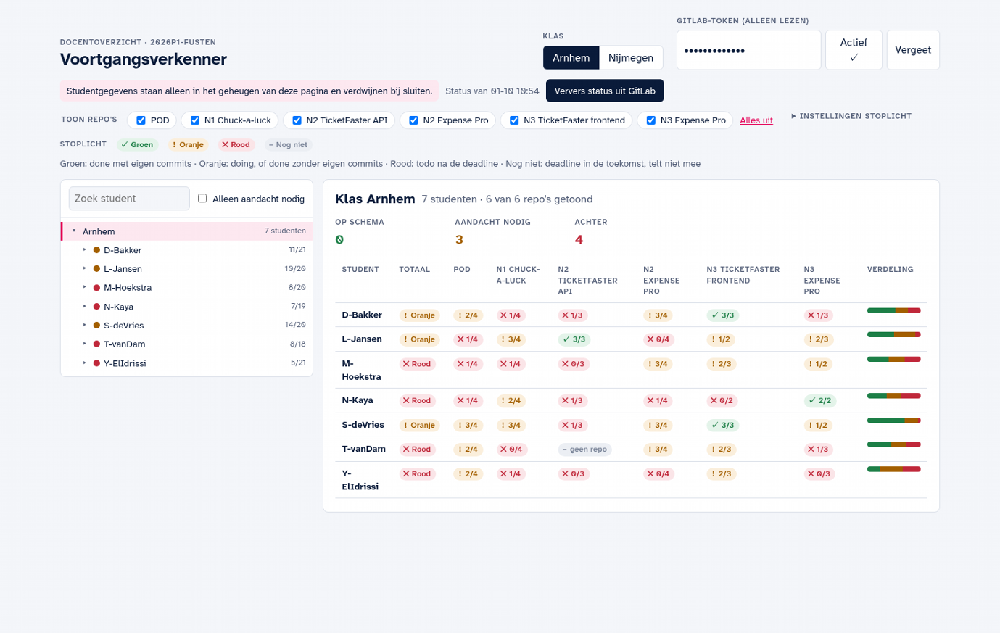

#### Progress calculation and stoplight rules

- **Work item stoplight:**
  - **Green (Done):** Work item is closed or in a done state, with at least one commit by the student referencing the issue (`#<number>`), and non-teacher changes (and comments, if enabled).
  - **Orange (In Progress / Missing requirements):** Work item is in progress/doing, or marked done without student commits or missing comments when required.
  - **Red (Todo):** Work item is open or todo without progress.
  - **Gray (Empty):** The student repository has no work items.
- **Overall repo stoplight:**
  Calculated from the percentage of non-green work items compared to thresholds:
  - `< orangeThresholdPercent` (default 10%) $\to$ **Green**
  - $\ge orangeThresholdPercent$ and $\le redThresholdPercent$ (default 50%) $\to$ **Orange**
  - `> redThresholdPercent` $\to$ **Red**
- **Dynamic overrides:** Instructors can adjust the threshold sliders and toggle the comment requirement directly on the dashboard's Settings tab to dynamically recolor the student overview in real time.

---

## 5. Workflow: from Markdown to Brightspace

BSO converts quizzes to the QTI format (Question and Test Interoperability). QTI is an open standard from 1EdTech (formerly IMS Global) for exchanging test questions and assessments between systems (1EdTech, n.d.). Brightspace imports QTI files as assessments in the Tests/Quizzes tool, so questions do not have to be retyped by hand.

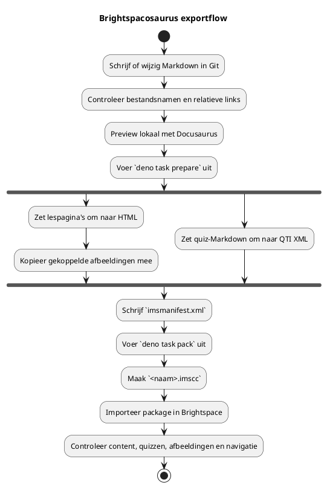
```plantuml
@startuml
title Brightspacosaurus exportflow

start
:Schrijf of wijzig Markdown in Git;
:Controleer bestandsnamen en relatieve links;
:Preview lokaal met Docusaurus;
:Voer `deno task prepare` uit;
fork
  :Zet lespagina's om naar HTML;
  :Kopieer gekoppelde afbeeldingen mee;
fork again
  :Zet quiz-Markdown om naar QTI XML;
end fork
:Schrijf `imsmanifest.xml`;
:Voer `deno task pack` uit;
:Maak `<naam>.imscc`;
:Importeer package in Brightspace;
:Controleer content, quizzen, afbeeldingen en navigatie;
stop
@enduml
```

The source files remain authoritative:

- Lesson pages and student material live in the configured source directory (`sourcesDir`).
- BSO converts quiz files with the `quiz-` prefix to QTI.
- BSO can start the configured Docusaurus preview with `bso preview`, so authors can check formatting, links, code blocks and diagrams before the slower Brightspace import round-trip.
- BSO does not import teacher answer keys with the suffix `-antwoorden-docent` as a student page.
- Derived output lives in the build directory (`outputDir`) and should not be edited by hand.

### 5.1 The two commands

Run the export from the root of your course project:

```sh
deno task prepare
deno task pack
```

`prepare` scans the source directories, converts Markdown to HTML, converts quiz Markdown to QTI and writes the intermediate output to the build directory. `pack` packages that directory into an `.imscc` archive in the same build directory, for example `build/brightspace/cursus.v1.0.0.imscc`: the name comes from `name`/`courseName` and the postfix from the course `version` in the config.

`imsmanifest.xml` records how the package was made: the LOM description holds the BSO version, course name and course version, for example `Brightspacosaurus 0.18.0; course: Demo Course; course version: 0.10.0`. Read it without Brightspace with `unzip -p cursus.v1.0.0.imscc imsmanifest.xml`. No build time is written by default, so repeated builds stay identical; set `SOURCE_DATE_EPOCH` (seconds since 1970) to add `built: <ISO 8601 time>`.

With `--readers-only` you generate only the reader and teacher PDFs without the rest of the build. With `--skip-readers` you do the opposite: BSO skips all PDF generation with pandoc (readers, instructor manual and user manual) and still copies pre-built PDFs. That makes local builds and tests much faster when the PDFs are not what you are checking.

For fast author feedback, use `bso preview` when `docusaurusDir` is configured. This starts the Docusaurus development server for the course repository, so most content and formatting issues can be caught locally before creating and importing a new `.imscc` package.

### 5.2 Import behavior: additive with overwrite option

Brightspace import is additive by default for content modules and quizzes: a new import adds items but does not automatically delete or overwrite existing modules or quizzes. Duplicate imports lead to duplicate items.

The import wizard does offer the option **"Overwrite existing files"**. This option applies to files in Manage Files (images, PDFs, HTML files) — not to content modules or quizzes as a whole. Specifically:

- **Lesson pages (content topics)**: are added as a new item on re-import, not overwritten. Manual deletion before re-import is required.
- **Files (images, PDFs)**: are overwritten if the option is checked and the path matches.
- **Quizzes**: are added as a new assessment, not overwritten.

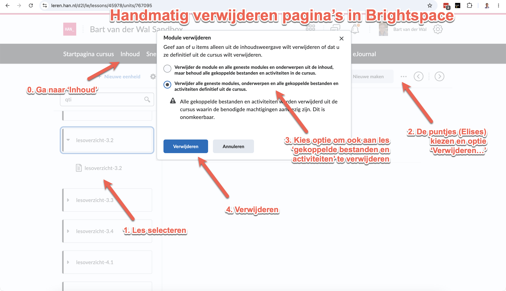

_Figure 4_: Manually removing a page in Brightspace.

Figure 4 shows how you manually remove a page.

- Step 0: Navigate to the module in Content.
- Step 1: Click the ellipsis (⋮) next to the topic.
- Step 2: Choose **Remove**.
- Step 3: Confirm with **Yes, remove also contents** if you also want to remove the underlying files.
- Step 4: Confirm with **Remove**.

Recommended workflow: check "Overwrite existing files", but manually remove old content modules before re-import if the structure has changed. For bulk deletion see §11.

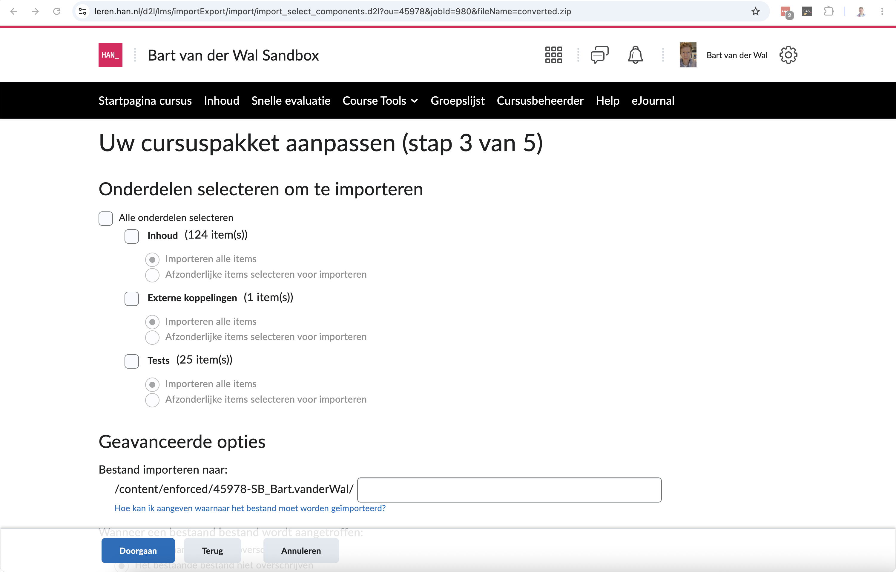

_Figure 5_: Brightspace import — selecting components.

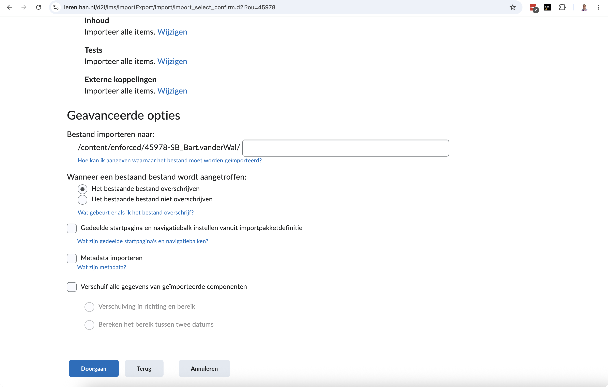

_Figure 6_: Option — overwrite existing files.

After import, check at minimum:

1. Do the content topics appear in the expected order?
2. Do lesson pages show headings, lists, tables, code blocks and images correctly?
3. Are quizzes in the Tests/Quizzes tool and do they open without an error?
4. Are teacher answer keys absent from the student-visible content?
5. Have duplicate modules or old versions been manually removed before you import again?

### 5.3 Import options in Brightspace

When importing a course package, Brightspace shows two optional checkboxes:

#### 5.3.1 Import metadata — Yes, check it

Metadata describe course objects (modules, topics) in a structured way — think of language, keywords and catalog information. BSO generates metadata in the manifest (title, language `nl-NL`). Including these ensures that Brightspace correctly adopts the titles and structure (D2L, n.d.-g).

#### 5.3.2 Shared home pages and navigation bars — No, do not check it

This option links a shared home page or navigation bar defined elsewhere. The BSO package contains no references to shared home pages or navbars — it uses the default course navigation. Leaving this box unchecked prevents Brightspace from accidentally activating the wrong navbar.

### 5.4 Recommended import procedure

1. Go to **Course tools** → **Import/Export/Copy Components**.
2. Choose **Import Components** → **from a course package**.
3. Upload the `.imscc` package.
4. Check **Metadata** ✓.
5. Leave **Shared home pages and navigation bars** unchecked ✗.
6. Click **Import**.
7. Wait until the import is complete (may take several minutes for large packages).

Preferably choose a clean sandbox course for tests.

### 5.5 PlantUML and Mermaid diagrams in lesson pages

BSO renders PlantUML and Mermaid fenced code blocks in lesson Markdown during `prepare`. The renderer uses `remark-kroki-a11y` and a Kroki-compatible HTTP service. By default BSO uses the public `https://kroki.io` endpoint and embeds rendered SVG as a base64 image in the generated Brightspace HTML.

Example:

````markdown
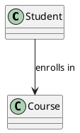
```plantuml
@startuml
class Student
class Course
Student --> Course : enrolls in
@enduml
```
````

Optional configuration:

```json
{
  "diagrams": {
    "krokiUrl": "https://kroki.io",
    "output": "img-html-base64",
    "failOnError": true
  }
}
```

For CI, privacy-sensitive material, or offline work you can point `diagrams.krokiUrl` to a self-hosted Kroki service. A local Docker Kroki setup renders PlantUML directly; Mermaid requires the `yuzutech/kroki-mermaid` companion container. The public `https://kroki.io` service includes that companion.

Brightspace lesson pages should not depend on custom JavaScript for core accessibility behavior. Depending on Brightspace configuration, script-capable content files can be sandboxed in a secure iframe, and browser/security restrictions can also affect embedded scripts. BSO therefore adapts the generated diagram output to native HTML controls: source and natural-language descriptions are exposed through `<details>/<summary>`, and descriptions are associated with the rendered image where available. This improves screen-reader and no-JavaScript access, but it is not a formal WCAG conformance claim. Before publishing an important course, check representative pages manually in Brightspace with the assistive technologies your students use.

`diagrams.failOnError` controls the build policy. With the default `true`, invalid diagram metadata, invalid source, or an unreachable Kroki endpoint fails the build. With `false`, BSO logs a warning, keeps the original fenced code block in the generated page, and continues.

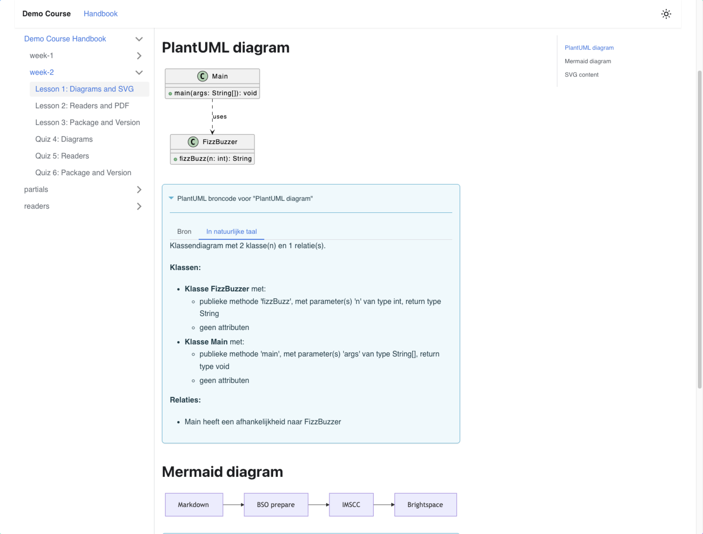

*Figure 7*: Diagram in the Docusaurus preview with source and natural-language description tabs.

Figure 7 shows the Docusaurus preview. In Brightspace the same content appears as native `<details>` disclosures.

---

## 6. Import/export: IMS Common Cartridge

Brightspace can import and export course components via Common Cartridge. D2L describes Common Cartridge as an open standard for content, assessments and digital content, and mentions import from a course package as a supported route (D2L, n.d.-g).


_Figure 8_: Contents of an unpacked `.imscc` package.

The manifest describes the resources; the content directories contain the HTML files and images that Brightspace imports.

BSO generates an `.imscc` package conforming to IMS Common Cartridge 1.3 from Markdown source files. Brightspace supports multiple Common Cartridge versions; for version 1.1 D2L explicitly mentions the `.imscc` extension as a recognizable package extension (D2L, n.d.-h).

---

## 7. Quizzes and QTI

The Source Scanner classifies files with the `quiz-` prefix as quiz files. BSO supports the **Quizzosaurus / QuizDown** syntax: place a `quiz` fenced block in the file. Each question starts with `?`, an optional hint with `!`, and its response type is inferred from its markers:

- `- ( )` / `- (x)` for single-choice options; if no `(x)` is marked, the first option is used.
- `- [ ]` / `- [x]` for multiple-response options; at least one `[x]` is required.
- `= answer / accepted variant ~20` for an auto-graded short answer with accepted variants and an optional maximum input length.

Question and option order is kept deterministic; numbered options can reserve their display position. Mixing round and square option markers, or combining options with short-answer syntax, is invalid. See the [Quizzosaurus syntax example](https://bartvanderwal.github.io/remark-kroki-a11y/examples/uml-quiz-experimental-syntax) and the [QuizDown/Quizzosaurus module documentation](https://github.com/bartvanderwal/remark-kroki-a11y/tree/main/test-docusaurus-site/src/components/Quiz).

For each quiz Markdown file, BSO generates one valid QTI 1.2 XML file conforming to the IMS CC QTI profile (`cc.exam.v0p1`). The QTI files appear in Brightspace both in the Quizzes tool and in the content navigation.

Generated quizzes get a maximum attempt count through QTI metadata. Configure it with `quiz.maxAttempts` in `brightspacosaurus.config.json`; when omitted, BSO uses `0`, which means unlimited attempts. The value must be a non-negative integer. In the IMS Common Cartridge output, BSO writes Brightspace's `cc_maxattempts` metadata field; `0` is exported as `unlimited`, matching Brightspace's own Common Cartridge export.

The earlier H1/H2 format with lettered options and a `Correct answer: X` answer key remains accepted for existing course files. New quizzes should use the linked QuizDown syntax; it keeps the answer key with each question instead of relying on a separate teacher-answer file. BSO exports single-choice as `cc.multiple_choice.v0p1`, multi-select as `cc.multiple_response.v0p1`, and auto-graded short answers as `cc.fib.v0p1`. Long-form essay and matching questions are not part of the currently documented QuizDown syntax. Verify QTI import and scoring in a Brightspace sandbox.

Set `quiz.shuffleAnswers` to `true` in `brightspacosaurus.config.json` to randomize
answer order per attempt. Default `false` preserves source order. BSO writes
`<render_choice shuffle="Yes">` or `shuffle="No"`, keeping stable option identifiers
and the correct scoring reference. See the [Common Cartridge specification](https://www.imsglobal.org/node/51891).
The Docusaurus demo uses the same setting and parser for interactive practice;
answers are shuffled on page entry/new attempt, and stay in place while answering.
Preview scores are local feedback, not stored grades; Brightspace enforces native
assessment rules and attempt limits. Restart preview after changing configuration.
Verify native randomization and correct scoring after importing into Brightspace.

### 7.1 Images in quizzes

A quiz can be given a **header image** via the quiz settings in Brightspace (manually). In the QTI format that BSO generates, you can embed images in question texts via HTML img tags. A quiz banner as a whole is a Brightspace UI setting, not part of QTI.

### 7.2 Teacher and student variants

Practical convention for filenames:

- Lesson pages are imported as content topics.
- Files with the `quiz-` prefix are converted to QTI and imported as an assessment.
- Files with the suffix `-antwoorden-docent` are not imported as a student page or assessment.

Brightspace itself already has a separate tool/navigation for tests and quizzes. BSO therefore converts quiz Markdown to QTI assessments and does not build an extra content module for tests.

---

## 8. Readers: reference material as PDF

Readers (for example memory models, class diagrams, PlantUML or Git explanations) are reference material that is referenced from multiple lessons. They live in the configured readers source directory (`readersDir`).

The Source Scanner classifies files with the `reader-` prefix as reader files. BSO converts them to PDF via pandoc with xelatex or lualatex as the PDF engine. Some properties:

- Reader PDFs use the DejaVu fonts when installed (on macOS: `brew install --cask font-dejavu`). Without DejaVu, BSO falls back to the TeX Gyre fonts that ship with TeX Live, and the check mark `✔` to Menlo, Noto Sans Symbols2 or Symbola if present. If none has that glyph, the PDF still builds, with a LaTeX warning and a missing check mark.
- If pandoc is not available, BSO logs a warning and skips the reader PDF conversion without aborting the build.
- Pandoc's `--resource-path` is set to the directory of the source file, so that relative image references are resolved correctly.
- If a reader conversion fails, BSO reports the file and continues with the remaining readers, but returns a non-zero exit code afterwards.
- Generated reader PDFs get a mandatory separate cover page before the table of contents. The cover title comes from Markdown frontmatter `title`, otherwise from the first H1, otherwise from the file name. `author`/`auteur` and `version`/`versie` frontmatter are used when present, otherwise the course name and version.
- The cover shows when the reader first appeared and when it was last changed, each on its own line, for example `Oorspronkelijke datum: 2026-05-15` and `Laatste wijziging: 2026-10-01`. The original date comes from `date`/`datum` in the frontmatter. The last change comes from Git: the last commit that touched the reader file. Without Git, BSO uses `updated`/`bijgewerkt` from the frontmatter. With only one date, or two equal dates, the cover shows one date line. Labels follow `diagrams.locale` (Dutch or English). BSO never inserts the current date, so repeated builds stay reproducible.
- Every chapter starts on a new page. The chapter level is the highest heading level in the reader; when that level occurs only once, as a title above `##` chapters, the next level counts. Headings in code blocks are ignored, and a manual `\clearpage` before a chapter gives no blank page, so you can remove those from your readers. Turn it off with `"readerChapterNewPage": false`.
- In CI with a shallow clone (for example GitLab's `GIT_DEPTH`) the last commit that touched a file may be missing, or replaced by a later one. BSO detects a shallow clone and then ignores the Git date, falling back to `updated`. For the real date in CI, fetch the full history (`GIT_DEPTH: 0`) for the job that builds the readers.
- Add a cover image with `coverImage` in the frontmatter, relative to the reader file, for example `coverImage: img/git-branches.png`. The image appears between author and date, scaled to at most 80% of the page width and 45% of its height. Use PNG or JPG, and a path without spaces or LaTeX special characters (`%`, `#`, `{`, `}`). If the file is missing or the path is unusable, BSO prints a warning and builds the cover without image. `coverAlt` may hold a description for editors; the PDF does not use it yet.
- Add a logo to every reader cover page with `readerCoverLogo` in `brightspacosaurus.config.json`, relative to the repository root, for example `"readerCoverLogo": "shared/han-logo.png"`. The logo appears at the bottom of the cover, above the date, at most 4 cm wide and 3 cm high. The same path rules and warnings apply as for `coverImage`.

BSO includes reader PDFs in the IMSCC package as webcontent resources. By default they get their own "Readers" module in the menu; see [8.2](#82-menu-module-and-order) to put them in another module.

### 8.1 Mapping to Brightspace

In Brightspace you can offer the reader PDFs as follows:

1. Upload the reader PDFs to **Manage Files** in the course.
2. Link to the PDF from relevant lesson pages via a relative URL.
3. Optionally: create a top-level module "Reference material" with links to the PDFs.


_Figure 9_: Brightspace Manage Files — reader PDFs are linked from lesson pages.

---


### 8.2 Menu module and order

The Brightspace menu follows the folders in `sourcesDir`: each first-level folder becomes a module, sorted by name, so a folder `algemeen` comes before `week-1`. The module title is the H1 of the folder's `index.md`, otherwise the folder name.

Within a module BSO orders the pages like the Docusaurus sidebar:

1. the teacher page (`teacherPage`), always first in its module;
2. the folder's `index.md`;
3. pages with `sidebar_position` in their front matter, ascending;
4. the rest by lesson code (for example `1.2`) and title.

Reader PDFs get their own module by default. To put them in a content module instead, after its pages, set `readersModule` to that folder's name:

```json
"readersModule": { "slug": "algemeen", "title": "Algemeen" }
```

`title` sets the module title; without it the module keeps the H1 of its `index.md` or the folder name. If no content folder has that name, BSO creates a separate module with the given title.

The Voortgangsverkenner (see [4.8](#48-teacher-progress-dashboard-voortgangsverkenner)) has its own separate module by default. With `teacherDashboard.module` it joins a content module directly after the teacher page, before the other pages. If the same module also holds the readers, the order is: teacher page, Voortgangsverkenner, the other pages, readers.

Moving the readers changes the menu structure: after the next import the old "Readers" module stays in Brightspace and you delete it once by hand. The reader topics keep their identifiers.

## 9. Images in the export

BSO automatically includes images from lesson pages (Markdown ``) in the `.imscc` package. Conditions:

1. The path is relative to the Markdown source file.
2. The file exists at that path.
3. The image is in a directory that BSO scans.

BSO converts Markdown image references to HTML img tags and copies the image files into the `.imscc` archive. If a referenced image does not exist, BSO logs a warning with the source file and the missing path.

In addition to the images referenced from Markdown, you can supply extra static assets (banners, logos) via the `assetsDir` configuration field, which BSO copies into the build.

---

## 10. Custom styling

BSO ships a default CSS stylesheet (`brightspacosaurus.css`), based on the HAN house style. This stylesheet is generic and contains no course-specific colors or selectors.

If you want to add your own styling, you configure a `customCss` path in the configuration file. BSO then adds that stylesheet alongside the default stylesheet. Without `customCss`, BSO uses only the default stylesheet.

---

## 11. Bulk-deleting content via the browser console

Because Brightspace import is additive (see §5.2), on re-import you first have to delete existing content. Manually this costs four clicks per item — with dozens of pages that is unworkable. The bundled script `utils/verwijder-brightspace-paginas.js` partly automates this. This is a deliberately hacky workaround for the lack of API access to Brightspace: you paste the script in full into your browser's JavaScript console (F12/Developer Tools → **Console** tab) and press Enter.

The script is experimental and depends on Brightspace's internal HTML structure. It functions independently of the BSO core (no shared imports or configuration).

### 11.1 Usage

1. Open the course in Brightspace → **Content**.
2. Navigate to the module whose items you want to delete.
3. Select the first item where you want to start.
4. Open DevTools (F12) → **Console**.
5. Copy the contents of `utils/verwijder-brightspace-paginas.js` and paste into the console.
6. Press Enter. The script asks how many items you want to delete.

### 11.2 How it works

The script:

- Polls quickly (50 ms) for UI reactions instead of using fixed wait times.
- Waits until the confirmation dialog is **closed** before starting on the next item — this prevents a stack of open dialogs.
- Clicks the "also delete underlying files" radio if it is present.
- Skips items without a delete option (quizzes, assignments) and continues with the next.
- Dismisses success toasts immediately.
- Keeps a set of failed object IDs so it does not endlessly retry the same items.

### 11.3 Limitations

- The script works via DOM manipulation and depends on Brightspace's internal HTML structure. A Brightspace update can break it.
- Quizzes and assignments that appear as a link in a module have a different delete mechanism and are skipped.
- With large numbers (100+) it can help to press F5 in between and run the script again — Brightspace's internal state sometimes becomes corrupt after a lot of DOM manipulation in one session.
- The script is intended as a temporary workaround until Brightspace API access is available.

---

## References

- 1EdTech. (n.d.). _Question and Test Interoperability (QTI)_. Retrieved June 3, 2026, from https://www.1edtech.org/standards/qti
- D2L. (n.d.-a). _Add and organize learning materials in the Classic Content experience_. Brightspace Community. Retrieved May 14, 2026, from https://community.d2l.com/brightspace/kb/articles/2750-add-and-organize-learning-materials-in-the-classic-content-experience
- D2L. (n.d.-b). _Add and organize course content_. Brightspace Community. Retrieved May 14, 2026, from https://community.d2l.com/brightspace/kb/articles/4983-add-and-organize-course-content
- D2L. (n.d.-c). _Create and configure a quiz_. Brightspace Community. Retrieved May 14, 2026, from https://community.d2l.com/brightspace/kb/articles/3413-create-and-configure-a-quiz
- D2L. (n.d.-d). _Using the Quizzes tool_. Brightspace Community. Retrieved May 14, 2026, from https://community.d2l.com/brightspace/kb/articles/18174-using-the-quizzes-tool
- D2L. (n.d.-e). _Create an assignment_. Brightspace Community. Retrieved May 14, 2026, from https://community.d2l.com/brightspace/kb/articles/2776-create-an-assignment
- D2L. (n.d.-f). _Create a Content topic in Manage Files_. Brightspace Community. Retrieved May 14, 2026, from https://community.d2l.com/brightspace/kb/articles/3670-create-a-content-topic-in-manage-files
- D2L. (n.d.-g). _About Import/Export/Copy Components_. Brightspace Community. Retrieved May 14, 2026, from https://community.d2l.com/brightspace/kb/articles/16786-about-import-export-copy-components
- D2L. (n.d.-h). _Import, export, or copy course components_. Brightspace Community. Retrieved May 14, 2026, from https://community.d2l.com/brightspace/kb/articles/16788-import-export-or-copy-course-components
- Pandoc. (n.d.). _Releases_. Retrieved May 21, 2026, from https://pandoc.org/releases.html
