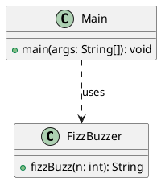

# Lesson 1: FizzBuzz

{@include: [Learning goals](../../partials/learning-goals.md)}

FizzBuzz is a classic beginner exercise. For each number from 1 to n:

- print `Fizz` if it is divisible by 3
- print `Buzz` if it is divisible by 5
- print `FizzBuzz` if it is divisible by both
- otherwise print the number itself

## Implementation (Java)

```java
public class FizzBuzzer {
    public String fizzBuzz(int n) {
        if (n % 15 == 0) return "FizzBuzz";
        if (n % 3 == 0) return "Fizz";
        if (n % 5 == 0) return "Buzz";
        return String.valueOf(n);
    }
}
```

## Command-line application

```java
public class Main {
    public static void main(String[] args) {
        int limit = args.length == 0 ? 100 : Integer.parseInt(args[0]);
        FizzBuzzer fizzBuzzer = new FizzBuzzer();

        for (int number = 1; number <= limit; number++) {
            System.out.println(fizzBuzzer.fizzBuzz(number));
        }
    }
}
```

## Unit test (JUnit)

```java
import org.junit.jupiter.api.Test;
import static org.junit.jupiter.api.Assertions.assertEquals;

class FizzBuzzerTest {
    private final FizzBuzzer fizzBuzzer = new FizzBuzzer();

    @Test
    void divisibleByThreeGivesFizz() {
        assertEquals("Fizz", fizzBuzzer.fizzBuzz(9));
    }

    @Test
    void divisibleByFiveGivesBuzz() {
        assertEquals("Buzz", fizzBuzzer.fizzBuzz(10));
    }

    @Test
    void divisibleByFifteenGivesFizzBuzz() {
        assertEquals("FizzBuzz", fizzBuzzer.fizzBuzz(15));
    }

    @Test
    void otherNumbersReturnThemselves() {
        assertEquals("8", fizzBuzzer.fizzBuzz(8));
    }
}
```

## Class diagram

The example has a `Main` entry point that loops from 1 to a configurable limit and delegates each value to `FizzBuzzer.fizzBuzz`. The default limit is 100.


