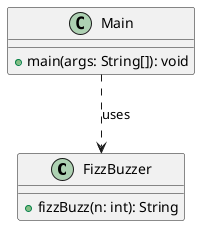
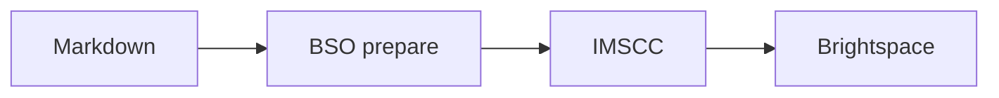

# Lesson 1: Diagrams and SVG

**Manual test:** verify PlantUML, Mermaid, SVG assets, alt text, source disclosure and diagram descriptions.

## PlantUML diagram

## Mermaid diagram

## SVG content

Expected: both diagrams and the SVG image are visible after import; source code and accessibility information remain available.
