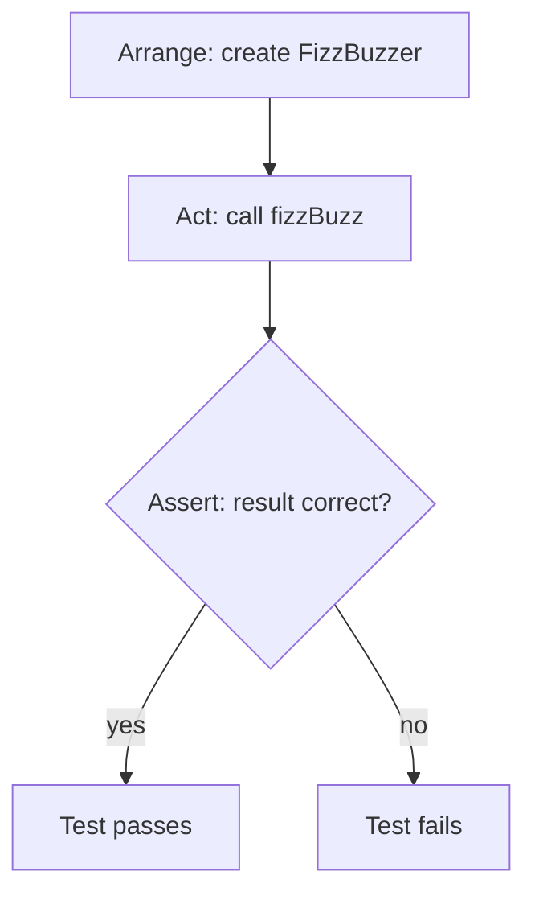
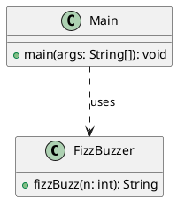

# Reader: Testing Basics

{@include: [Learning goals](../partials/learning-goals.md)}

A short reference on the arrange-act-assert pattern for unit tests.

## Arrange-Act-Assert

Most unit tests follow three phases:

1. **Arrange** — set up the object under test and any inputs.
2. **Act** — call the method being tested.
3. **Assert** — verify the result matches expectations.

## Test flow

## Class diagram

Keep tests small and focused: one behaviour per test, with a clear name that describes the expected outcome.
