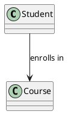

# PlantUML diagram fixture

Een lespagina met een PlantUML-diagram en een gewoon codeblok.


```plantuml
@startuml
class Student
class Course
Student --> Course : enrolls in
@enduml
```

```ts
console.log("this must stay code");
```
